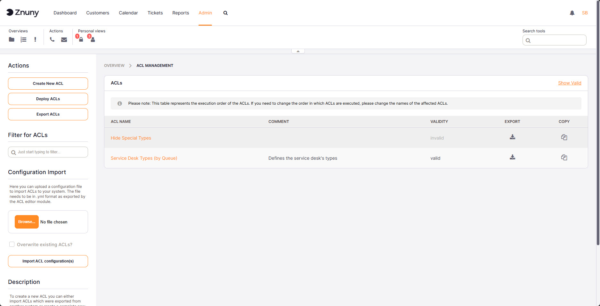
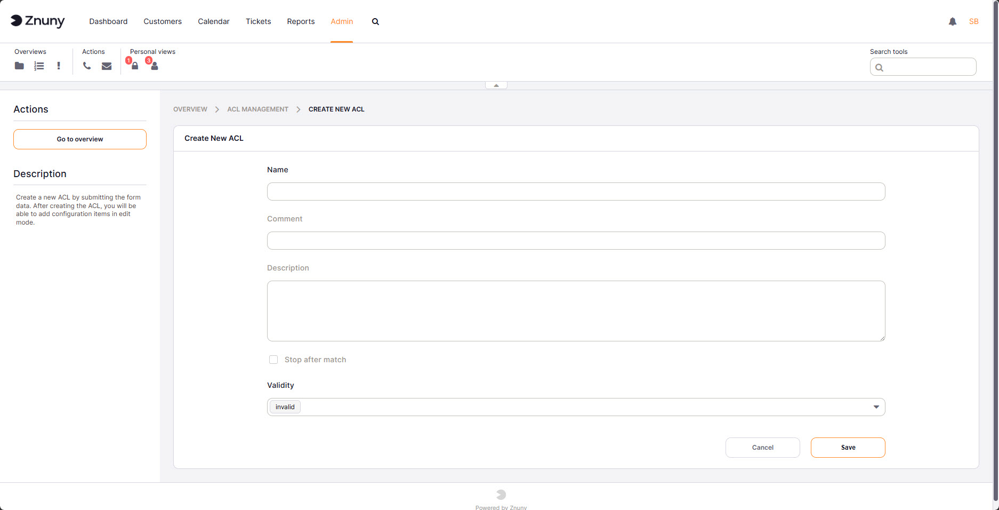
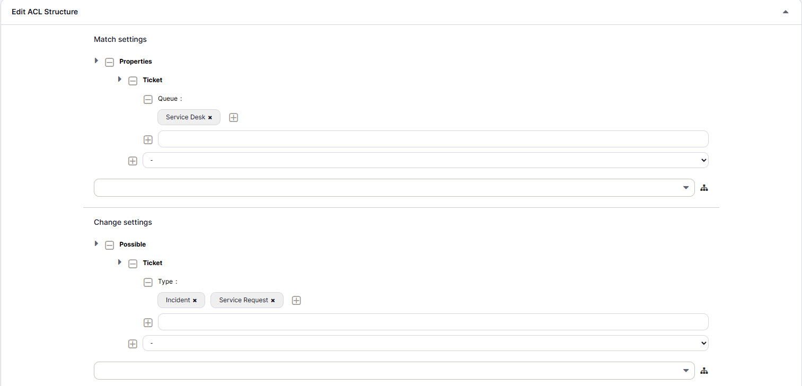
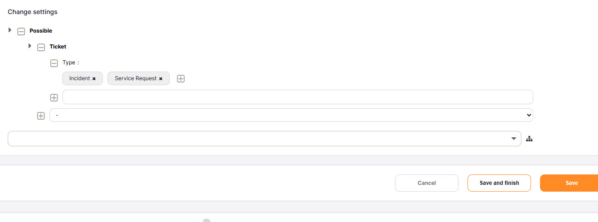
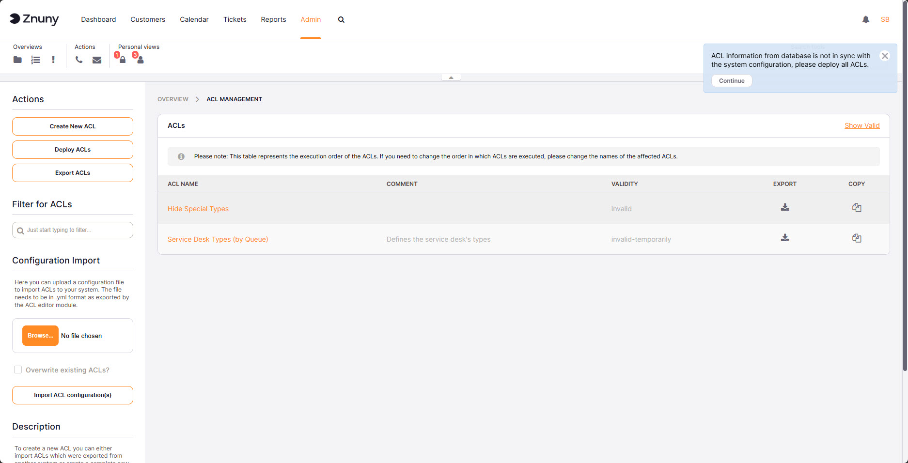

.. meta::
   :description: Manage Znuny Access Control Lists — create, edit, deploy, import and export ACLs to control what agents and customers can see and do in ticket screens.
   :keywords: znuny acl, access control list, acl admin, acl deploy, acl import, acl export, acl match, acl change, acl properties, acl possible

.. _PageNavigation admin_acl_index:

Access Control Lists (ACL)
##########################

Access control lists (ACLs) restrict what options are visible or selectable in ticket screens — queues, states, priorities, dynamic field values, and frontend actions. Each ACL defines a set of conditions to match and a set of changes to apply when those conditions are met. ACLs are evaluated in sequence; the first matching ACL applies its changes, and evaluation continues unless **Stop after match** is enabled.

.. note::

   ACLs do not apply to the Superuser account (UserID 1).

Managing ACLs
*************

The ACL overview lists all configured ACLs with their name, validity status, and available actions (edit, copy, export, delete). When any ACL has been created or modified but not yet deployed, a Notification appears on the right side of the screen prompting you to deploy. You can also trigger deployment at any time using the **Deploy ACLs** button in the ACL overview.

Use the **Create New ACL** button to create a new ACL, or **Export ACLs** to download a YAML file containing every ACL in the system.

Creating and Editing an ACL
****************************

General Settings
================

Each ACL has the following fields:

+--------------------+----------------------------------------------------------------------+
| Field              | Description                                                          |
+====================+======================================================================+
| Name               | Unique identifier for this ACL. Used in YAML exports and log         |
|                    | messages. Required.                                                  |
+--------------------+----------------------------------------------------------------------+
| Comment            | Short internal note (up to 70 characters). Optional.                 |
+--------------------+----------------------------------------------------------------------+
| Description        | Longer explanation of the ACL's purpose (up to 200 characters).      |
|                    | Optional.                                                            |
+--------------------+----------------------------------------------------------------------+
| Validity           | Controls whether the ACL is active. Set to **Invalid** before        |
|                    | deleting an ACL.                                                     |
+--------------------+----------------------------------------------------------------------+
| Stop after match   | When enabled, no further ACLs are evaluated once this ACL matches.   |
|                    | Useful for explicit allow/deny rules at the end of a sequence.       |
+--------------------+----------------------------------------------------------------------+

Match settings
==============

Match settings define when an ACL applies. The tree builder has four levels:

- **Level 1 — Source:** Choose where the values are read from.

  - *Properties* — matches values held in the current browser session (what the user sees on screen right now).
  - *PropertiesDatabase* — matches values stored in the database (the ticket as last saved).

  Both sources can be combined in a single ACL.

- **Level 2 — Category:** The type of object to inspect — for example *Ticket*, *Queue*, *CustomerUser*, or *DynamicField*.

- **Level 3 — Attribute:** The specific field within that category — for example *State*, *Priority*, or *DynamicField_MyField*.

- **Level 4 — Value:** The value to match. Values support optional prefixes for advanced matching:

  +-----------------+-----------------------------------------------------+
  | Prefix          | Meaning                                             |
  +=================+=====================================================+
  | *(none)*        | Exact match (case-sensitive)                        |
  +-----------------+-----------------------------------------------------+
  | ``[Not]``       | Exact match, negated                                |
  +-----------------+-----------------------------------------------------+
  | ``[RegExp]``    | Regular expression, case-sensitive                  |
  +-----------------+-----------------------------------------------------+
  | ``[regexp]``    | Regular expression, case-insensitive                |
  +-----------------+-----------------------------------------------------+
  | ``[NotRegExp]`` | Regular expression, negated, case-sensitive         |
  +-----------------+-----------------------------------------------------+
  | ``[Notregexp]`` | Regular expression, negated, case-insensitive       |
  +-----------------+-----------------------------------------------------+

Change settings
===============

Change settings define what the ACL does when it matches. The tree builder works the same way as match settings (Level 1–4), but Level 1 offers three action types:

- **Possible** — white-list. Only the values listed here remain available for selection. All others are hidden.
- **PossibleNot** — black-list. The values listed here are removed from the available set. Everything else remains.
- **PossibleAdd** — extend. Adds values that would not normally appear in the current set.

Multiple action types can be combined within one ACL.

Deploying ACLs
**************

Saved ACLs are not active until they are deployed. Deployment writes all ACLs from the database into ``Kernel/Config/Files/ZZZACL.pm``, which the system reads at runtime.

When saved ACLs differ from the last deployed version, a Notification appears on the right side of the screen. Click **Continue** in the Notification or **Deploy ACLs** in the ACL overview to synchronise.

.. important::

   Deploy after every create, edit, or delete operation. A saved but undeployed change has no effect on the running system.

Copying and Deleting ACLs
**************************

**Copy** creates a duplicate ACL named ``<original> (copy N)``. For example:

- Copying ``Restrict-Queues`` produces ``Restrict-Queues (copy) 1``
- Copying ``Restrict-Queues (copy) 1`` produces ``Restrict-Queues (copy) 1 (copy) 2``

Always copy from the original ACL, not from an existing copy, to avoid compounding suffixes. After copying, rename the new ACL before making changes.

**Delete Invalid ACL** is only available when the ACL's validity is set to *Invalid* or *Temporarily Invalid*. If the button is not shown, set validity to Invalid first, save, then return to delete.

Importing and Exporting ACLs
*****************************

**Export ACLs** downloads a YAML file containing every ACL in the system. Use the **Export** icon on an individual row to export a single ACL. The exported file is human-readable, suitable for version control, and can be imported into another Znuny instance.

**Import ACL configuration(s)** uploads a YAML file produced by an export. The **Overwrite existing ACLs?** checkbox controls behaviour when an imported ACL has the same name as an existing one:

- Checked — the existing ACL is replaced.
- Unchecked — the existing ACL is left unchanged and the import is skipped for that entry.

.. note::

   After an import, deploy is required before the imported ACLs take effect.

See also :doc:`/annexes/acl_reference/acl_properties` for the complete reference of available match properties and change targets.
