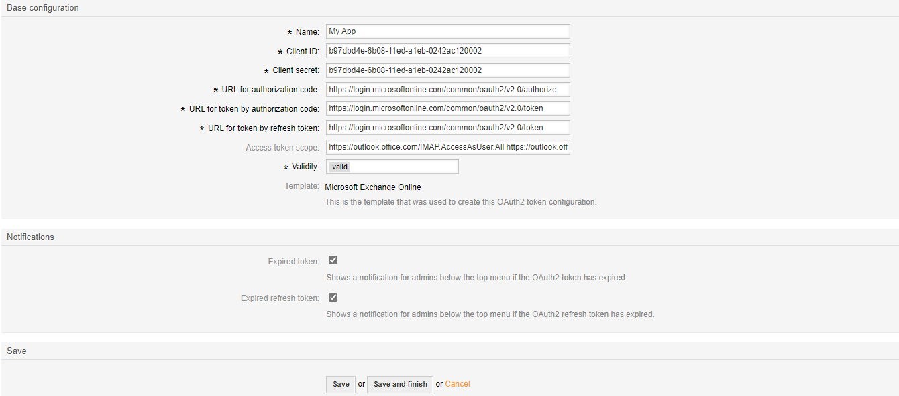
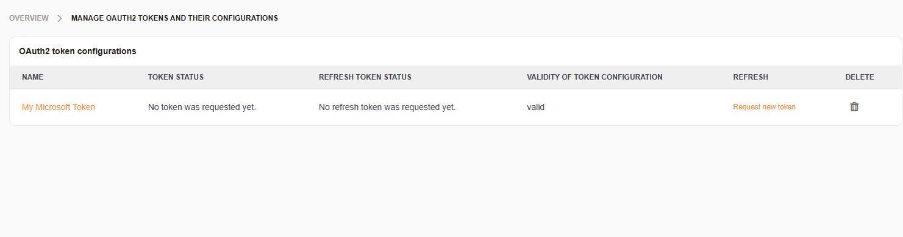
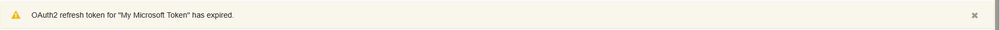
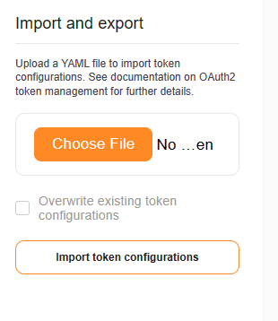

OAuth2 Token Administration
###########################
.. _PageNavigation authenticate_token_index:

.. versionadded:: 6.3

It is possible to administer OAuth tokens in the administration area. Tokens added to the system are used by the :ref:`PostMaster Mail Account <PageNavigation email_postmaster_mail_account>` module for email authentication.

As this is an advanced task, you're required to understand how to configure your provider's service.

More background information about OAuth on `Wikipedia <https://en.wikipedia.org/wiki/OAuth>`_

Adding a Token
**************

Adding a token will generates a YAML configuration in the database. This file has a specific format depending upon the provider and can be exported, modified, and imported as needed by the configuration or for migration (:ref:`see below <PageNavigation authenticate_token_index_backup_and_migration>`). We include basic formatting templates for the email providers, Google and Microsoft (Common, Consumer, and Organization). The configuration is all done comfortably in the web interface, and you may generate as many service tokens as needed for your accounts. 

.. important::

    The system setting ``HttpType`` must be https for production systems using external services like GMail and Office365.

    You can set this using the command-line as follows:

    .. code-block::
    
        [otrs@host ~]$ bin/otrs.Console.pl Admin::Config::Update --setting-name HttpType --value https

    Alternatively, you can search for *HttpType* in the system configuration and set it there.

.. note::

    After configuration, it may be necessary to edit the endpoints manually, as the service provider can change the requirements at any time.

.. image:: images/oauth2_admin_add.png
    :alt: Image Add Token

The following fields are needed:

Name
    A name for the token.

Client ID
    Your client id. (The public identifier.)

Client secret
    Your client secret. (The application’s own password.)

Validity
    The validity of the setting.

Template
    Shows the template that was used to create this OAuth2 token configuration.

Types of Notifications to be shown

Expired token
    Shows a notification for admins below the top menu if the OAuth2 token has expired.

Expired refresh token
    Shows a notification for admins below the top menu if the OAuth2 refresh token has expired.

Edit a Token
************

You can edit the token at any time.

.. note:: 
    
    The template type is permanent once the token is saved.

Token Overview
**************

It the token overview, it is necessary to manually request a new token upon token setup and as required by your service provider. You will receive front-end notifications as configured to inform you when the token or refresh token has expired.

Token Notifications
*******************

In the notification area, you receive notifications if a token or refresh token has expired. Clicking the notification will send you to the administration module for renewal. You may then click on refresh to get a new token.

.. note:: 
    
    When a refresh token expires, you must generate a new one with your service provider.

Backup and Migration
********************
.. _PageNavigation authenticate_token_index_backup_and_migration:

Export and import settings using the function provided in the left sidebar.

.. note::

    The option to overwrite settings only changes those settings of the same name.

Vendor-Specific Documentation
*****************************

As each setup is specific to your vender, please read more about setting up a token at the vendor site.

* `Microsoft <https://docs.microsoft.com/en-us/exchange/client-developer/legacy-protocols/how-to-authenticate-an-imap-pop-smtp-application-by-using-oauth>`_
* `Google <https://developers.google.com/gmail/api/auth/about-auth#:~:text=Gmail%20uses%20the%20OAuth%202.0%20protocol%20for%20authenticating,for%20your%20app.%20Why%20use%20Google%20for%20authentication%3F>`_
