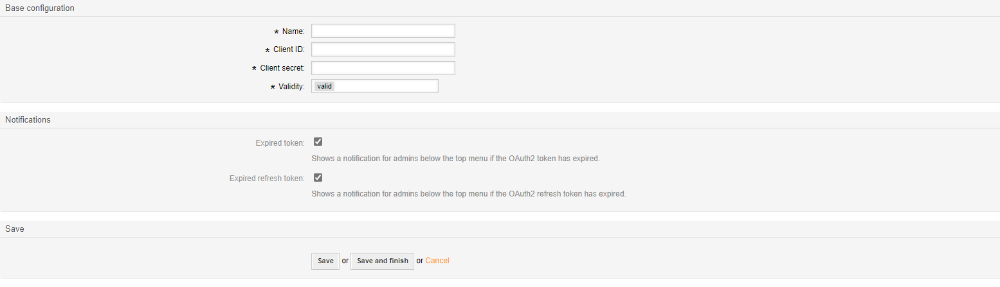
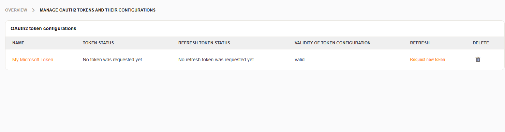
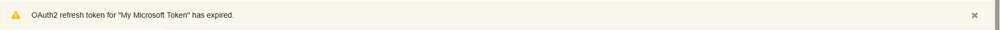
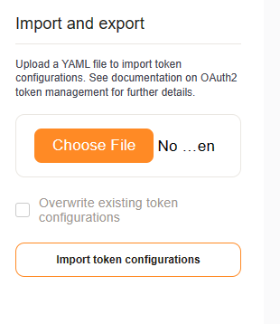

.. _PageNavigation authenticate_token_index:

OAuth2 Token Administration
###########################

OAuth2 Flow Support
*******************

We support the following authorization flows:

* Authorization Flow
* Client Credentials Flow

.. important::

    The authorization flow is the most common OAuth2 flow. It is used by most providers, including Google and Microsoft. 
    It requires user interaction to authorize the application to access the user's data.

    The client credentials flow is used for server-to-server communication where no user interaction is required.

More background information about OAuth on `Wikipedia <https://en.wikipedia.org/wiki/OAuth>`_

Token Usage
***********

Tokens can currently be used by

* PostMaster Mail Accounts
* Web Service Invokers

Application Registration
************************

An application registration is required to access resources via OAuth2. Upon registration, you should receive:

* ClientID
* Client Secret
* Endpoint(s)

Microsoft and IMAP/POP
======================

Microsoft has switch off basic authentication for IMAP and POP protocols and moved to "Modern Authentication" (which is OAuth 2.0 token based auth) This has many benefits and improvements:

* OAuth access tokens have a limited usable lifetime
* are specific to the applications and resources they are issued
* can’t be re-used

`Read more on Microsoft's site <https://learn.microsoft.com/en-us/exchange/client-developer/legacy-protocols/how-to-authenticate-an-imap-pop-smtp-application-by-using-oauth>`_

An Example Microsoft App
========================

In our Blog, we outlined an `example setup <https://www.znuny.org/en/blog/modern-authentication-with-microsoft>`_

Token Settings
**************

Adding a token will generates a YAML configuration in the database. This file has a specific format depending upon the provider and can be exported, modified, and imported as needed by the configuration or for migration (:ref:`see below <PageNavigation authenticate_token_index_backup_and_migration>`). We include basic formatting templates for the email providers, Google and Microsoft. The configuration is all done comfortably in the web interface, and you may generate as many service tokens as needed for your accounts.

.. important::

    The system setting ``HttpType`` must be https for production systems using external services like GMail and Office365.

    You can set this using the command-line as follows:

    .. code-block::

        [znuny@host ~]$ bin/znuny.Console.pl Admin::Config::Update --setting-name HttpType --value https

    Alternatively, you can search for *HttpType* in the system configuration and set it there.

.. note::

    After configuration, it may be necessary to edit the endpoints manually, as the service provider can change the requirements at any time.

The following fields are needed, depending on the OAuth2 flow:

Name
    A name for the token.

Client ID
    Your client id. (The public identifier.)

Client secret
    Your client secret. (The application’s own password.)

URL
    Enter the endpoints required for authorization, token, and/or token refresh.

Scope
    Add the scope for the token.

Validity
    The validity of the setting.

Template
    Shows the template that was used to create this OAuth2 token configuration.

Types of Notifications to be shown

Expired token
    Shows a notification for admins below the top menu if the OAuth2 token has expired.

Expired refresh token
    Shows a notification for admins below the top menu if the OAuth2 refresh token has expired.

Token Overview
**************

It the token overview, it is necessary to manually request a new token upon token setup and as required by your service provider. You will receive front-end notifications as configured to inform you when the token or refresh token has expired.

Edit a Token
************

Select any token from the overview to edit a token.

Token Notifications
*******************

In the notification area, you receive notifications if a token or refresh token has expired. Clicking the notification will send you to the administration module for renewal. You may then click on refresh to get a new token.

.. note::

    When a refresh token expires, you must generate a new one with your service provider.

Backup and Migration
********************
.. _PageNavigation authenticate_token_index_backup_and_migration:

Export and import settings using the function provided in the left sidebar.

.. note::

    The option to overwrite settings only changes those settings of the same name.

Vendor-Specific Documentation
*****************************

.. important:: 

    Redirect URI
        The redirect_uri for Znuny is built from the system variables in the following manner:

    ``${HttpType}://${FQDN}/${ScriptAlias}/get-oauth2-token-by-authorization-code.pl``

    i.e.

    ``https://znuny.example.com/otrs/get-oauth2-token-by-authorization-code.pl``
