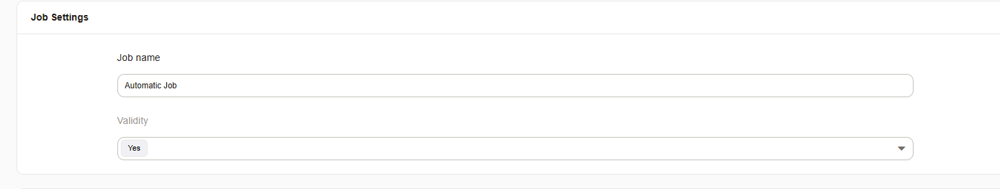
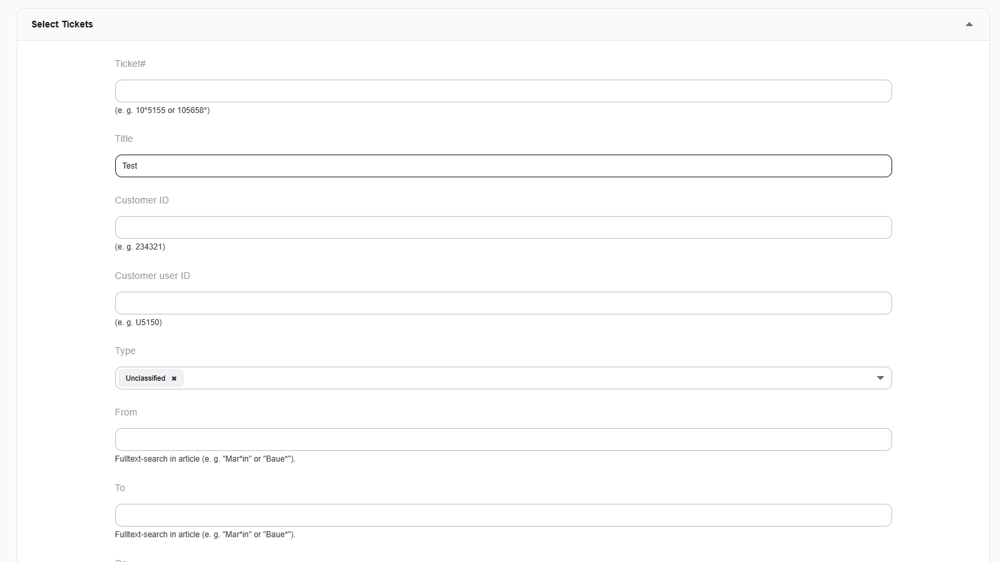
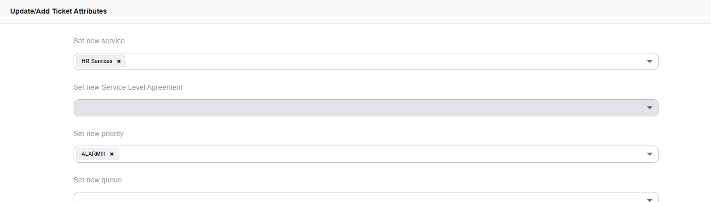
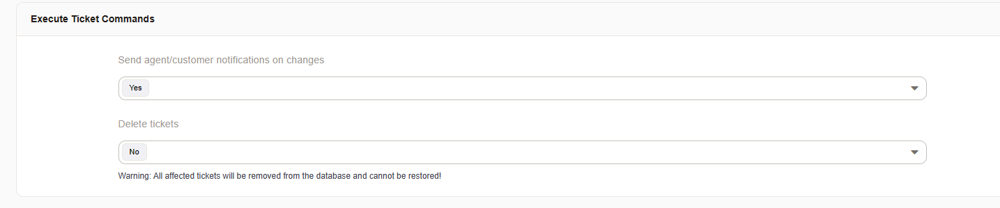
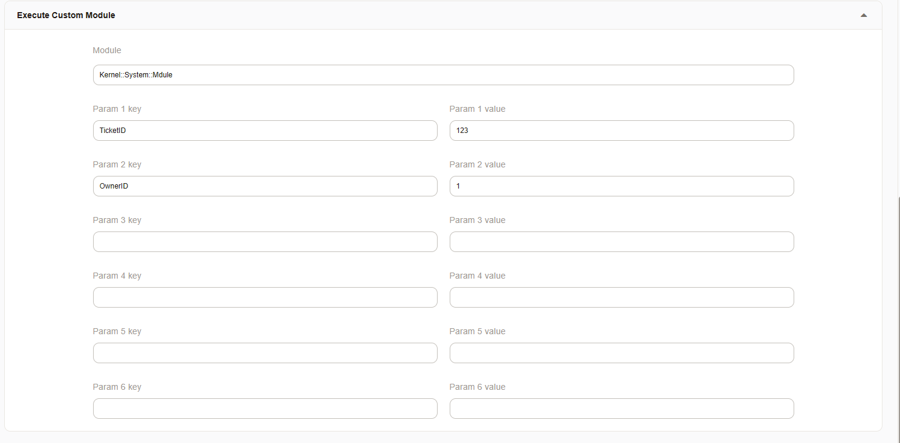

.. _Page automation_generic_agent:

Scheduled Tasks (Generic Agent)
###############################

It's very helpful to be able to automatically perform tasks at any given time or when other actions occur within the system. The generic agent provides you with such flexibility.

Programming a generic agent to run a scheduled task is available via the web interface.

You must enter a name and an execution type.



Execution Types
***************

**Scheduled**

A scheduled task requires you to use the dropdown menus to enter the schedule in hour, minute, and day format. This will generally affect multiple tickets based upon the search criteria.


**Event Based**

An event based schedule is used when you want to catch an event within the system. For example when a ticket is created in order to trigger the generic agent. This will always affect just one ticket.


Filter Criteria
***************

The criteria entered in the next screen will be used to filter out the tickets which are affected.



Ticket Changes
**************

Here you can enter the changes which should be applied to the ticket or the tickets found.



**Add a Note:**

If you choose to do so, you can also make a note to the ticket.


Ticket Commands
***************

You can perform two different commands on a ticket that has been found.




Delete a Ticket
===============

Using the generic agent is one way to delete tickets within the system.

.. important::

  Please use with care as this is a permanent deletion. There is no recovery option and no dedicated logging of this action.

Inform Agents of Changes
=========================

Here you can deactivate agent notifications upon changes to tickets.


Execute Commands
****************
.. _PageNavigation automation_generic_agent:

Using Perl program modules it a way to integrate customizations. This is also the only possibility to execute commands outside of the software API within Znuny.



.. note::

  The entered parameters can be called by their name ``$Param{New}->{'Test2'}`` as given to get the value, or you can use ``$Param{New}->{'ParamKey2'}`` or ``$Param{New}->{'ParamKeyValue2'}``. Basic parameters can be used by your script by using ``$Param{'TicketID'}``. You can additionally access other search and result parameters. As the system is highly extensible, there is no exhaustive list available.


.. versionchanged:: 6.3

The possibility to execute system command (CMD) was removed for security reasons. If you still require this functionality it is possible with a custom generic agent module. There is an example module which replaces the CMD function located at ``Kernel/System/GenericAgent/SystemCommandExecution.pm.dist``. Use this file as a template and copy it. Don't forget to change the ``package Kernel::System::GenericAgent::SystemCommandExecution;``` to match the name of the copied file. This file can be used then multiple times.

**Example Module**

.. code:: perl

  # --
  # Copyright (C) 2021-2022 Znuny GmbH, https://znuny.org/
  # --
  # This software comes with ABSOLUTELY NO WARRANTY. For details, see
  # the enclosed file COPYING for license information (AGPL). If you
  # did not receive this file, see http://www.gnu.org/licenses/agpl.txt.
  # --

  package Kernel::System::GenericAgent::SystemCommandExecutionExample;

  use strict;
  use warnings;

  our @ObjectDependencies;

  #
  # Example module to show the execution of system commands in generic agent context.
  #

  sub new {
      my ( $Type, %Param ) = @_;

      my $Self = {};
      bless( $Self, $Type );

      # 0=off; 1=on;
      $Self->{Debug} = $Param{Debug} || 0;

      return $Self;
  }

  sub Run {
      my ( $Self, %Param ) = @_;

      use Data::Dumper;
      print STDERR Dumper(\%Param);

      # Execute system command
      #my $Output = `/path/to/some/script.sh`;

      # Parameters given in generic agent config can be used, e.g.:
      my $Output = `/path/to/some/script.sh $Param{TicketID} $Param{New}->{'ParamKeyValue2'};

      return 1;
  }


  1;


**Example Parameters Available for Use:**

.. code:: perl

  VAR1 = {
           'EscalationTimeSearchType' => '',
           'ChangeTimeSearchType' => '',
           'MIMEBase_To' => '',
           'LastCloseTimeSearchType' => '',
           'TimePendingSearchType' => '',
           'EscalationResponseTimeSearchType' => '',
           'MIMEBase_From' => '',
           'ScheduleLastRun' => '2022-04-08 12:59:25',
           'LastChangeTimeSearchType' => '',
           'MIMEBase_Subject' => '',
           'TimeSearchType' => '',
           'MIMEBase_Body' => '',
           'TicketNumber' => '*',
           'EscalationUpdateTimeSearchType' => '',
           'New' => {                                ##### All the changes made to the ticket.
                      'SendNoNotification' => '0',
                      'ParamValue5' => '',
                      'ParamValue1' => 'A',
                      'Delete' => '0',
                      'ParamKey3' => 'Test3',
                      'PendingTimeType' => '60',
                      'ParamKey6' => '',
                      'Test' => 'A',
                      'PendingTime' => '',
                      'ParamValue3' => 'C',
                      'ParamValue2' => 'B',
                      'NoteTimeUnits' => '',
                      'ParamKey2' => 'Test2',
                      'ParamKey1' => 'Test',
                      'CustomerID' => '',
                      'Test3' => 'C',
                      'ParamKey5' => '',
                      'Note' => {
                                  'Subject' => '[Ticket#2021012710123456] ',
                                  'Body' => 'Test Note'
                                },
                      'Title' => '',
                      'NoteSubject' => '',
                      'Test2' => 'B',
                      'CustomerUserLogin' => '',
                      'ParamValue6' => '',
                      'NoteFrom' => '',
                      'Module' => 'Kernel::System::GenericAgent::SystemCommandExecution',
                      'ParamKey4' => '',
                      'ParamValue4' => '',
                      'NoteBody' => 'Test Body'
                    },
           'CustomerID' => '',
           'Valid' => '1',
           'CloseTimeSearchType' => '',
           'MIMEBase_Cc' => '',
           'EscalationSolutionTimeSearchType' => '',
           'Name' => 'Test',
           'CustomerUserLogin' => '',
           'Title' => '',
           'TicketID' => '1'
         };
