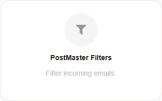
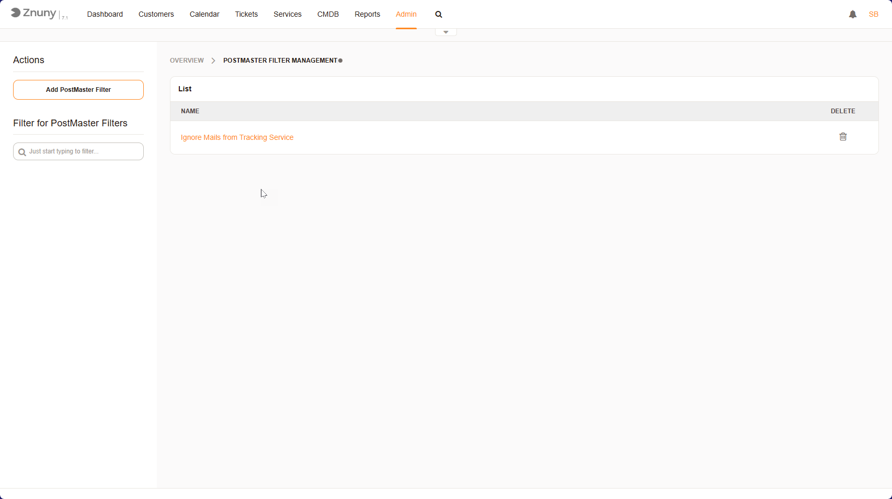
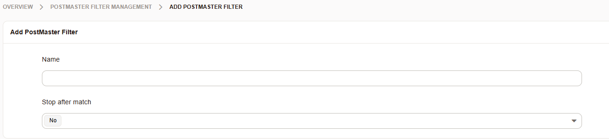
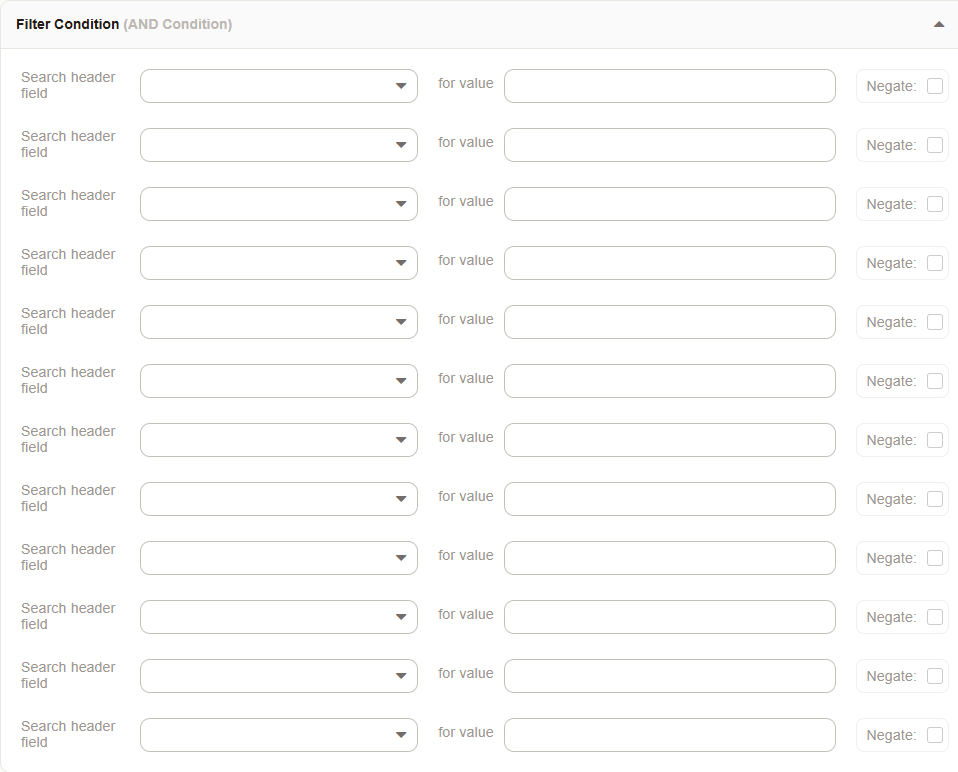
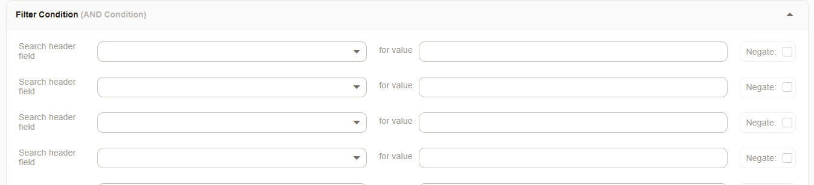

.. _PageNavigation admin_automation_postmaster_filter_index:

Email Filtering
###############

Overview
********
The administration module, **PostMaster Filters** allows administrators to **automate email processing** by defining rules for incoming messages. 
This helps in **organizing tickets**, **filtering unnecessary emails**, and **setting other various details** on tickets as required.

This guide explains how to **add, search, and manage PostMaster filters** effectively.

Accessing PostMaster Filter Management
***************************************

   Admin Module PostMaster Filters

1. **Log in** to Znuny.
2. Click on **"Admin"** in the top navigation menu.
3. Navigate to **PostMaster Filters**.

Adding a New PostMaster Filter
*******************************

To create a new filter that processes incoming emails based on specific criteria:

   PostMaster Filter Overview

1. Click the **"Add PostMaster Filter"** button in the left panel.
2. Configure the filter settings:

   General Settings

**Name**
    Name of the filter
**Stop after match**
    Set this to ensure no other filter matches.

   Filter Settings

**Search header field**
    Select the header to evaluate.
**Value**
    A regular expression value to match
**Negate**
    Select the checkbox to negate the filter.

.. note:: 

    All headers are **AND** connected, and with the exception of the ``Body`` Header, should only be used once.

   Header Settings

**Set email header**
    The header which should be set.
**Value**
    The value for the header.

.. note:: 

    Value can be the value of a named or single matching group, or any text value.

3. Click **"Save"** to apply the filter.

Additional Value Handling
=========================

**Capture an email address**
    If you want to match only the email address, use EMAILADDRESS:info@example.com in From, To or Cc.
**Value Matching**
    You can use the matching group value i. e. ``(term)`` as the *Set email header* value by adding this ``[***]``.
**Named Groups**
    You can also use named captures (?<name>) and use the names as the **Value** of any field.
    like this: ``[**\name**]``

.. note::

    Using EMAILADDRESS avoids having to parse around the Real Name (e.d. "Max Musterman" <mmuster@example.com>) and directly address the 
    email address. It also avoids the localpart being overriden and matches the localpart exclusively. Otherwise your regular expression
    must perform this part properly.

Filtering for a PostMaster Filter
*********************************

- Use the **filter bar** in the left panel to quickly locate a filter by typing its name.
- Results will automatically update as you type.

Managing Existing Filters
*************************

- **Viewing Filters**:  
  - The main table lists all created filters.  
  - Clicking on a filter name allows you to edit its settings.

- **Deleting Filters**:  
  - Click the **trash bin icon** next to a filter to remove it.  
  - A confirmation prompt may appear before deletion.

.. important::

    The filter entity has no valid type. To invalidate a filter, choose an invalid key or filter when editing it, so that it will not match.

    .. image:: images/postmaster_edit_invalid.PNG
    

Example Use Case: Ignoring Automated Emails
*******************************************

**ignoring automated  emails** that do not require a ticket.  
For example, a filter named **"Ignore Mails from Tracking Service"**:

**Search header field:** From:

**Value:** tracker@example.com

**Set email header:** X-OTRS-Ignore

**Value:** yes

These mails will be logged to the communication log, but not create a ticket and be deleted immediately.

Best Practices
**************
- **Keep filter names numbered (000-ignore junk)** for easy identification and correct firing order.
- **Regularly review filters** to ensure they are still relevant.
- **Use specific conditions** to **avoid filtering important emails** by mistake.

Additional Information
**********************

For a list of all available headers see :ref:`pagenavigation annexes_headers_index`.
