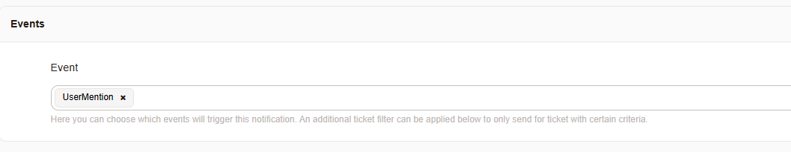
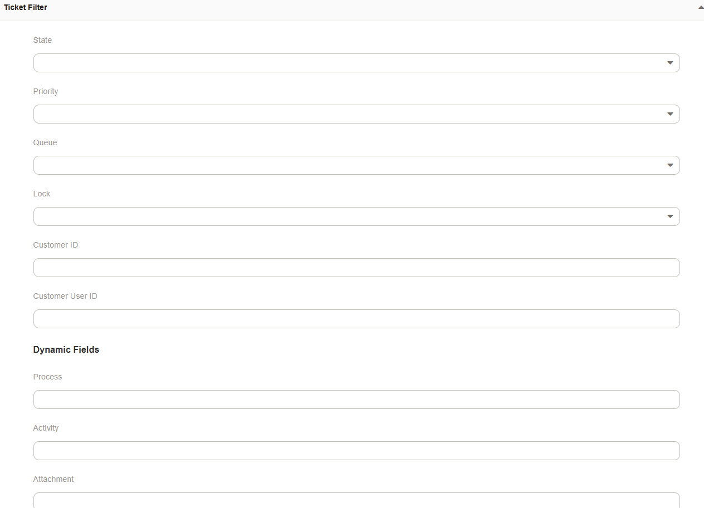
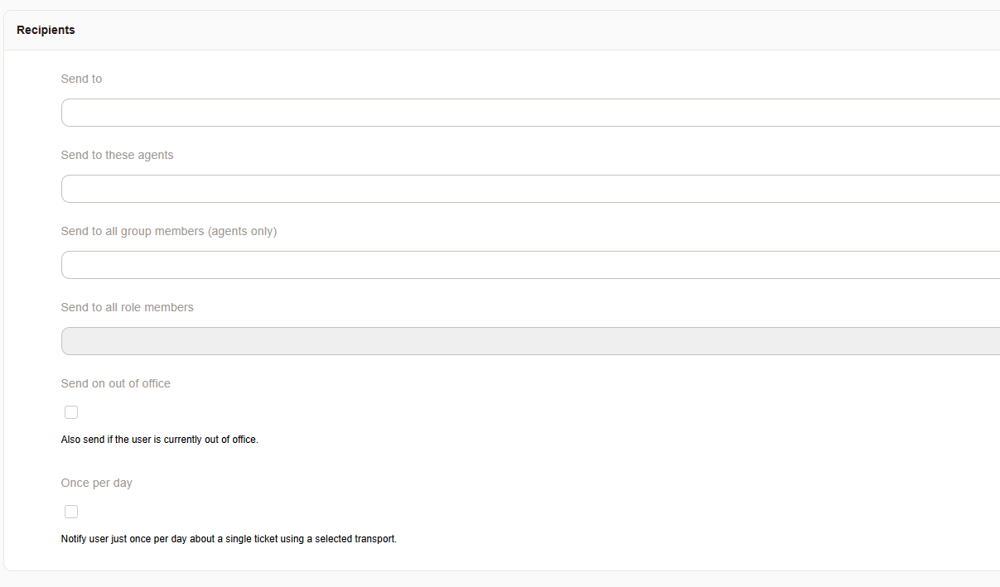
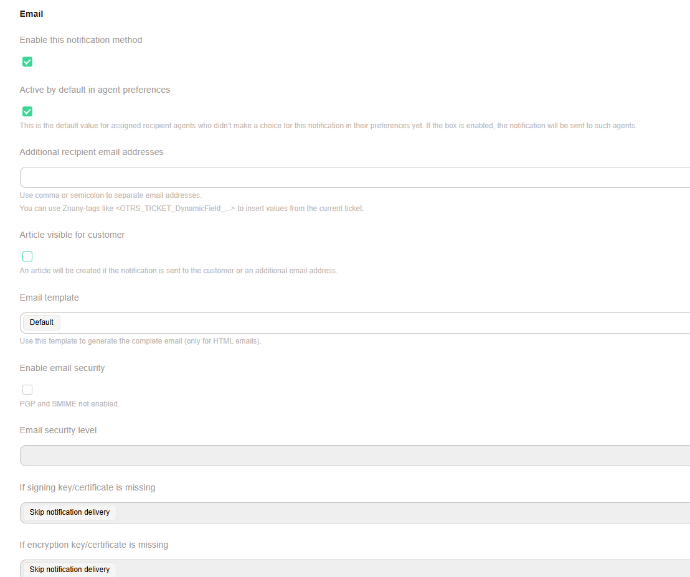
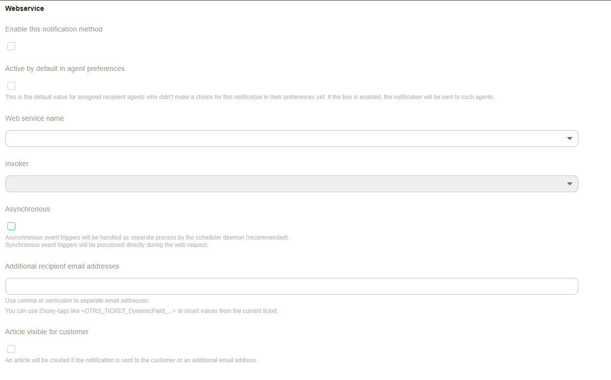
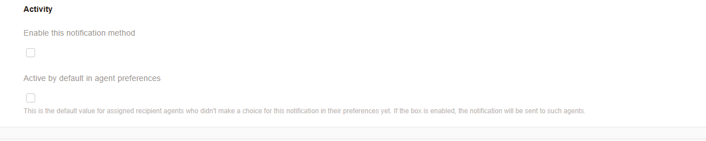
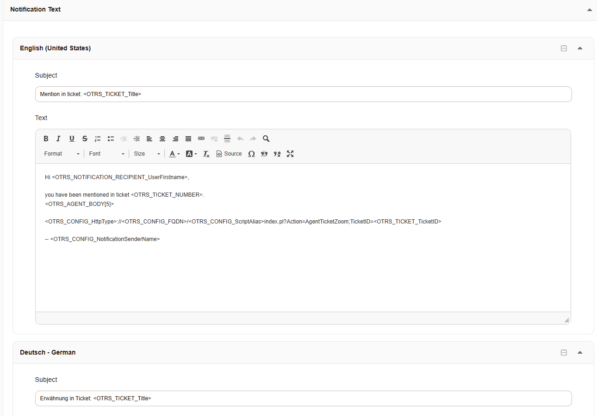
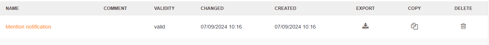
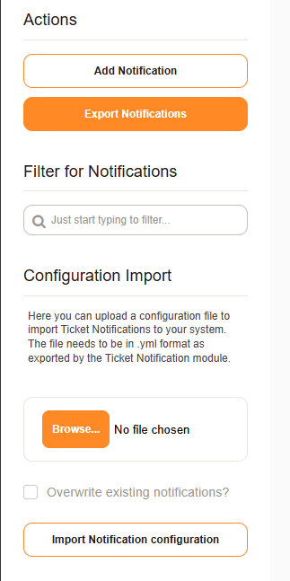

.. _PageNavigation admin_automation_ticket-notification_index:

Ticket Notications
##################

Automatically communicate ticket events to customers, agents, and external users. Each event triggered can pass on valuable information to its recipients. Some notifications are provided by default.

Default notifications
*********************

* Mention notification - Notify users when they have been mentioned in a ticket.
* Ticket create notification - Notify users of newly received tickets in their subscribed queue.
* Ticket email delivery failure notification - Notify a user that an email has not been sent.
* Ticket escalation notification - Notify the users of a ticket that has breached its service window. See :ref:`pagenavigation admin_queues_index` 
* Ticket escalation warning notification - Advance notification of pending service level breach. :ref:`pagenavigation admin_queues_index`
* Ticket follow-up notification (locked) - A notification to the involved agents about a follow-up to a ticket.
* Ticket follow-up notification (unlocked): This is a Notification to all agents with permission to the ticket about following up on an unlocked ticket.
* Ticket lock timeout notification - Notify agents that a ticket has been unlocked. :ref:`pagenavigation admin_queues_index`
* Ticket new note notification - Notification to users about notes added to their tickets.
* Ticket owner update notification - Notify an agent about their assignment to the ticket.
* Ticket pending reminder notification (locked) - A notification to the involved agents that the waiting time has expired.
* Ticket pending reminder notification (unlocked) - A notification to all agents with permission that the waiting time has expired.
* Ticket queue update notification - A notification to users that another team has passed them a ticket.
* Ticket responsible update notification  - Notify an agent about their assignment to the ticket* Ticket service update notification - A notification to users that a ticket has been assigned to their subscribed service.

Adding or Editiing notifications
********************************

The following settings are required when creating or modifying a notification.

Basic Settings
==============

    General Settings   

* Name - The name of the notification.
* Comment - A field for admins to create comments about the usage of this notification.
* Show in agent preferences - Determines if an agent should be able to select this or if it will be required.
* Agent preferences tooltip - This message will be shown on the agent preferences screen as a tooltip for this notification.
* Validity - Here, you can mark the notification as invalid or invalid temporary when making changes to the system.
* Event - List of possible events that can be used to trigger this notification. Read more: :ref:`pagenavigation annexes_event_reference_index_event_reference` 

Filters
=======

    Filter Settings
   
* Ticket Filter - Use ticket attitude to determine if the notification applies to this ticket.
* Article Filter - A filter for the article create an event. Only the article create event will respect these filter items.

Recipients Groups Settings
==========================

    Recipient Settings   

* Send to these agents - Agent recipient groups.
* Send to all group members - Send to a specific group of members.
* Send to all role members - Send to a specific role. The role must have at least read permission on these tickets.
* Send on out of office - If the message should be sent during out-of-office hours for the user.
* Once per day - If the message can be triggered more than once a day, per user, per ticket.

Notification Methods
=====================

**Email**

    Email - Allow the email channel for this notification.

**Webservice**
   

    
    Webservice - Deliver the message via a web service

**Activity**

   Activity - Deliver the message to the agent front-end.

Notification Method Options Mail
^^^^^^^^^^^^^^^^^^^^^^^^^^^^^^^^

* Enable this notification method - Require this email channel for notification.
* Additional recipient email addresses - Additional recipients can also be part of a dynamic field. et.
* Article visible for customer - An article will be created if the notification is sent to the customer or an additional email address.
* Email template - HTML Template for the notification
* Enable email security settings - Only if PGP or SMIME is enabled.

Notification Method Options Webservice
^^^^^^^^^^^^^^^^^^^^^^^^^^^^^^^^^^^^^^

* Web service name - Name for the web service.
* Invoker - Name of the invoker
* Asynchronous - Should the message be sent immediately or scheduled?
* Additional recipient email addresses
* Article visible for the customer

Notification Method Options Activity
^^^^^^^^^^^^^^^^^^^^^^^^^^^^^^^^^^^^

Enable this notification method

Notification Text
=================

   
You can add and modify the text to support languages. When the user language is set, then the appropriate language will be sent, if configured here, with a message. The ``DefaultLanguage`` will be used for users with no preferences. If only one language has configured text, this text will be used.

    Text Settings

Further Help
============

A tag reference list is seen at the bottom of the add/edit screen.

Notifaciton Mangement
=====================

In the table of configured notifications, you will have three distinct options for managing notifications.

    Manage, copy, delete and export notifications.

Actions Menu
============

Create export and filter visible notifications in the actions menu of the notification management screen.

   Actions Area
