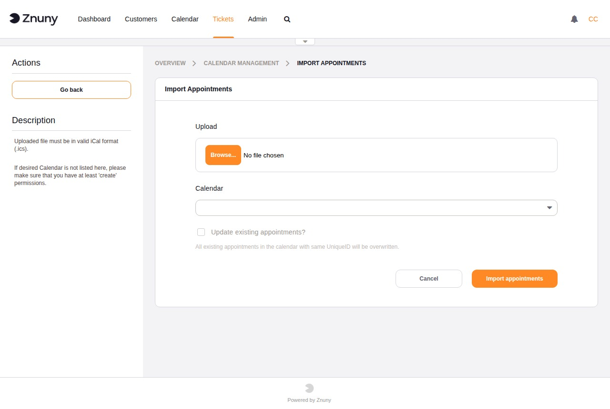

.. meta::
   :description: Import appointments into a Znuny calendar from an iCalendar (.ics) file — select a target calendar and optionally overwrite existing appointments.
   :keywords: znuny import appointments, ical import, ics file, calendar import appointments

.. _PageNavigation admin_calendar_import:

Import Appointments
###################

Use this screen to bulk-import appointments into an existing calendar from
an iCalendar (.ics) file. This is useful for migrating appointments from
an external calendar application or for restoring appointment data.

+--------------------------------+-----------------------------------------------------------+
| Field                          | Description                                               |
+================================+===========================================================+
| Upload                         | Required. Select an .ics file from your local computer.   |
+--------------------------------+-----------------------------------------------------------+
| Calendar                       | Required. The target calendar to import the appointments  |
|                                | into. Only calendars for which you have create permission |
|                                | are listed.                                               |
+--------------------------------+-----------------------------------------------------------+
| Update existing appointments?  | When checked, imported appointments that share a unique   |
|                                | identifier with an existing appointment are overwritten.  |
|                                | When unchecked, existing appointments are left unchanged  |
|                                | and duplicates are skipped.                               |
+--------------------------------+-----------------------------------------------------------+

Click **Import appointments** to begin the import. Click **Cancel** to
return to the calendar overview without importing.

.. note::

   To import a calendar *configuration* (name, colour, group, and ticket
   appointment rules) rather than appointment data, use the
   :doc:`manage` screen.
