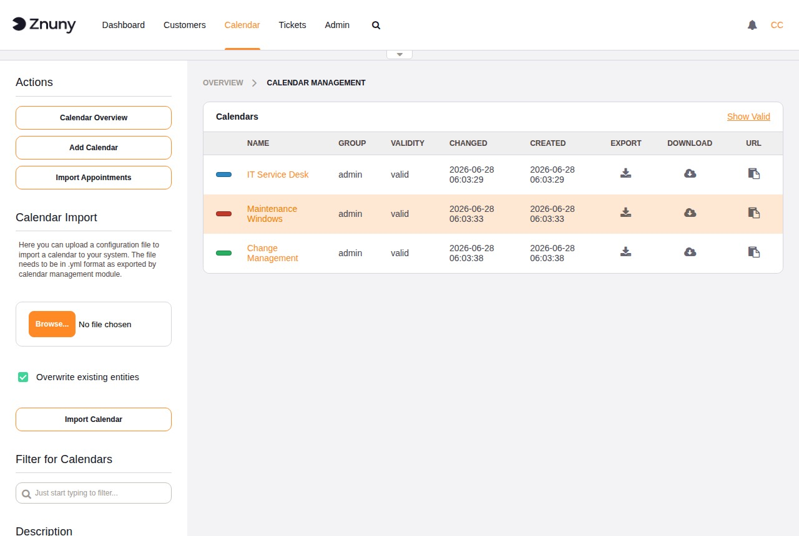
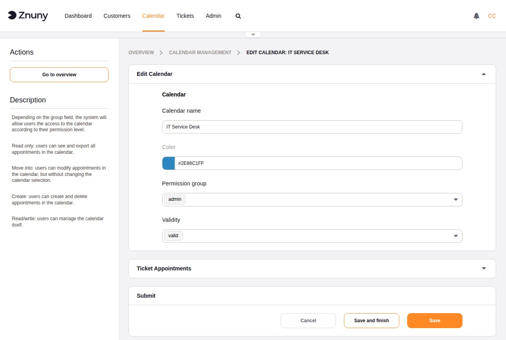
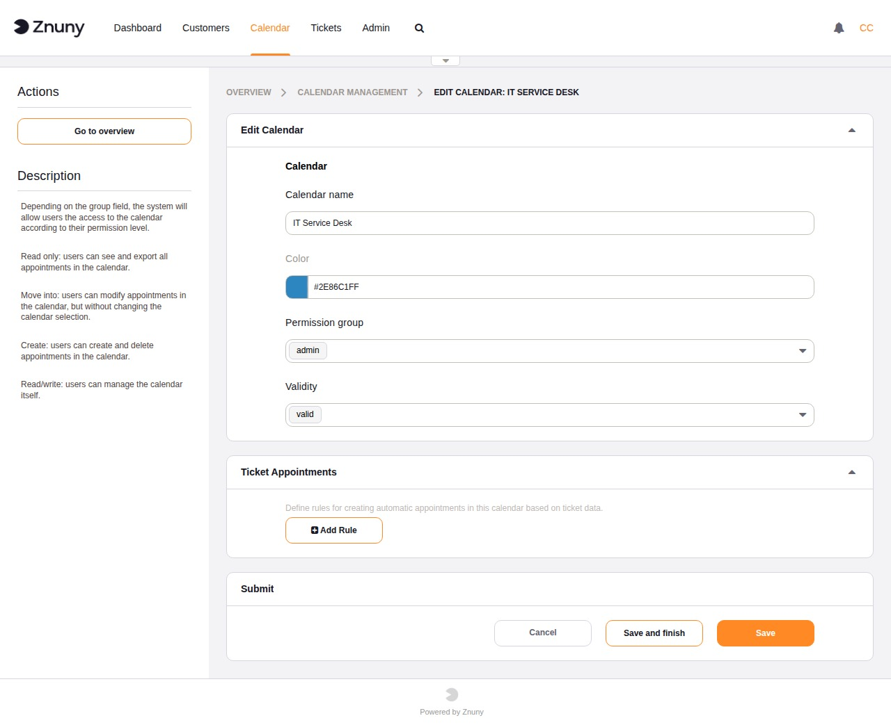

.. meta::
   :description: Create and manage Znuny calendars — configure names, colours, permission groups, validity, and ticket appointment rules that automatically link appointments to tickets.
   :keywords: znuny calendar, add calendar, calendar colour, permission group, ticket appointments, calendar import, calendar export, yaml

.. _PageNavigation admin_calendar_manage:

Managing Calendars
##################

The Calendar Management screen lists all configured calendars with their
name, colour, permission group, validity, and available row actions. Use
the **Add Calendar** button in the sidebar to create a new calendar, or
the **Import Calendar** button to upload a previously exported YAML file.

Creating and Editing a Calendar
*********************************

The calendar edit form contains two sections: general settings and ticket
appointment rules.

General Settings
================

+--------------------+---------------------------------------------------------------------+
| Field              | Description                                                         |
+====================+=====================================================================+
| Calendar name      | Required. Display name shown in all calendar views and agent        |
|                    | screens.                                                            |
+--------------------+---------------------------------------------------------------------+
| Color              | Required. Pick from the colour palette. Used to visually            |
|                    | distinguish this calendar from others in the agent interface.       |
+--------------------+---------------------------------------------------------------------+
| Permission group   | Required. Only members of this group can view and create            |
|                    | appointments in this calendar.                                      |
+--------------------+---------------------------------------------------------------------+
| Validity           | Controls whether the calendar is available in the agent interface.  |
+--------------------+---------------------------------------------------------------------+

Buttons: **Save and finish** saves and returns to the overview. **Save**
saves without navigating away. **Cancel** discards all unsaved changes.

Ticket Appointments
===================

Ticket appointment rules automatically synchronise appointment data with
tickets. When an appointment in this calendar matches a rule, the rule
writes the appointment start and end dates back to the linked ticket (or
creates a new appointment when the ticket is updated).

Each rule is independent. A calendar can have multiple rules targeting
different queues or date field combinations.

+--------------------+---------------------------------------------------------------------+
| Field              | Description                                                         |
+====================+=====================================================================+
| Queues             | Required. The rule applies only to tickets in these queues.         |
+--------------------+---------------------------------------------------------------------+
| Start date         | Required. Which ticket field provides the appointment start time.   |
+--------------------+---------------------------------------------------------------------+
| End date           | Required. Which ticket field provides the appointment end time, or  |
|                    | a relative duration from the start.                                 |
+--------------------+---------------------------------------------------------------------+
| Search attributes  | Optional. Additional ticket attribute filters (such as ticket type, |
|                    | owner, or a dynamic field value) that further narrow which tickets  |
|                    | this rule applies to.                                               |
+--------------------+---------------------------------------------------------------------+

Click **Add Rule** to add a new rule row. Click **Remove** on a rule row
to delete it. Rules take effect after saving the calendar.

Importing and Exporting Calendar Configurations
*************************************************

Calendar configurations can be transferred between Znuny instances using
YAML files.

- **Export calendar** (row icon in the overview) — downloads a YAML file
  containing the calendar configuration. This file captures the name,
  colour, group, validity, and ticket appointment rules.
- **Import Calendar** (sidebar button) — uploads a YAML file produced by
  an export. When the **Overwrite existing entities?** checkbox is
  checked, an imported calendar with the same name replaces the existing
  one. When unchecked, the existing calendar is left unchanged and the
  import is skipped for that entry.

.. note::

   Export and import operate on calendar *configuration*, not on
   appointment data. To import appointments from an iCal file, use the
   :doc:`import` screen.
