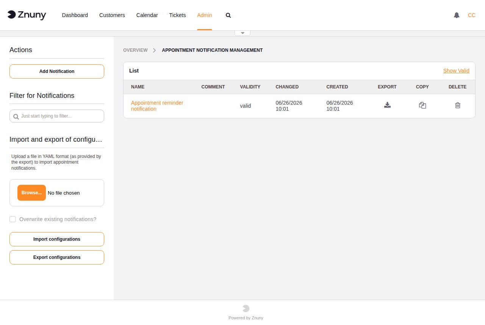
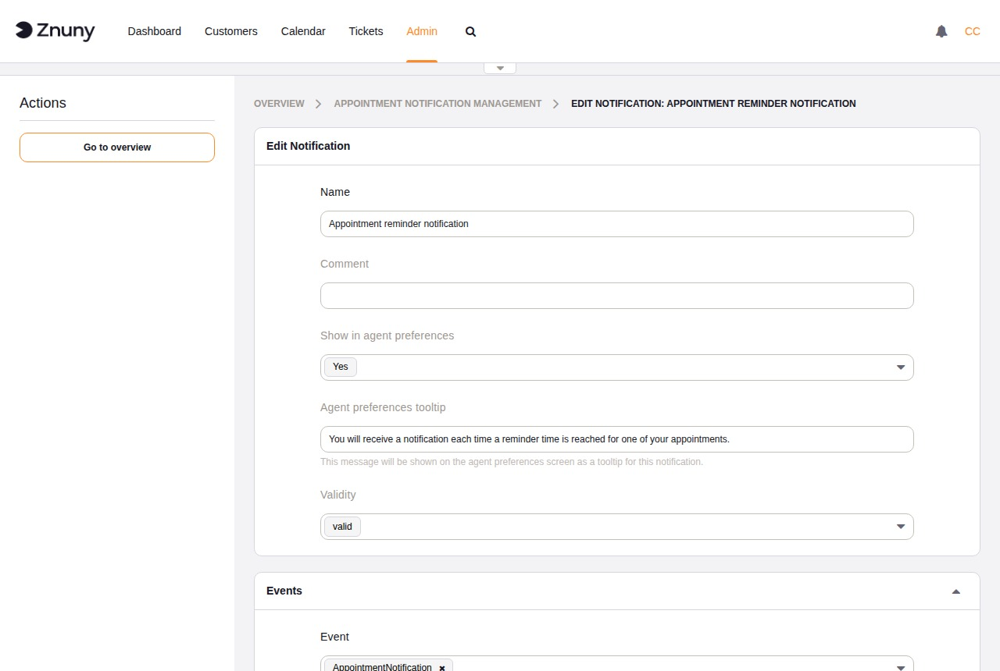
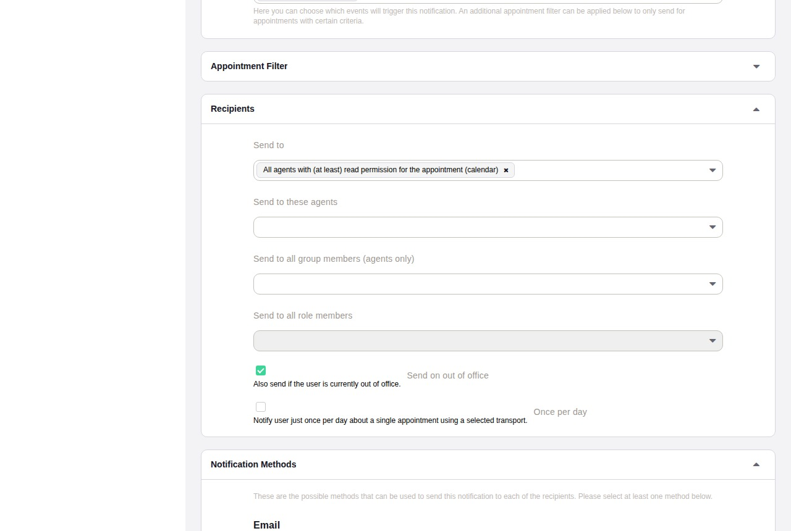
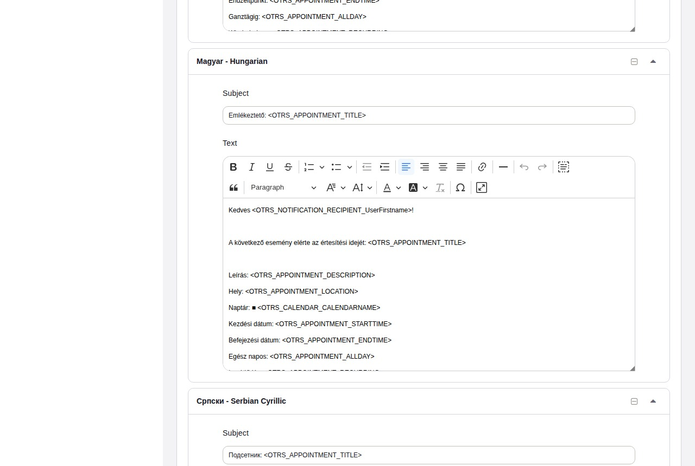

.. meta::
   :description: Configure Znuny appointment notification events — set recipients, transport methods, appointment filters, and multi-language notification text for calendar events.
   :keywords: znuny appointment notifications, calendar notification, appointment event, notification recipients, notification transport, calendar alert

.. _PageNavigation admin_calendar_notifications:

Appointment Notifications
#########################

Appointment notification events define when and how agents are alerted
about calendar activity — for example, when an appointment is created,
updated, or about to start. Each notification event combines an event
trigger, optional appointment filters, a recipient list, one or more
transport methods, and per-language message templates.

The overview lists all configured notification events with their name,
validity, and row actions. Use the **Add Notification** button in the
sidebar to create a new event, **Export configurations** to download all
notifications as a YAML file, or **Import configurations** to upload a
previously exported file.

Creating and Editing a Notification
*************************************

Basic Settings
==============

+-------------------------------------+---------------------------------------------------------+
| Field                               | Description                                             |
+=====================================+=========================================================+
| Name                                | Required. Unique name for this notification event.      |
+-------------------------------------+---------------------------------------------------------+
| Comment                             | Optional. Short internal note.                          |
+-------------------------------------+---------------------------------------------------------+
| Show in agent preferences           | When enabled, agents can activate or deactivate this    |
|                                     | notification in their personal preferences.             |
+-------------------------------------+---------------------------------------------------------+
| Agent preferences tooltip           | Optional hint text shown to agents in their preference  |
|                                     | screen to explain what this notification does.          |
+-------------------------------------+---------------------------------------------------------+
| Validity                            | Controls whether the notification event is active.      |
+-------------------------------------+---------------------------------------------------------+
| Event                               | Required. One or more events that trigger this          |
|                                     | notification. See the event reference below.            |
+-------------------------------------+---------------------------------------------------------+

The following events are available:

+-------------------------------+---------------------------------------------------------------+
| Event                         | Fires when …                                                  |
+===============================+===============================================================+
| CalendarCreate                | A new calendar is created.                                    |
+-------------------------------+---------------------------------------------------------------+
| CalendarUpdate                | An existing calendar's settings are changed.                  |
+-------------------------------+---------------------------------------------------------------+
| AppointmentCreate             | A new appointment is created in any calendar.                 |
+-------------------------------+---------------------------------------------------------------+
| AppointmentUpdate             | An existing appointment is modified (title, time,             |
|                               | description, or any other field).                             |
+-------------------------------+---------------------------------------------------------------+
| AppointmentDelete             | An appointment is deleted.                                    |
+-------------------------------+---------------------------------------------------------------+
| AppointmentNotification       | An appointment reaches its configured reminder time. This     |
|                               | event is triggered by the Znuny daemon on a schedule, not     |
|                               | by user interaction.                                          |
+-------------------------------+---------------------------------------------------------------+

Multiple events can be selected for a single notification rule. A notification with the
*Appointment Filter* set will only fire when the matching appointment or calendar also
satisfies those filter conditions.

Appointment Filter
==================

All filter fields are optional. When set, the notification fires only
when the appointment matches every configured filter.

+------------+-----------------------------------------------------------------+
| Filter     | Description                                                     |
+============+=================================================================+
| Calendar   | Limit to appointments in a specific calendar.                   |
+------------+-----------------------------------------------------------------+
| Title      | Match on the appointment title.                                 |
+------------+-----------------------------------------------------------------+
| Location   | Match on the appointment location.                              |
+------------+-----------------------------------------------------------------+
| Team       | Match on the assigned team (requires the Team module).          |
+------------+-----------------------------------------------------------------+
| Resource   | Match on the assigned resource.                                 |
+------------+-----------------------------------------------------------------+

Recipients
==========

+-----------------------------------+-------------------------------------------------------+
| Field                             | Description                                           |
+===================================+=======================================================+
| Send to                           | Predefined recipient groups such as the appointment   |
|                                   | creator or all agents with calendar access.           |
+-----------------------------------+-------------------------------------------------------+
| Send to these agents              | One or more specific agents.                          |
+-----------------------------------+-------------------------------------------------------+
| Send to all group members         | All agents who are members of the selected groups.    |
+-----------------------------------+-------------------------------------------------------+
| Send to all role members          | All agents who hold the selected roles.               |
+-----------------------------------+-------------------------------------------------------+
| Send on out of office             | When enabled, agents who have an active out-of-office |
|                                   | setting still receive the notification.               |
+-----------------------------------+-------------------------------------------------------+
| Once per day                      | When enabled, at most one notification per appointment|
|                                   | per day is sent through each transport.               |
+-----------------------------------+-------------------------------------------------------+
| Additional email address          | Free-text email address to include as a recipient.    |
+-----------------------------------+-------------------------------------------------------+

Notification Methods
====================

Each available transport (for example, Email) appears as a separate block.
Each block has an **Enable this notification method** checkbox and an
**Active by default in agent preferences** checkbox that controls whether
the transport is pre-selected when agents view this notification in their
preferences.

Notification Text
=================

Add one message template per language. Each template requires:

- **Subject** — the notification subject line.
- **Text** — the notification body, which supports rich-text formatting
  and smart tags (for example, ``<ZNUNY_APPOINTMENT_TITLE>``).

Click **Add new notification language** to add a template in another
language. Click **Remove Notification Language** to delete an existing
language block.

Copying and Deleting Notifications
************************************

- **Copy** (row icon) — creates a duplicate notification with a
  compounding suffix (``<name> (copy) 1``, then
  ``<name> (copy) 1 (copy) 2``). To avoid chained suffixes, always copy
  from the original notification.
- **Delete** (row icon) — removes the notification immediately. Unlike
  ACLs, notifications do not need to be set to *Invalid* before they can
  be deleted.
