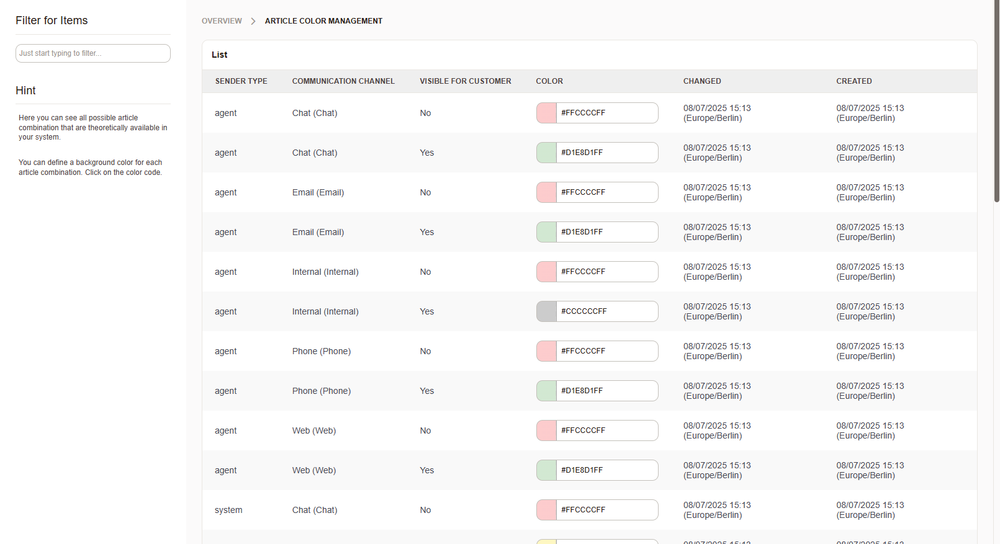
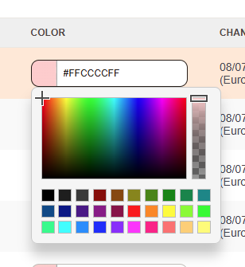

.. meta::
   :description: Assign colors to Znuny article channels and sender types — quickly distinguish email, phone and chat articles in the ticket zoom communication table.
   :keywords: article colors, znuny colors, article channel, sender type, ticket zoom, communication color, visual differentiation

Manage Article Colors
#####################

Each communication is an article that can be assigned a specific color. This feature is particularly useful for quickly identifying the type of communication, such as an email, phone call, or chat message and it's sender type in the :ref:`zoom_communication_table` of the ticket details screen.

.. important:: 

    It is not possible to add or modify the channels or sender types. These are hard coded. You may only change the colors assigned to each channel and sender type and visibility combination.

   Overview of the article colors.

To edit a color, click on the color box. A color picker will appear allowing you to select a new color. 

   The color chooser dialog.

   
Once you have chosen a color, the changes are saved automatically.
