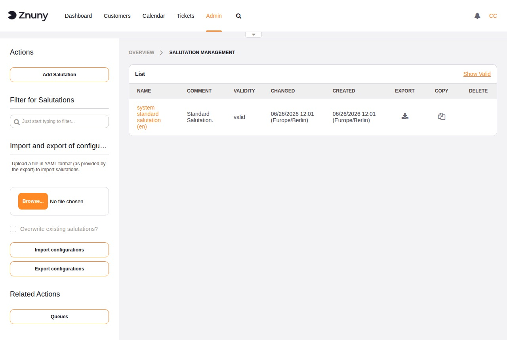
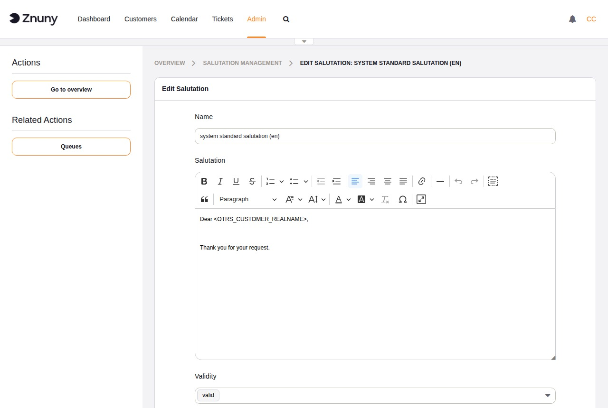

.. meta::
   :description: Manage Znuny salutations — create reusable HTML opening lines for answer templates, assigned to queues for consistent outbound replies.
   :keywords: znuny salutations, email salutation, queue salutation, answer template, greeting, opening line

.. _PageNavigation admin_communication_salutations_index:

Salutations
###########

A salutation is the opening line prepended to answer templates. Like
:ref:`signatures <PageNavigation admin_communication_signature>`, salutations
are assigned per queue and applied automatically when an agent selects an
answer template.

The overview lists all salutations with their name, comment, validity, and
the dates they were last changed or created. The sidebar provides buttons to
add a salutation, import and export configurations as YAML, and a shortcut
to **Queues** for assignment.

Creating and Editing a Salutation
***********************************

+------------+-------------------------------------------------------------------+
| Field      | Description                                                       |
+============+===================================================================+
| Name       | Required. Internal identifier shown in the overview and in queue  |
|            | settings.                                                         |
+------------+-------------------------------------------------------------------+
| Salutation | Required. The salutation text, fully HTML-capable via the         |
|            | built-in rich text editor. Placeholders for ticket and customer   |
|            | data can be used here.                                            |
+------------+-------------------------------------------------------------------+
| Validity   | Required. Set to *Invalid* to disable this salutation without     |
|            | deleting it.                                                      |
+------------+-------------------------------------------------------------------+
| Comment    | Optional. Internal note about the purpose of this salutation.     |
+------------+-------------------------------------------------------------------+

Buttons: **Save and finish** returns to the overview. **Save** saves
without navigating away. **Cancel** discards unsaved changes.

.. seealso::

   :ref:`pagenavigation annexes_placeholders_index` for a full list of
   placeholders available in salutation text.

Assigning a Salutation to a Queue
***********************************

Salutations take effect through the queue they are assigned to. Navigate to
**Admin → Queues**, open the queue, and select the salutation from the
**Salutation** dropdown.

.. seealso::

   :ref:`pagenavigation admin_queues_index`
