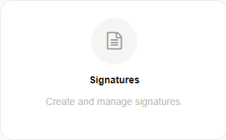
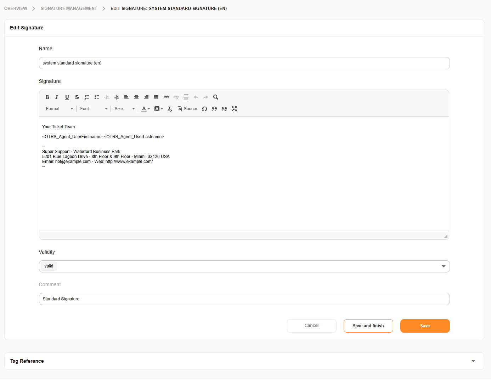
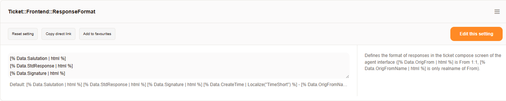

.. _PageNavigation admin_communication_signature:

Team Signatures
###############


    
   Signature Administration


Signatures are added to the 
:ref:`answer templates <pagenavigation admin_communication_templates_index>` by default
and are assigned via the :ref:`queue settings <pagenavigation admin_queues_index>`. 
You may add signatures by navigating to Admin > Signatures.

All signatures are fully HTML capable using the CKEditor. Images, can also be added per 
drag and drop or copy paste from the clipboard.


    
   Edit Signature

Review our :ref:`pagenavigation annexes_placeholders_index` annex for more information 
about useable tags. 

.. note::

    Signatures sizes are limited based on the used database. Images can quickly overrun
    the allowed size for the signature text. Consider an ```` element instead.

How and if the signatures are used during response creation is dictated by 
``Ticket::Frontend::ResponseFormat``. 

See :ref:`pagenavigation admin_index_systemconfiguration` 



   System Configuration Edit Screen

.. seealso:: 

	:ref:`pagenavigation annexes_entity_management_index` for more information on how to manage entities. There is also information about import and export of entities.