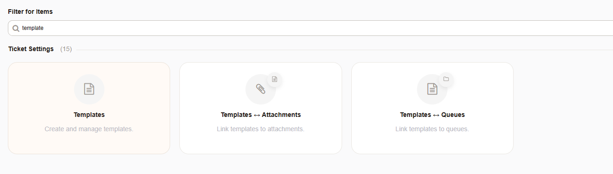
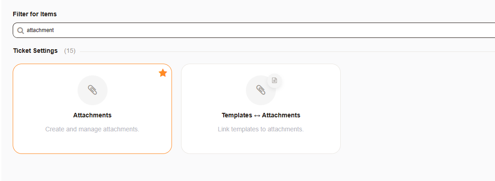
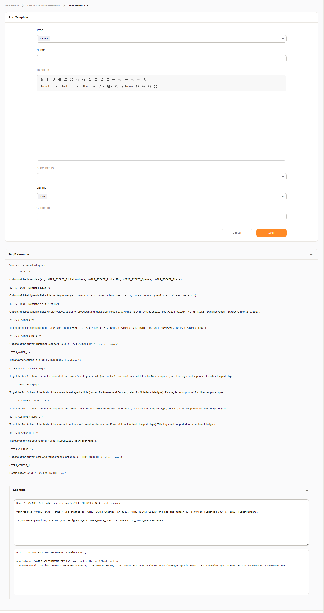
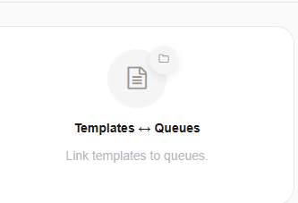
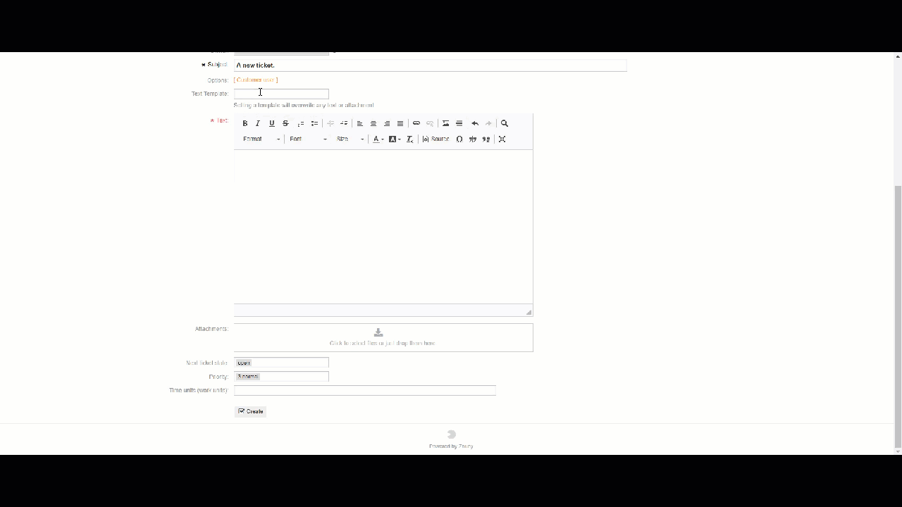

Communication Templates
#######################
.. _PageNavigation admin_communication_templates_index:

The following admin modules are available for managing templates, template queue relations, attachments, and template attachment relations.

Manage Templates

Manage Attachments

Template Types
***************

Answer
    This template will be offered for use within when answering a ticket (AgentTicketCompose).
Create
    This template will be offered for use within when creating an ticket (AgentTicketEmail, AgentTicketPhone).
Email
    This template will be offered for use within when creating an outbound e-mail (AgentTicketEmailOutbound).
Forward
    This template will be offered for use within when forwarding a e-mail.(AgentTicketForward)
Note
    This template will be offered for use within when adding a note (AgentTicketNote, or wherever an article is present in screens not previously listed.)
Phone call
    This template will be offered for use within when documenting a call. (AgentTicketPhoneOutbound, AgentTicketPhoneInbound)
Process Management
    This template will be offered for use within all process activity dialogs, regardless of queue.
Snippet
    This template will be offered for use in all dialogs.

.. versionadded:: 6.4

    Template type:
    * Process Management
    * Snippet

Add/Edit A Template
*******************

After creating a new template, do not forget to assign this template to a queue for selection.

Assigning A Template
====================
.. _PageNavigation admin_communication_templates_assign_template:

Navigate to this administration module to managed relationships between templates and queues.

.. seealso::

    :ref:`Entity Management <PageNavigation annexes_entity_management_index>`

Selecting A Template
*********************

Selecting a template is done in the same fashion in every part of the system. the templates that are available are displayed in the drop down below the subject.

Choosing a template applies the body and attachments immediately. A warning appears to the user prior to prevent overwriting attachments or text. Deselecting all templates removes text and attachments.

.. note::

    ACLs cannot be used to limit the list of available templates.

Snippets
********

A snippet is used in any mask where HTML is enabled and the ticket is in the queue defined in :ref:`template assignment <PageNavigation admin_communication_templates_assign_template>`.

.. note::

    It's not possible to add attachments to a ticket via a snippet. Even though the interface does allow this.

.. seealso::

    Snippet Use in our :ref:`common features <PageNavigation ticketviews_agentticketactioncommon_snippet>` section

Using <OTRS_*> tags is also possible. A limited amount of tags is available in the ticket create screens.