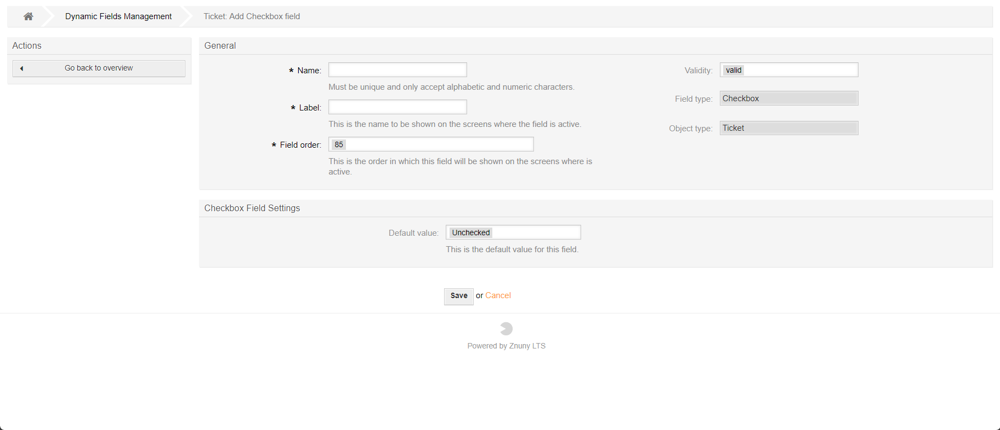

.. meta::
   :description: Configure a checkbox dynamic field in Znuny — let agents and customers toggle a boolean flag directly within ticket, article or customer screens.
   :keywords: znuny checkbox field, dynamic field checkbox, boolean field, ticket checkbox, boolean dynamic field, toggle field

Checkbox
########

Configuring a type of checkbox will allow the user to fill out a checkmark in screen.

    Add a checkbox.
