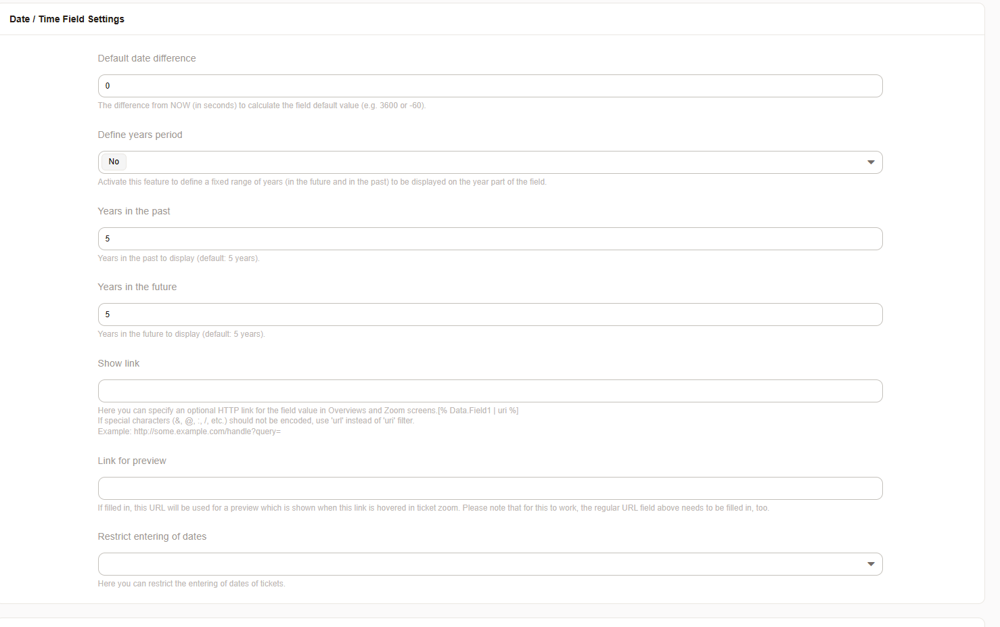

Date/Time
#########

Configuring a type of date/time will allow the user to input a date and a time (hours/minutes) within this field.

    Add a date time field.   

.. tip::

   Use the system configuration **TimeInputMinutesStep** to configure the steps in the selection of the minutes.

