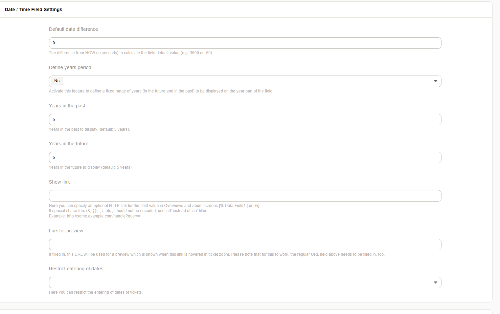

.. meta::
   :description: Configure a date/time dynamic field in Znuny — let users pick a calendar date plus hours and minutes, with the TimeInputMinutesStep option for granularity.
   :keywords: znuny date time field, dynamic field datetime, ticket datetime, timestamp field, calendar time picker, time input minutes step

Date/Time
#########

Configuring a type of date/time will allow the user to input a date and a time (hours/minutes) within this field.

    Add a date time field.   

.. tip::

   Use the system configuration **TimeInputMinutesStep** to configure the steps in the selection of the minutes.

