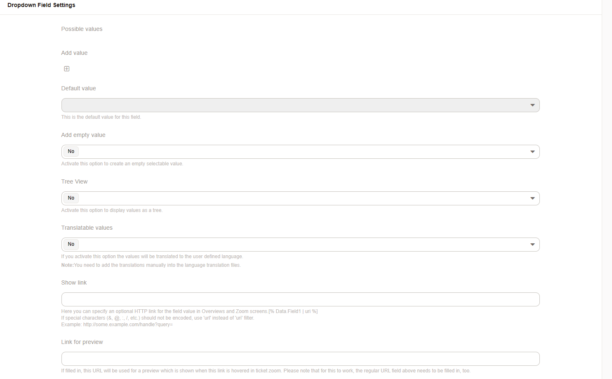

Dropdown
########

Configuring a type of dropdown will allow the user to select one option from a preconfigured set of options.

    Add a dropdown field.

- **Tree View**: displays values as a expandable tree. 

.. note:: 

    To create a tree stucture the keys must look like this:

    .. code-block::

        Level1
        Level1::Sublevel1
        Level1::Sublevel2
