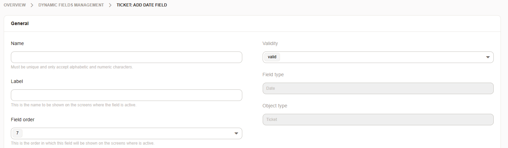

.. _PageNavigation admin_dynamicfields_index:

Extend Ticket Data (Dynamic Fields)
###################################

Dynamic fields extend the capability to collect additional data within your tickets. Dynamic fields can be connected to not just tickets, but any objects within the system. Each dynamic field has, in addtion to it's object, a specific type and a specific configuration.

.. note::

   Installing add-ons may also introduce additional types or objects with them.

Each field has it's own set of configuaration options. It starts with the basic options, for each field. 

   Dynamic Field General Settings

   

These are similar and contain the following options.

Dynamic Field Objects
*********************

Ticket
   These can be used with ticket objects and is the default choice for most cases.
Article
   These are attached to individual articles. Currently, they cannot be used for searching or statistics.
Customer
   These can be attached to customer objects. It requires a mapping within ``Kernel/Config.pm``
Customer User
   These can be attached to customer user objects. It requires a mapping within ``Kernel/Config.pm``

Dynamic Field Types
*******************

Checkbox
Date
Date/Time
Dropdown 
Multiselect
TextArea 
Web service (Dropdown)
Web service (Multiselect)

.. toctree::
   :maxdepth: 2

   webservice
   checkbox
   date
   date_time
   dropdown
   multiselect
   text_area
   text
   
Configuring Screens
*******************

We've taken the guesswork out of finding the correct system configuration in order to configure the dynamic fields to be used within screens. Using the following module, you will be able to configure the viewable fields for overviews and screens per drag and drop.

.. note::

   This only applies to fields which belong to the ticket object.

.. toctree::
   :maxdepth: 2

   screens
 
