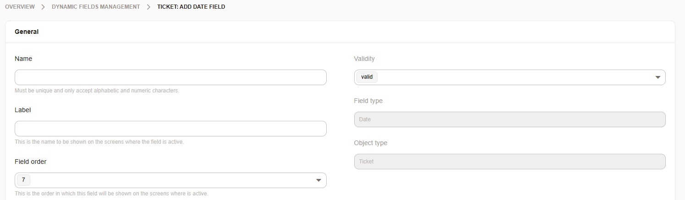

.. _PageNavigation admin_dynamicfields_index:

Extend Ticket Data (Dynamic Fields)
###################################

Dynamic fields extend the capability to collect additional data within your tickets. Dynamic fields can be connected to not just tickets, but any objects within the system. Each dynamic field has, in addition to its object, a specific type and a specific configuration.

.. note::

   Installing add-ons may also introduce additional types or objects with them.

Each field has its own set of configuration options. It starts with the basic options, for each field. 

   Dynamic Field General Settings

These are similar and contain the following options.

Dynamic Field Objects
*********************

Ticket
   These can be used with ticket objects and is the default choice for most cases.
Article
   These are attached to individual articles. Currently, they cannot be used for searching or statistics.
Customer
   These can be attached to customer objects. It requires a mapping within ``Kernel/Config.pm``
Customer User
   These can be attached to customer user objects. It requires a mapping within ``Kernel/Config.pm``

Dynamic Field General Options
*****************************

Depending on the field type, you will have the following options.

+--------------------------+----------------------------------------------------------+--------------+
| Option                   | Description                                              | Field Type   |
+==========================+==========================================================+==============+
| Name                     | Machine readable name used in configuration system wide. | All          |
+--------------------------+----------------------------------------------------------+--------------+
| Label                    | Human readable and translatable name.                    | All          |
+--------------------------+----------------------------------------------------------+--------------+
| Default Value            | The value shown if no value has been set.                | All          |
+--------------------------+----------------------------------------------------------+--------------+
|| Possible Values         || A key => value pair for selectable Values               || Dropdown    |
||                         ||                                                         || Multiselect |
+--------------------------+----------------------------------------------------------+--------------+
|| Show Link               || A link to jump to an external URI.                      || Dropdown    |
||                         ||                                                         || Date        |
||                         ||                                                         || DateTime    |
||                         ||                                                         || Text        |
+--------------------------+----------------------------------------------------------+--------------+
|| Preview Link            || A link to preview a resource in a hover over window.    || Dropdown    |
||                         ||                                                         || Date        |
||                         ||                                                         || DateTime    |
||                         ||                                                         || Text        |
+--------------------------+----------------------------------------------------------+--------------+
|| Check RegEx             || Regular Expression to validate input                    || Text        |
||                         ||                                                         || TextArea    |
+--------------------------+----------------------------------------------------------+--------------+
|| Default Date Difference || Difference in seconds from now                          || Date        |
||                         ||                                                         || DateTime    |
+--------------------------+----------------------------------------------------------+--------------+
|| Years in the past       || Limit the number of past years allowed                  || Date        |
||                         ||                                                         || DateTime    |
+--------------------------+----------------------------------------------------------+--------------+
|| Years in the future     || Limit the number of future years allowed                || Date        |
||                         ||                                                         || DateTime    |
+--------------------------+----------------------------------------------------------+--------------+
|| Restrict dates          || Restrict input of future or past dates                  || Date        |
||                         ||                                                         || DateTime    |
+--------------------------+----------------------------------------------------------+--------------+
| Number of rows           | Number of rows shown (Height)                            | TextArea     |
+--------------------------+----------------------------------------------------------+--------------+
| Number of columns        | Number of columns shown (Width)                          | TextArea     |
+--------------------------+----------------------------------------------------------+--------------+

Descriptions are in the add/edit forms as seen in the screens below.

Dynamic Field Types
*******************

.. toctree::
   :maxdepth: 2

   webservice
   checkbox
   date
   date_time
   dropdown
   multiselect
   text_area
   text
   
Configuring Screens
*******************

We've taken the guesswork out of finding the correct system configuration in order to configure the dynamic fields to be used within screens. Using the following module, you will be able to configure the viewable fields for overviews and screens per drag and drop.

.. note::

   This only applies to fields which belong to the ticket object.

.. toctree::
   :maxdepth: 2

   screens
 
