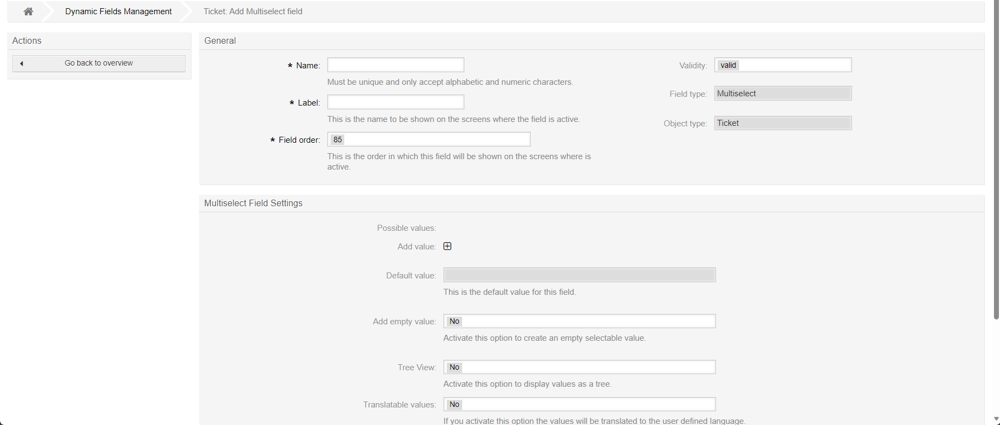

Multiselect
###########

Configuring a type of multiselect, similar to the dropdown, will allow the user to select multiple options from preconfigured set of options.

    Add a multiselect field

- **Tree View**: displays values as a expandable tree. 

.. note:: 

    To create a tree stucture the keys should look like this:
    .. code-block::

        Level1
        Level1::Sublevel1
        Level1::Sublevel2
