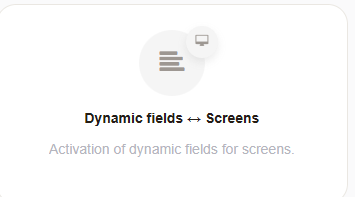
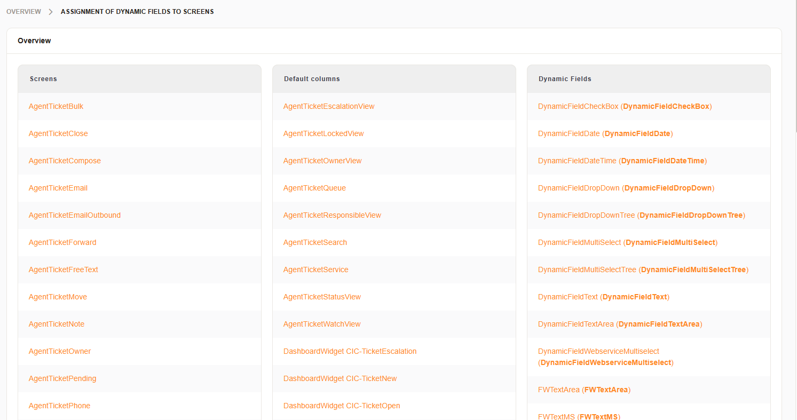
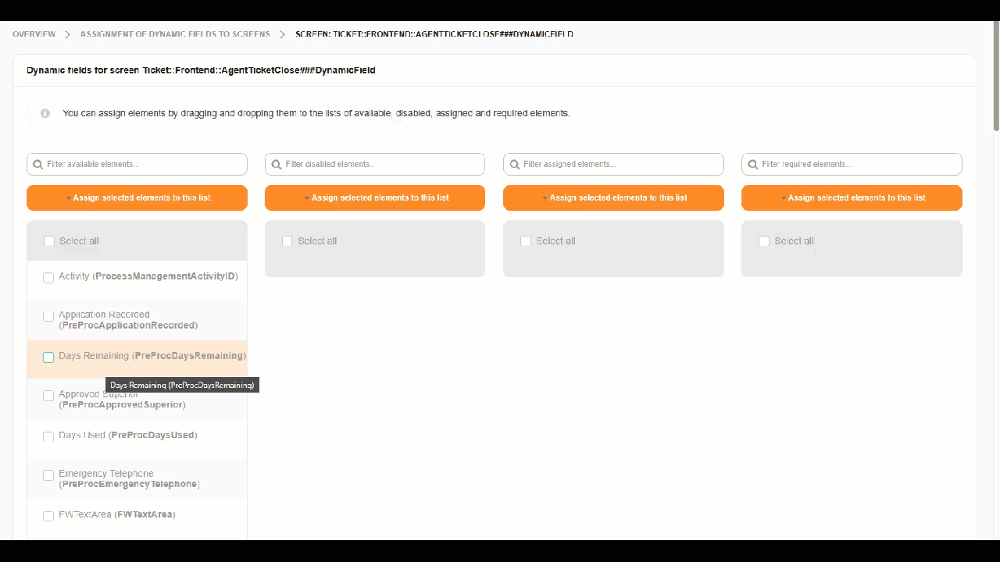
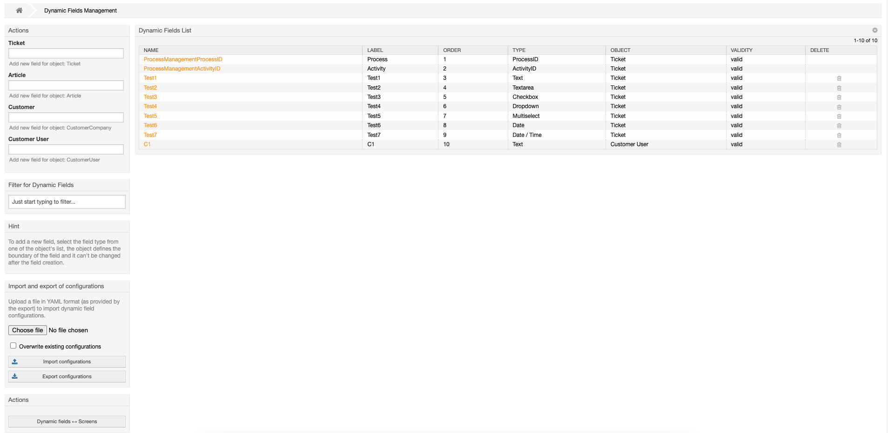
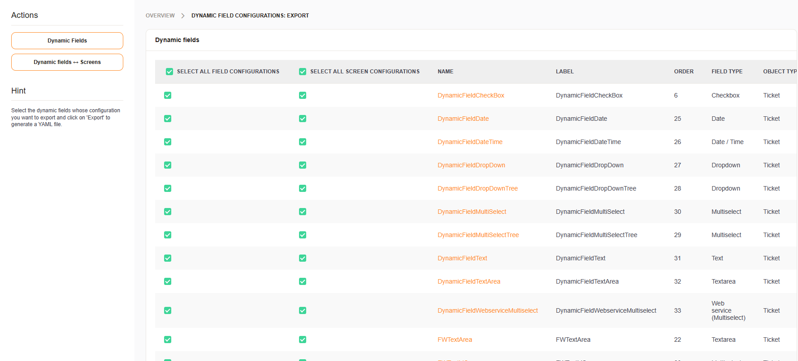

****************************
Dynamic Field Screens
****************************

.. versionadded:: 6.1 This feature is available as a public add-on for Znuny LTS 6.0

Dynamic Field screens is a GUI to assign Dynamic Fields to specific views.
With the embedded import/export functions, it makes staging between different environments much easier.

This module can be found in the admin area:

After you select it, an overview is shown with a list of available:

- Views
- Overviews
- Dashboards

  

There are two ways to assign Dynamic Fields to views:

- By View / Overview
- By Field

Select / De-Select elements
********************************************

If you select a field you get a list of available views and three additional columns:

- Disabled
- Active
- Active and required
  

This includes overviews, dashboard widgets and regular views. 

You can assign a field to one or multiple views:

1) Select one or more views and tick the checkbox
2) Click "Assign selected elements to this list" on the matching column 
3) Save

**OR**

1) Use drag and drop and move one view to the desired colmun
2) Save

Import / Export
********************************************

The import / export feature is available on the left menu, in the overview of Dynamic Fields.

You can select on or multiple fields + their currently assigned views for the export. 

As a result you get a YAML file as download, which then can be imported on other 
instances. 

