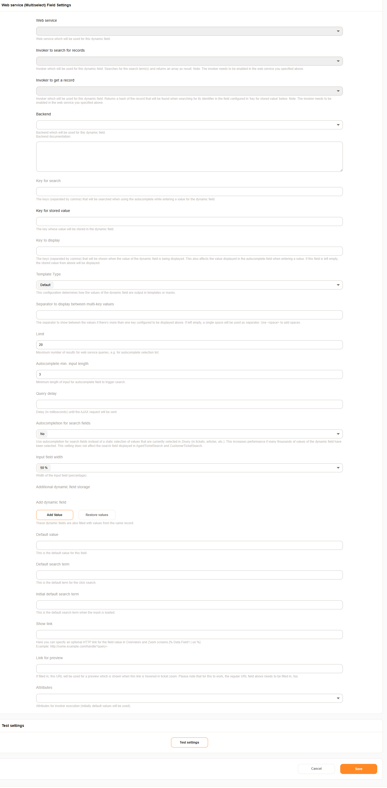

Type Web service
################

This dynamic field allows to retrieve information from web services. **Webservice (Text)** is used to store a single value, **Webservice (Multiselect)**  allows to select and save multiple values from the result of the web service.

Requirements
************

You need a web service with two different invoker: one handles the request for searching and the other retrieves the data for a specific entry. Using the invoker Generic::Tunnel  is sufficient.

The data passed to the web service looks like this:

.. code-block:: JSON

    {
        "SearchTerms": "question",
        "UserID": "1"
    }

..

`SearchTerms` contains the search entered by the user when the search invoker is called. When the get invoker is called it's the stored identifier of the record which should be retrieved.
`UserID` is the the ID of the agent or the login if the customer user.

Use the outbound mapping to transform this data to match the externals systems requirements.

The data which is returned from the external system might need to be transformed in on of the following structures. We recommend ResponseValues since it's more flexible. 

**ResponseValues**: Returns an information about the response and an array with objects.

.. code-block:: json
	:caption: Response example

	{
	    "response": {
	        "returncode": "200",
	        "returnmessage": "Success"
	    },
	    "values": [
	        {
	            "ID": "1",
	            "Name": "John",
	            "City": "Berlin"
	        },
	        {
	            "ID": "2",
	            "Name": "Jane",
	            "City": "Coronado"
	        }
	    ]
	}

..

**DirectRequest**: Return a simple key/value structure.

.. code-block:: json
	:caption: Response example

	[
    	{
    	    "Key": "1",
    	    "Value": "John"
    	},
    	{
    	    "Key": "2",
    	    "Value": "Jane"
    	},
	]

..

Configuration
*************

Select the web service, both invoker and the backend to the values which matches your preparations described in the previous block.

- **Key for search** : the keys to search in, only used in the frontend, this has not affect on the web service.
- **Key for stored value**: the key which is stored to retriev entries later with the get invoker. Usually some id.

.. note:: If the get invoker is not able to retrieve data this value is displayed. You might use the function Additional dynamic field storage to have a persistent display value available.

- **Key to display**: Which key(s) should be displayed.

- **Template Type**: Only for Multiselect available. This setting defines how multiple values are separated. Available are **Default** comma separated, **Separator** one or more characters can be defined as separator, **Word Wrap** creates line breaks and **List** displays a list.

- **Separator to display between multi-key values**: Belongs to **Template Type**, this setting apply when **Separator** is used.

- **Limit**: Limit for the displayed entries when the search result is displayed.

- **Autocomplete min. input length**: The search is only started when the characters entered by the user has this length reached.

- **Query delay**: Amount of milliseconds after the input is entered until the search is started. This setting is evaluated every time the search input changes.

- **Additional dynamic field storage**:

Enables you to populate data into other fields, usefull when the backend setting is **ResponseValues**. You select a dynamic field, the key from the search result object and how the value should be stored: `Backend` save the value of the key in the selected dynamic field, `Frontend` writes the value into the field if it's available in the current screen without saving, `Frontend and Backend` does both.
For the Multiselect field, the results are stored comma-separated in the field.

- **Default Value**: Always set when the field is shown. It does not initiate a search and therefore no results list.

- **Default search term**: Specifies a default search term which is used when the user clicks into the search field.
 
- **Initial default search term**: Search term which is used to start a search without any user interaction when the screen is shown.
