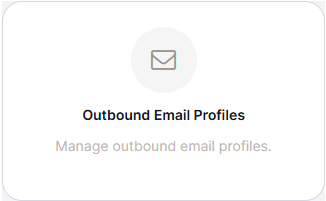
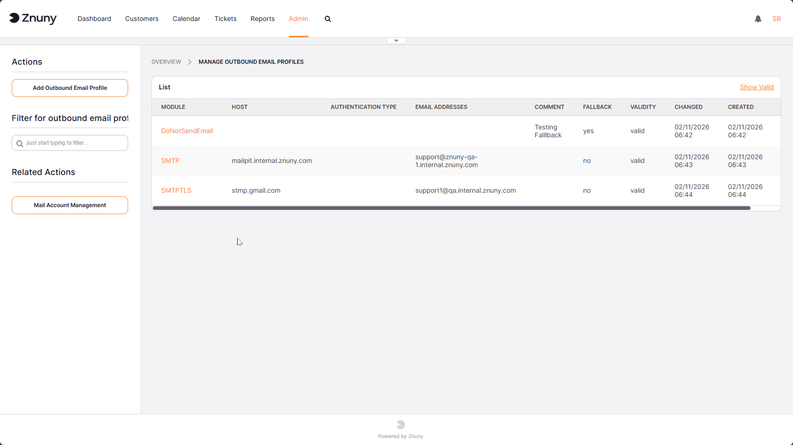
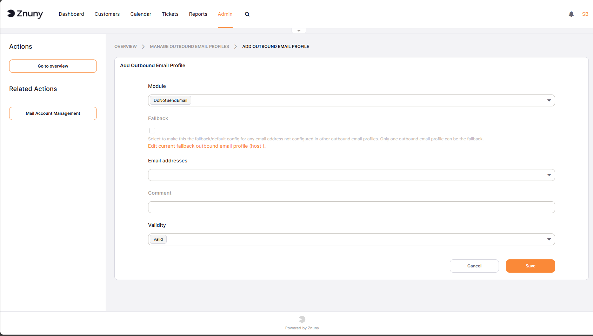

.. meta::
   :description: Manage Znuny outbound email profiles — configure per-sender SMTP host, port, authentication and fallback profiles using the MultiSendmail module.
   :keywords: outbound email profiles, znuny smtp profile, multisendmail, per-sender smtp, email routing, fallback profile, sender configuration

.. _PageNavigation outbound_email_profiles:

Manage Outbound Email Profiles
##############################

Outbound email profiles are used to manage different email sending configurations. Each profile can have its own SMTP settings, sender address, and other email-related configurations.

.. important::
    
    To use this feature, it must first be activated by selecting the ``SendmailModule`` setting to ``Kernel::System::Email::MultiSendmail``. Once activated, you can create and manage multiple outbound email profiles. (see :ref:`admin_smtp_settings`  )

Navigate to Admin ->  Outbound Email Profiles to create and manage your email profiles.

    Outbound Email Profiles Administration

In the overview, you can see all existing outbound email profiles. You can create a new profile by clicking on the "Add Outbound Email Profile" button. You can also edit or delete existing profiles using the corresponding buttons and links in the actions column.

    Overview of Outbound Email Profiles

When creating or editing an outbound email profile, you can configure the following settings:

    New Outbound Email Profile

* **Module**: Select the email sending module to use for this profile (e.g., SMTP, SMTPS, SMTPTLS).
* **Fallback**: If enabled, this profile will be used as a fallback if there is no profile matching the sender address of an outgoing email.
* **Host**: The hostname of the SMTP server to use for sending emails with this profile.
* **Command**: The command to use for sending emails (applicable for sendmail module).
* **Port**: The port number of the SMTP server.
* **Timeout**: The timeout in seconds for connecting to the SMTP server.
* **Skip SSL Verification**: If enabled, SSL certificate verification will be skipped when connecting to the SMTP server.
* **Authentication Type**: The type of authentication to use with the SMTP server (e.g., password, OAuth2 token).
* **Username**: The username for SMTP authentication.
* **Password**: The password for SMTP authentication.
* **OAuth2 Token Configuration**: The name of the OAuth2 token configuration to use (see :ref:`pagenavigation authenticate_token_index` )
* **Email Address**: The profile is used by the selected system email address. If the sender email address of an outgoing email matches the email address configured in this profile, this profile will be used for sending the email. (see :ref:`pagenavigation system_email` )

.. note:: 
    
    Not all settings may be applicable for every email sending module. The available settings may vary based on the selected module. For example, the "Command" setting is only applicable for the sendmail module, while "Host", "Port", and "Authentication Type" are relevant for SMTP-based modules.

   