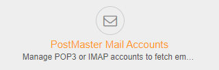
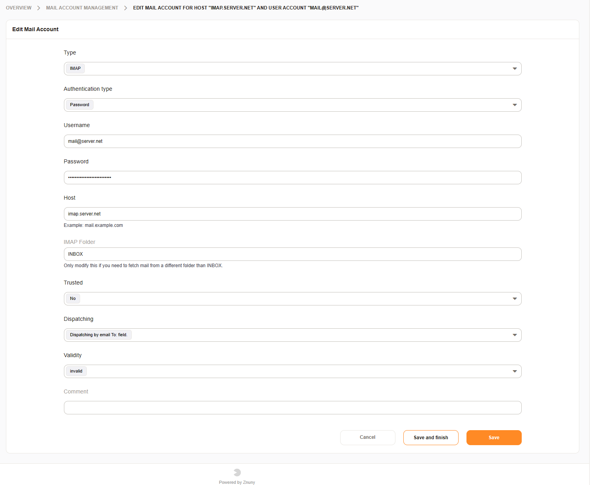
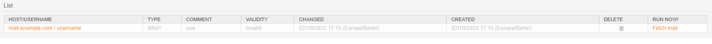

Configure Mailbox Collection
############################
.. _PageNavigation email_postmaster_mail_account:

Schedule e-mail collection from any number of accounts by adding them to the system here. All standard protocols are supported.

* IMAP
* IMAPS
* IMAPTLS
* POP3
* POP3S
* POP3TLS

.. note:: 
    
    For systems with high-volume accounts or many mailboxes, we recommend direct delivery.

Search for this module in the administrator panel.

Adding an Account
*****************

Add an account and enter for the following data:

Type
    The protocol to use for the connection.
Authentication Type
    Use user name and password (Password) or authentication token (OAuth2 token).
Username
    The login name for the mailbox.
Password *
    The password for the account.
OAuth2 token configuration *
    Choose the correct :ref:`authentication token <PageNavigation authenticate_token_index>` for the user.
IMAP Folder *
    If using one of the IMAP protocols, you may choose the folder to be collected.
Trusted
    Choosing 'yes' allows mails to contain X-OTRS headers. X-OTRS headers will allow you to set ticket data without using a postmaster filter and is an advanced option.
Dispatching
    Choose to dispatch all mails to a single queue 'Dispatched by selected Queue.' or use the recipient to determine the queue 'Dispatched by To: field'.
Queue *
    Choose the queue to receive all mail.
Validity
    Validity of the account. 'invalid' or 'invalid-temporary' will not be collected.
Comment
    Additional information for an administrator.

.. note:: 
    
    Items with a `*` are optional based upon other settings.

Deleting and Fetching Mail
**************************

In the overview screen you can delete an account or manually fetch just one account using the functions in the account list.

