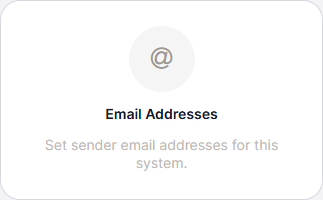
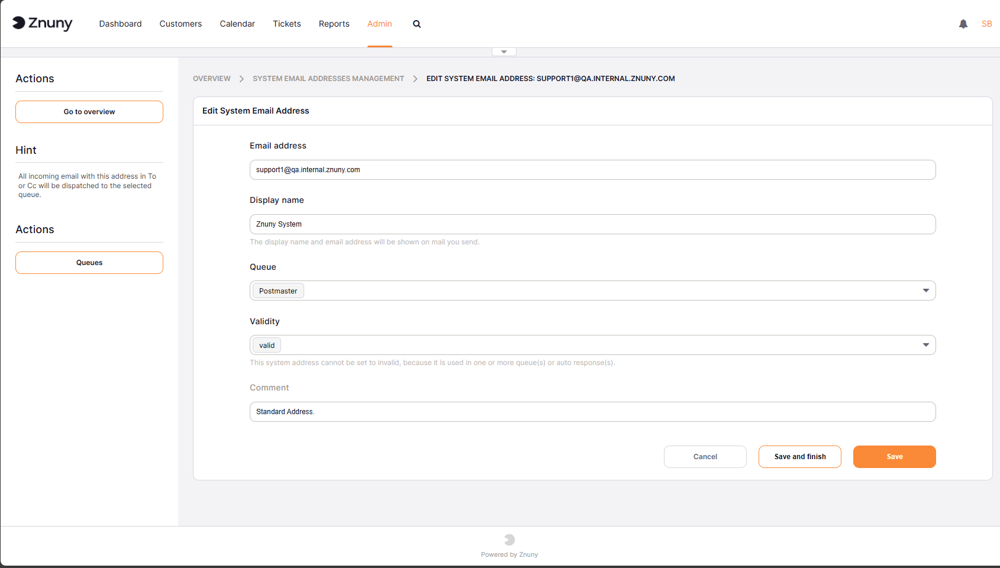

.. _PageNavigation system_email:

System Email
############

Each system requires one ore more dedicated system email addresses. System email addresses are used for sending and receiving. Once an email address is added to the system, it can be used for sending and routing inbound emails. You can add a new, or manage existing system email address on the System Email page. Navigate to Admin -> Email Addresses to access the System Email page.

    Email Address Management

Adding a System Email Address
*****************************
To add a new system email address, click the ``Add System Address`` button. This will open the Add System Email Address form.

    Add System Email Address

Enter the data:

- **Email Address**: The email address to be added to the system. This email address will be used for sending and receiving emails.
- **Display Name**: The display name associated with the email address. This name will be shown in the "From" field when sending emails.
- **Queue**: Select the queue to which incoming emails will be routed. This is required for email addresses that will be used for receiving emails. This can be overridden in the :ref:`pagenavigation email_postmaster_mail_account` settings.
- **Valid**: Choose invalid or invalid-temporary, to mark the email address as invalid. This is useful for email addresses that are no longer in use, but you want to keep them in the system for historical purposes. Invalid email addresses will not be used for sending or receiving emails.
- **Comment**: Optional comment about the email address.

.. important:: 
    
    It is not possible for Znuny to send mails to these addresses. This prevents email loops. To communicate between queues, use notes and split tickets.
