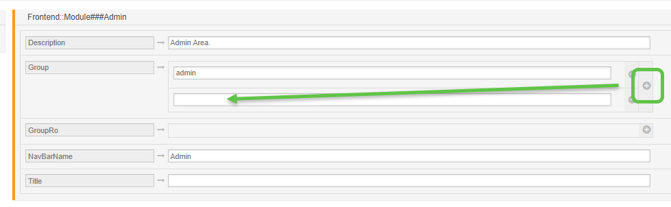

Granting Limited Admin Privileges
#################################

In some cases, it is used to manage teams' configurations, such as templates, attachments, signatures, and other things like email addresses. You may be required to create a mini admin role. It is necessary to grant a specific group the rights to access the modules and menus within the administration area via the system configuration. To achieve this, add a group (:ref:`pagenavigation admin_groups_index`) and a role. Assign the group to the role, and the role to the user. The roles should have RW permission, and the group should be used for nothing else.

The group is assigned using the module labeled "Agents ↔ Groups" by giving basic permissions to the mini-administrator in these two settings.

``Frontend::Module###Admin``

``Frontend::NavigationModule###Admin``

``Frontend::Navigation###Admin###001-Framework``

All other modules, you'd like to provide access to, should be done in the same fashion. Let's say a mini-administrator should be able to edit templates. Then you would additionally need to provide access by editing

``Frontend::Module###AdminTemplate``

``Frontend::NavigationModule###AdminTemplate``

Add the group permission by 

1. Search for the module configuration, in the system configuration
2. Select the setting
3. Click the plus next to the key `Group` to add a new value field
4. Add the new user group created above
5. Save
6. Deploy, or continue to search for and edit more modules

    System Configuration
