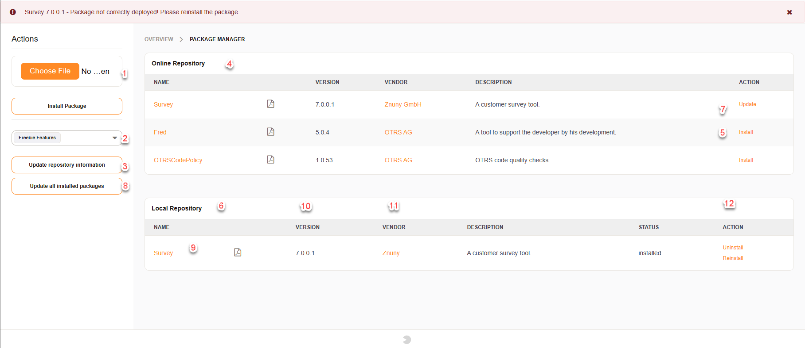
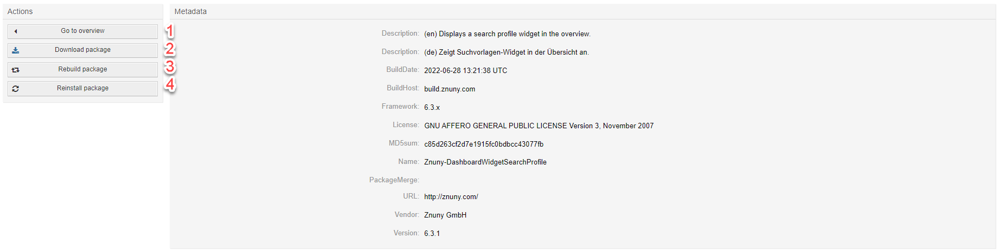
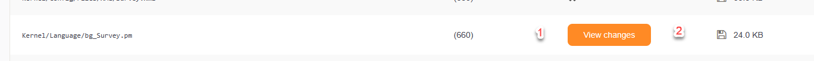
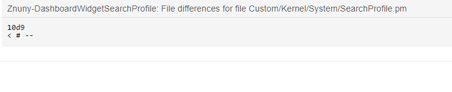
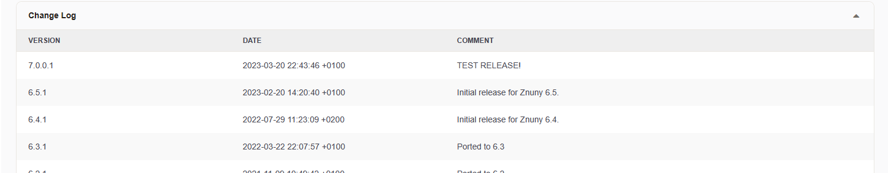
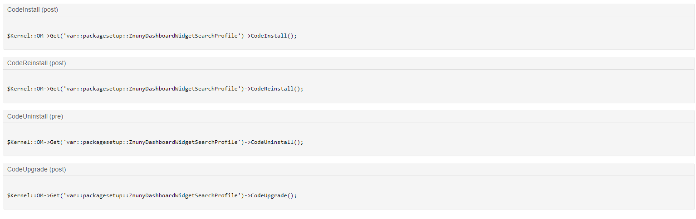
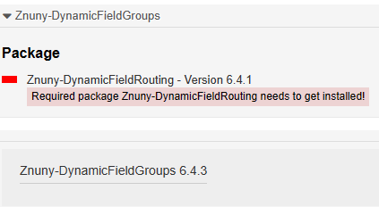

Installing Features
###################
.. _PageNavigation admin_packagemanagement_index:

Using the package manager you can install many new features in the form of packages. A package is an XML File with the ```.opm`` extension. The package manager has a configurable list of online repositories from which you can directly install the features. Alternatively, install packages by uploading the OPM directly in the front end. For larger multi-stage setups you can also install packages directly from another instance. This allows you to only install pre-approved and tested packages. The package manager also provides access via internet proxy with or without basic authentication, and uploading a package may also be prohibited. For more on creating packages and what the packaging system can do, read the :ref:`developer documentation. <PageNavigation developer_extending_index>`.


Package Manager
***************



In the image above, you can see the different functions of the Package Manager.

1. Choose an OPM to install from the local filesystem
2. Choose the desired package repository
3. Update the online repository
4. View the available packages
5. Install a package
6. View the installed packages
7. Update an individual package
8. Update all packages on a system
9. Display package contents
10. Download documentation
11. Link to the vendor's website
12. Uninstall the package

Package Information
*******************

Clicking on the package name to display the package contents link will send you to a screen that shows you the installation status of the package as well as gives you other options.



In the general information screen you see:

Description
    What the package does, in short.
Build Date
    When the package was built.
Build Host
    Host name which built the package.
Framework
    The framework must be installed to use this package.
License
    The license used for the add-on.
MD5 Sum
    The MD5 sum for package verification.
Name
    The name of the package.
Package Merge
    The name of the package which is to be replaced by this package.
URL
    Vendor or add-on website.
Vendor
    Vendor name.
Version
    Add-on version.

Package Actions
===============

In the actions menu, you can perform specific actions as described below.

1. Go back to the overview
2. Download the OPM from the database
3. Rebuild the package
4. Reinstall the package

.. note::

    Rebuilding the package will generate an OPM file for download with your changes. Use where ever possible the Custom/ folder to replace files for better compatibility.

Reinstalling the package can be necessary to fix issues or after a source update.

Package Health
==============

Packages may not sometimes be properly installed get corrupted or have changes made by somebody on the system. By clicking on the name of the package you can see the status of the package itself. If a package has been improperly installed or is not completely installed, you will also see a  clickable notification that accesses the same screen as by clicking on the package name. The first part of this will show you the general package information, the second part will show you the files included and their status, and the third part will show you any type of code which will be run during installation or uninstall including databases when they are going to be created and dropped. This last point is very important when uninstalling a package to make sure that you make a copy of your database tables for the future in case you need them because they will be deleted upon removal of the package.



File Management
===============

If a package is not completely installed or has a modified file you will see a red X (1) next to the file name by clicking on this you will be able to get to this screen which will show you a diff of the file and the changes that have been made so that you can restore these if necessary. Restoring is done by reinstalling the package. This will not affect the database data or any other settings within your system. you can also download individual files by clicking on the disk (2) icon on the right-hand side.



Change Log
==========

Each updated package brings its new features and fixes to the package installed. This is shown in the change log area.




Review Code and Database Changes
================================

Executed code or changes to the database structure will be seen in this section.



Package Prerequisites
*********************

.. versionadded:: 6.5
  Dependency Validation

It's possible that some packages have dependancies. In such case, the dependencies are checked prior to installation.

Missing Dependency
==================



Dependency Met
==============

.. image:: images/met_dep.png
   :alt:  Image of Met Dependency