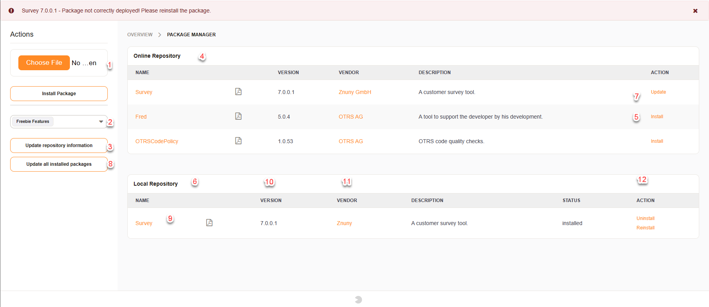
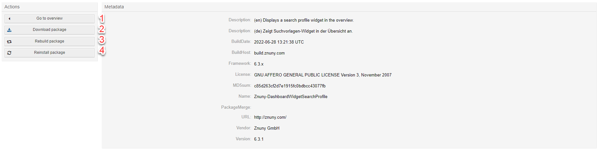
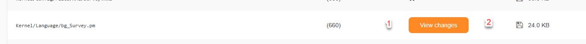
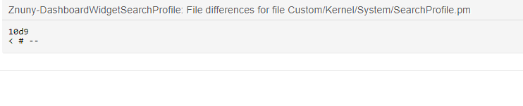
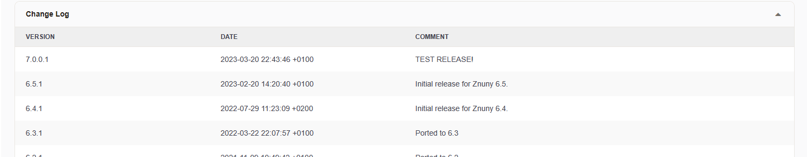
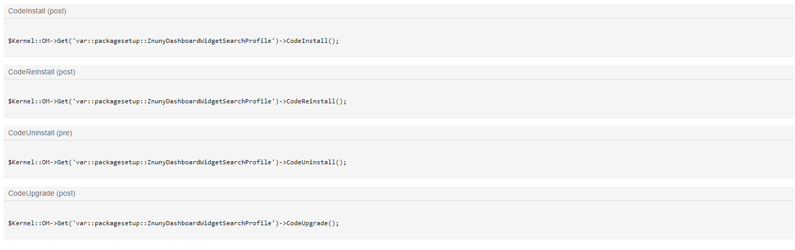

.. _PageNavigation admin_package_index:

Managing Features
#################

Using the package manager you can install many new features in the form of packages. A package is an XML File with the ```.opm`` extension. The package manager has a configurable list of online repositories from which you can directly install the features. Alternatively, install packages by uploading the OPM directly in the front end. For larger multi-stage setups you can also install packages directly from another instance. This allows you to only install pre-approved and tested packages. The package manager also provides access via internet proxy with or without basic authentication, and uploading a package may also be prohibited. For more on creating packages and what the packaging system can do, read the `Znuny Developer Documentation <https://doc.znuny.org/developer/extending/index.html>`_.


Package Manager
***************



In the image above, you can see the different functions of the Package Manager.

1. Choose an OPM to install from the local filesystem
2. Choose the desired package repository
3. Update the online repository
4. View the available packages
5. Install a package
6. View the installed packages
7. Update an individual package
8. Update all packages on a system
9. Display package contents
10. Download documentation
11. Link to the vendor's website
12. Uninstall the package

Package Information
===================

Clicking on the package name to display the package contents link will send you to a screen that shows you the installation status of the package as well as gives you other options.



In the general information screen you see:

Description
    What the package does, in short.
Build Date
    When the package was built.
Build Host
    Host name which built the package.
Framework
    The framework must be installed to use this package.
License
    The license used for the add-on.
MD5 Sum
    The MD5 sum for package verification.
Name
    The name of the package.
Package Merge
    The name of the package which is to be replaced by this package.
URL
    Vendor or add-on website.
Vendor
    Vendor name.
Version
    Add-on version.

Package Actions
===============

In the actions menu, you can perform specific actions as described below.

1. Go back to the overview
2. Download the OPM from the database
3. Rebuild the package
4. Reinstall the package

.. note::

    Rebuilding the package will generate an OPM file for download with your changes. Use where ever possible the Custom/ folder to replace files for better compatibility.

Reinstalling the package can be necessary to fix issues or after a source update.

Package Health
==============

Packages may not sometimes be properly installed get corrupted or have changes made by somebody on the system. By clicking on the name of the package you can see the status of the package itself. If a package has been improperly installed or is not completely installed, you will also see a  clickable notification that accesses the same screen as by clicking on the package name. The first part of this will show you the general package information, the second part will show you the files included and their status, and the third part will show you any type of code which will be run during installation or uninstall including databases when they are going to be created and dropped. This last point is very important when uninstalling a package to make sure that you make a copy of your database tables for the future in case you need them because they will be deleted upon removal of the package.



File Management
===============

If a package is not completely installed or has a modified file you will see a red X (1) next to the file name, by clicking on this you will be able to get to this screen which will show you a diff of the file and the changes that have been made so that you can restore these if necessary. Restoring is done by reinstalling the package. This will not affect the database data or any other settings within your system. You can also download individual files by clicking on the disk (2) icon on the right-hand side.



Change Log
==========

Each updated package brings its new features and fixes to the package installed. This is shown in the change log area.




Review Code and Database Changes
================================

Executed code or changes to the database structure will be seen in this section.



Install a Feature
*****************

Znuny's feature-set is extendable via packages. You can install new features either from an online repository or by uploading a package file directly. These are OPM files and have the ```.opm``` file extension and are as well as called "Add-ons". To install a package, follow these steps:

1. Go to the Package Manager in the Admin area.
2. To install from an online repository, select the desired repository from the dropdown menu and click "Update Repository" to fetch the latest list of available packages.
3. Browse the list of available packages, and click the "Install" button next to the package you wish to install.
4. To upload a package file directly, click on the "Choose File" button, select the OPM file from your local filesystem, and then click "Upload and Install".
5. Follow any on-screen prompts to complete the installation process.
6. After the installation, verify that the package is functioning correctly and that all features are working as expected.
7. If necessary, clear your browser cache to ensure that any changes take effect and or restart

Install via the Console
=======================
Getting the package name for installation, 

You can also install packages via the console using the following commands.

Local Installation
~~~~~~~~~~~~~~~~~~

.. code-block:: bash

    bin/znuny.Console.pl Admin::Package::Install /path/to/packages/SystemMonitoring-7.1.2.opm

Remote Installation
~~~~~~~~~~~~~~~~~~~

.. code-block:: bash

    bin/znuny.Console.pl Admin::Package::Install https://download.znuny.org/releases/packages/:SystemMonitoring

Repository Installation
~~~~~~~~~~~~~~~~~~~~~~~

You will need to first update the repository to get the latest package list.

.. code-block:: bash

    bin/znuny.Console.pl Admin::Package::RepositoryList

You will find a list of available repositories, and their packages.

.. code-block::

    Listing package repositories...
    +----------------------------------------------------------------------------+
    | 1) Name: Freebie Features
    |    URL:  https://download.znuny.org/releases/packages
    +----------------------------------------------------------------------------+
    | 2) Name: Znuny Open Source Add-ons
    |    URL:  https://addons.znuny.com/public
    +----------------------------------------------------------------------------+
    
    Listing package repository content...
    +----------------------------------------------------------------------------+
    | Package overview for repository Freebie Features:
    +----------------------------------------------------------------------------+
    | 1) Name:        CloneDB
    |    Version:     7.2.1
    |    Vendor:      Znuny GmbH
    |    URL:         https://www.znuny.org/
    |    License:     GNU AFFERO GENERAL PUBLIC LICENSE Version 3, November 2007
    |    Description: Clones a Znuny database into an empty target database.
    |    Install:     Freebie Features:CloneDB-7.2.1.opm
    +----------------------------------------------------------------------------+
    | 2) Name:        FAQ
    |    Version:     7.2.1
    |    Vendor:      Znuny GmbH
    |    URL:         https://www.znuny.org/
    |    License:     GNU AFFERO GENERAL PUBLIC LICENSE Version 3, November 2007
    |    Description: FAQ/knowledge base.
    |    Install:     Freebie Features:FAQ-7.2.1.opm
    +----------------------------------------------------------------------------+
    | 3) Name:        SystemMonitoring
    |    Version:     7.2.1
    |    Vendor:      Znuny
    |    URL:         https://www.znuny.org/
    |    License:     GNU GENERAL PUBLIC LICENSE Version 3, 29 June 2007
    |    Description: Basic mail interface to System Monitoring Suites. Also provides deeper integration to Nagios and Icinga2 (acknowledge on lock and check script).
    |    Install:     Freebie Features:SystemMonitoring-7.2.1.opm
    +----------------------------------------------------------------------------+
    | 4) Name:        Znuny-PrimarySecondary
    |    Version:     7.2.3
    |    Vendor:      Znuny GmbH
    |    URL:         https://www.znuny.org/
    |    License:     GNU AFFERO GENERAL PUBLIC LICENSE Version 3, November 2007
    |    Description: Includes "Ticket Primary/Secondary" feature.
    |    Install:     Freebie Features:Znuny-PrimarySecondary-7.2.3.opm
    +----------------------------------------------------------------------------+
    
    +----------------------------------------------------------------------------+
    | Package overview for repository Znuny Open Source Add-ons:
    +----------------------------------------------------------------------------+
    | 1) Name:        GeneralCatalog
    |    Version:     7.2.1
    |    Vendor:      Znuny
    |    URL:         https://www.znuny.org/
    |    License:     GNU GENERAL PUBLIC LICENSE Version 3, 29 June 2007
    |    Description: The General Catalog package.
    |    Install:     Znuny Open Source Add-ons:GeneralCatalog-7.2.1.opm
    +----------------------------------------------------------------------------+
    | 2) Name:        ITSMConfigurationManagement
    |    Version:     7.2.1
    |    Vendor:      Znuny
    |    URL:         https://www.znuny.org/
    |    License:     GNU GENERAL PUBLIC LICENSE Version 3, 29 June 2007
    |    Description: The Znuny::ITSM Configuration Management package.
    |    Install:     Znuny Open Source Add-ons:ITSMConfigurationManagement-7.2.1.opm
    +----------------------------------------------------------------------------+
    | 3) Name:        ITSMCore
    |    Version:     7.2.1
    |    Vendor:      Znuny
    |    URL:         https://www.znuny.org/
    |    License:     GNU GENERAL PUBLIC LICENSE Version 3, 29 June 2007
    |    Description: The Znuny::ITSM Core package.
    |    Install:     Znuny Open Source Add-ons:ITSMCore-7.2.1.opm
    +----------------------------------------------------------------------------+
    | 4) Name:        Znuny-AutoSelect
    |    Version:     7.2.1
    |    Vendor:      Znuny GmbH
    |    URL:         http://znuny.com/
    |    License:     GNU AFFERO GENERAL PUBLIC LICENSE Version 3, November 2007
    |    Description: Hides certain dropdown input fields, if they only contain one selectable value.
    |    Install:     Znuny Open Source Add-ons:Znuny-AutoSelect-7.2.1.opm
    +----------------------------------------------------------------------------+
    | 5) Name:        Znuny-CISearch
    |    Version:     7.2.1
    |    Vendor:      Znuny GmbH
    |    URL:         http://znuny.com/
    |    License:     GNU AFFERO GENERAL PUBLIC LICENSE Version 3, November 2007
    |    Description: This package adds an additional toolbar search box for config items.
    |    Install:     Znuny Open Source Add-ons:Znuny-CISearch-7.2.1.opm
    +----------------------------------------------------------------------------+
    | 6) Name:        Znuny-CopyTicketNumber
    |    Version:     7.2.1
    |    Vendor:      Znuny GmbH
    |    URL:         https://znuny.com/
    |    License:     GNU AFFERO GENERAL PUBLIC LICENSE Version 3, November 2007
    |    Description: Adds a copy icon before the ticket number in the ticket zoom view, allowing agents to easily copy either the ticket number alone or the ticket number with title to the clipboard.
    |    Install:     Znuny Open Source Add-ons:Znuny-CopyTicketNumber-7.2.1.opm
    +----------------------------------------------------------------------------+
    | 7) Name:        Znuny-CustomerMap
    |    Version:     7.2.1
    |    Vendor:      Znuny GmbH
    |    URL:         http://znuny.com/en/
    |    License:     GNU AFFERO GENERAL PUBLIC LICENSE Version 3, November 2007
    |    Description: Google Maps integraton to show your customers on a map in the dashboard.
    |    Install:     Znuny Open Source Add-ons:Znuny-CustomerMap-7.2.1.opm
    +----------------------------------------------------------------------------+
    | 8) Name:        Znuny-CustomerViewDynamicFields
    |    Version:     7.2.1
    |    Vendor:      Znuny GmbH
    |    URL:         http://znuny.com/
    |    License:     GNU AFFERO GENERAL PUBLIC LICENSE Version 3, November 2007
    |    Description: Enables dynamic fields in dialog to set a ticket's customer (AgentTicketCustomer).
    |    Install:     Znuny Open Source Add-ons:Znuny-CustomerViewDynamicFields-7.2.1.opm
    +----------------------------------------------------------------------------+
    | 9) Name:        Znuny-DashboardWidgetSearchProfile
    |    Version:     7.2.1
    |    Vendor:      Znuny GmbH
    |    URL:         http://znuny.com/
    |    License:     GNU AFFERO GENERAL PUBLIC LICENSE Version 3, November 2007
    |    Description: Displays a search profile widget in the overview.
    |    Install:     Znuny Open Source Add-ons:Znuny-DashboardWidgetSearchProfile-7.2.1.opm
    +----------------------------------------------------------------------------+
    | 10) Name:        Znuny-DownloadAllAttachments
    |    Version:     7.2.1
    |    Vendor:      Znuny GmbH
    |    URL:         http://znuny.com/
    |    License:     GNU AFFERO GENERAL PUBLIC LICENSE Version 3, November 2007
    |    Description: Enables download of all ticket or article attachments as a single zip file.
    |    Install:     Znuny Open Source Add-ons:Znuny-DownloadAllAttachments-7.2.1.opm
    +----------------------------------------------------------------------------+
    | 11) Name:        Znuny-EscalationSuspend
    |    Version:     7.2.1
    |    Vendor:      Znuny GmbH
    |    URL:         http://znuny.com/
    |    License:     GNU AFFERO GENERAL PUBLIC LICENSE Version 3, November 2007
    |    Description: Enables escalation suspension.
    |    Install:     Znuny Open Source Add-ons:Znuny-EscalationSuspend-7.2.1.opm
    +----------------------------------------------------------------------------+
    | 12) Name:        Znuny-ExternalURLJump
    |    Version:     7.2.1
    |    Vendor:      Znuny GmbH
    |    URL:         http://znuny.com/
    |    License:     GNU AFFERO GENERAL PUBLIC LICENSE Version 3, November 2007
    |    Description: A feature to link external URLs in the navigation bar.
    |    Install:     Znuny Open Source Add-ons:Znuny-ExternalURLJump-7.2.1.opm
    +----------------------------------------------------------------------------+
    | 13) Name:        Znuny-ExtraSkins
    |    Version:     7.2.1
    |    Vendor:      Znuny GmbH
    |    URL:         https://znuny.com/
    |    License:     GNU AFFERO GENERAL PUBLIC LICENSE Version 3, November 2007
    |    Description: This package contains the slim skin in regular and dark mode.
    |    Install:     Znuny Open Source Add-ons:Znuny-ExtraSkins-7.2.1.opm
    +----------------------------------------------------------------------------+
    | 14) Name:        Znuny-OutOfOfficeFilter
    |    Version:     7.2.1
    |    Vendor:      Znuny GmbH
    |    URL:         http://znuny.com/
    |    License:     GNU AFFERO GENERAL PUBLIC LICENSE Version 3, November 2007
    |    Description: PostMaster filter to prevent ticket status changes by out-of-office messages.
    |    Install:     Znuny Open Source Add-ons:Znuny-OutOfOfficeFilter-7.2.1.opm
    +----------------------------------------------------------------------------+
    | 15) Name:        Znuny-PasswordPolicy
    |    Version:     7.2.1
    |    Vendor:      Znuny GmbH
    |    URL:         http://znuny.com/
    |    License:     GNU AFFERO GENERAL PUBLIC LICENSE Version 3, November 2007
    |    Description: Extended password policy.
    |    Install:     Znuny Open Source Add-ons:Znuny-PasswordPolicy-7.2.1.opm
    +----------------------------------------------------------------------------+
    | 16) Name:        Znuny-ProcessTimeUnits
    |    Version:     7.2.2
    |    Vendor:      Znuny GmbH
    |    URL:         http://znuny.com/
    |    License:     GNU AFFERO GENERAL PUBLIC LICENSE Version 3, November 2007
    |    Description: This package contains the functionality to set time units in processes without displaying article field.
    |    Install:     Znuny Open Source Add-ons:Znuny-ProcessTimeUnits-7.2.2.opm
    +----------------------------------------------------------------------------+
    | 17) Name:        Znuny-QuickClose
    |    Version:     7.2.1
    |    Vendor:      Znuny GmbH
    |    URL:         http://znuny.com/
    |    License:     GNU AFFERO GENERAL PUBLIC LICENSE Version 3, November 2007
    |    Description: Enables quick close in ticket action menu.
    |    Install:     Znuny Open Source Add-ons:Znuny-QuickClose-7.2.1.opm
    +----------------------------------------------------------------------------+
    | 18) Name:        Znuny-SecondTicketCreateScreen
    |    Version:     7.2.1
    |    Vendor:      Znuny GmbH
    |    URL:         http://znuny.com/
    |    License:     GNU AFFERO GENERAL PUBLIC LICENSE Version 3, November 2007
    |    Description: A second ticket create screen (phone and email ticket) to configure with own config settings.
    |    Install:     Znuny Open Source Add-ons:Znuny-SecondTicketCreateScreen-7.2.1.opm
    +----------------------------------------------------------------------------+
    | 19) Name:        Znuny-ShowTicketUnlockTime
    |    Version:     7.2.1
    |    Vendor:      Znuny GmbH
    |    URL:         https://znuny.com/
    |    License:     GNU AFFERO GENERAL PUBLIC LICENSE Version 3, November 2007
    |    Description: This feature shows the ticket unlock time in ticket zoom view.
    |    Install:     Znuny Open Source Add-ons:Znuny-ShowTicketUnlockTime-7.2.1.opm
    +----------------------------------------------------------------------------+
    | 20) Name:        Znuny-SortByLastContact
    |    Version:     7.2.1
    |    Vendor:      Znuny GmbH
    |    URL:         https://znuny.com/
    |    License:     GNU AFFERO GENERAL PUBLIC LICENSE Version 3, November 2007
    |    Description: Sorts tickets by last customer contact in certain views.
    |    Install:     Znuny Open Source Add-ons:Znuny-SortByLastContact-7.2.1.opm
    +----------------------------------------------------------------------------+
    | 21) Name:        Znuny-TypePriorityBasedEscalation
    |    Version:     7.2.1
    |    Vendor:      Znuny GmbH
    |    URL:         http://znuny.com/
    |    License:     GNU AFFERO GENERAL PUBLIC LICENSE Version 3, November 2007
    |    Description: An extension to support type and priority based escalations.
    |    Install:     Znuny Open Source Add-ons:Znuny-TypePriorityBasedEscalation-7.2.1.opm
    +----------------------------------------------------------------------------+
    | 22) Name:        Znuny-ZoomArticleDetailsExpand
    |    Version:     7.2.1
    |    Vendor:      Znuny GmbH
    |    URL:         http://znuny.com/
    |    License:     GNU AFFERO GENERAL PUBLIC LICENSE Version 3, November 2007
    |    Description: Automatically expands article details in ticket zoom.
    |    Install:     Znuny Open Source Add-ons:Znuny-ZoomArticleDetailsExpand-7.2.1.opm
    +----------------------------------------------------------------------------+
    
    Done.

Then you can install the desired package:

.. code-block:: bash

    bin/znuny.Console.pl Admin::Package::Install "Freebie Features:SystemMonitoring-7.2.1.opm"

Upgrade an Existing Package
***************************
To upgrade an existing package to a newer version, follow these steps:

1. Go to the Package Manager in the Admin area.
2. If the package is available in an online repository, select the desired repository from the dropdown menu and click "Update Repository" to fetch the latest list of available packages.
3. Locate the installed package in the list of available packages. If an update is available, you will see an "Update" button next to the package.
4. Click the "Update" button to initiate the upgrade process.
5. Follow any on-screen prompts to complete the upgrade process.
6. If you have an updated OPM file, you can also upload it directly by clicking on the "Choose File" button, selecting the OPM file from your local filesystem, and then clicking "Upload and Install".
7. Follow any on-screen prompts to complete the installation process.
8. After the upgrade, verify that the package is functioning correctly and that all features are working as expected.
9. If necessary, clear your browser cache to ensure that any changes take effect and or restart the web server.

Upgrade via the Console
========================
You can also upgrade packages via the console using the following commands.

Local Upgrade
~~~~~~~~~~~~~
.. code-block:: bash

    bin/znuny.Console.pl Admin::Package::Upgrade /path/to/packages/SystemMonitoring-7.1.2.opm

Remote Upgrade
~~~~~~~~~~~~~~
.. code-block:: bash

    bin/znuny.Console.pl Admin::Package::Upgrade https://download.znuny.org/releases/packages/:SystemMonitoring 

Repository Upgrade
~~~~~~~~~~~~~~~~~~~
You will need to first update the repository to get the latest package list.

.. code-block:: bash

    bin/znuny.Console.pl Admin::Package::RepositoryList

Then you can upgrade the desired package:

.. code-block:: bash

    bin/znuny.Console.pl Admin::Package::Upgrade "Freebie Features:SystemMonitoring-7.2.1.opm"

Uninstall a Feature
*******************
To uninstall a package and remove its features from your Znuny system, follow these steps:

1. Go to the Package Manager in the Admin area.
2. Locate the installed package you wish to uninstall in the list of installed packages.
3. Click the "Uninstall" button next to the package.
4. Follow any on-screen prompts to confirm the uninstallation process.
5. After the uninstallation, verify that the package has been removed and that all associated features are no longer present in your system.
6. If necessary, clear your browser cache to ensure that any changes take effect and or restart the web server.

Uninstall via the Console
=========================
You can also uninstall packages via the console using the following command.

.. code-block:: bash

    bin/znuny.Console.pl Admin::Package::Uninstall SystemMonitoring

.. note::

    Uninstalling a package will also remove any database tables created by the package. Make sure to back up any important data before proceeding with the uninstallation.
    Ensure that all features provided by the package are no longer in use before uninstalling to prevent system issues. Remove the package only if you are sure that it is no longer needed.

    After uninstalling a package, it is recommended to clear your browser cache and restart the web server to ensure that all changes take effect properly.