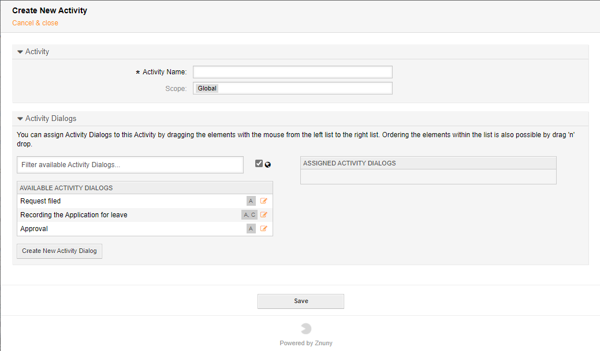

Activities Element
##################
.. _PageNavigation processmanagement_activities:

When adding a new activity, enter the following details:

Name
    The name of the activity.
Scope
    The scope of the activity.

Here you can directly use available activity dialogs, search and filter the visible dialogs, reorder currently selected dialogs, or create new dialogs.

.. note::

    Creating a new dialog from within the activity screen saves the current activity and redirects you to the activity dialog create screen.