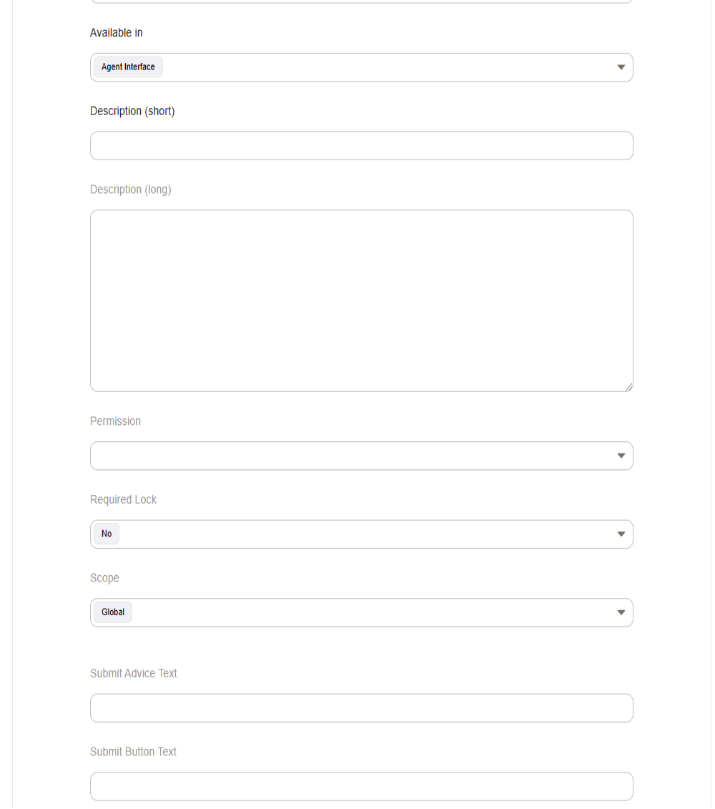
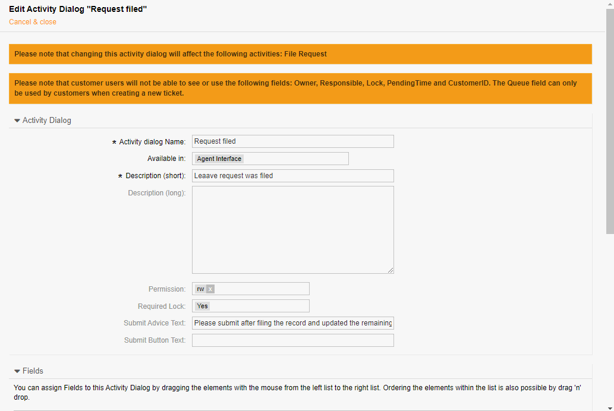
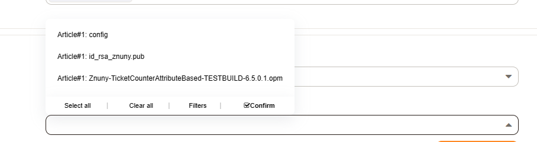

Activity Dialogs
################
.. _ActivityDialog:

Activity dialogs allow user input collection. This input is documented to the process for use by the practitioner and used by customers, in statistics, by business intelligence tools, and a wide variety of other applications.

This data can be entered manually or be pre-filled by other mechanisms like web services or the postmaster filter.

Activities contain activity dialogs. Their visibility can also be affected by ACLs. Using an activity dialog in a process offers context to ticket processing and gives flexibility in configuration. Using activity dialogs asks the user only for collectible data. Other data such as queue, status, and priority can be programmed as hidden values or added during a transition action. The user generally need-not know this level of information to complete an activity.

General Information
*******************

Each activity dialog requires some general information.

Name
    The name of the activity.
Visibility
    The setting dictates who can see the dialog.
Short Description
    The short description serves as the title of the description block in the activity dialog.
Long Description
    A detailed text description for the activity dialog. Can be used for instructional purposes, for example.
Permission
    This shows which permissions are required to use this activity dialog. This setting does not affect visibility. An error message occurs if permissions are not sufficient upon activity dialog use.
Advice Text
    The advice text is shown under the button to give the user more detailed information about what submitting entails.
Button Text
    This text is the actual text shown on the button. *Submit* is the default text.

Fields Listing
**************

After the general information, there is a list of available fields. Fields are standard ticket data, process management specific, or dynamic fields. Add these by dragging them from left to right. 

.. note:: 

    The order in which they appear under *Assigned Fields* is the order in which they will appear in the activity dialog.

Modifiable Field Properties
***************************

General Properties
==================

Some field properties may be modified. Each field has a display label. This label is either default, or user-defined in the case of dynamic fields.

In addition to the label, the following information is definable:

Short Description
    This description is under the field in the activity dialog.
Long Description
    This description appears as as tooltip in the activity dialog.
Default Value
    A default value can be applied. This value overrides the default value of a dynamic field.
Visibility
    A field can be: shown, shown as mandatory, or hidden. This setting may change based on the type field selected.

Other Properties
================

Some fields have considerations or additional options to be made.

Article Field
~~~~~~~~~~~~~

**Extra options are available:**

Channel
    Designate the communication channel.
Visible for Customer
    Dictates if this field should be visible in the customer front-end or not.
Time Units
    Dictates if the time units are: shown, optional, or mandatory.

.. note:: 
    
    Adding a default value or the article field as hidden is not possible.

State Field
~~~~~~~~~~~

PendingTime
    This field should accompany the State field when *pending auto* or *pending reminder* state types are allowed.
    
.. note::
    
    The default value, an offset, is an integer (seconds) for this field.

CustomerID Field
~~~~~~~~~~~~~~~~~

This field is only visible to agents and sets the customer user and customer of the ticket. This also affects the **Service** field.

Owner Field
~~~~~~~~~~~

Only shows users who have RW or Owner permissions in the current queue.

SLA
~~~~

This field respects the currently selected service and should be shown together with the service field.

Specialty Fields
****************

Some fields are specialty items. These fields are defined below.

**Special fields are:**

Attachments
    The attachments field presents a dropdown list of all attachments in the ticket. Select transition actions can use the attachments during the transition. :ref:`TicketCreate <TransitionAction TicketCreate>`.

