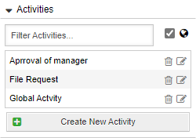
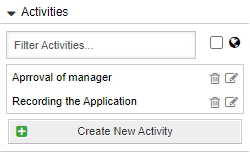
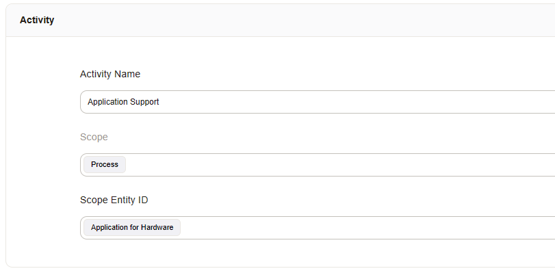
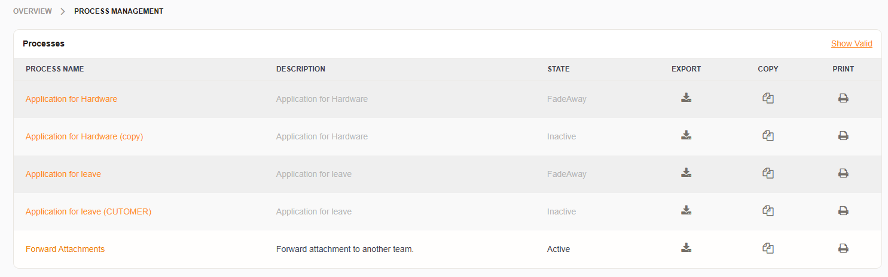
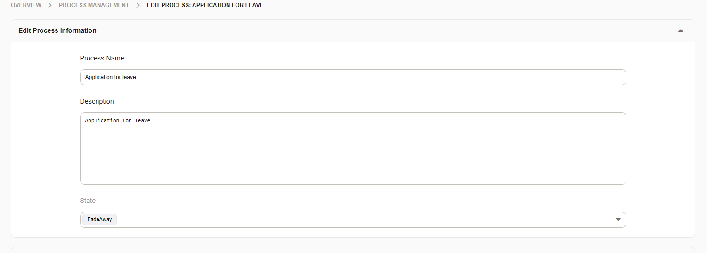
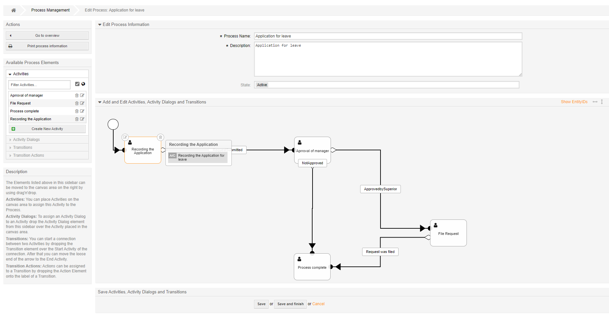
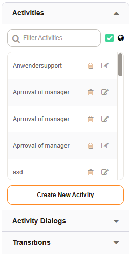

Manage Processes
################
.. _PageNavigation processmanagement_general:

Processes (a.k.a Workflows) are essential to communication. Therefore, the software supports the orchestration of tasks with processes. Process management makes managing the "everyday" information like queue, state, or priority much easier. Give your users real-world information to work with and let processes do the rest.

It's not relevant to a customer or agent in which queue a ticket lands, but it is of value to know which information is required to get the job done. Based on the data collected by the process, managers and owners can dictate what the next course of action is. This type of orchestration provides for agile change-making to operation procedures, like introducing new queues or states, smoother, and the users require less to no training. The process decides where the ticket goes, where to get needed information, and whom to inform.

**A request for pay increase**

.. mermaid::

    graph TD
        %% Styles
        style End stroke-width:6px, width: 10px
        %% Names
        Start((Start))
        A[Request Pay Raise]
        B[Conduct Employee Review]
        C[Report New Salary]
        D[Notify Employee]
        End((End))
        %% Flow
        Start --> A
        A --> B
        B --> C
        C --> D
        D --> End

The process above may require the user to enter information like current job title, desired pay, years in the position. But the user filling out the form should not have to know where to send the request (Queue), what type of request it is (Human Relations), or if there is a service attached to the ticket (Income Processing). Therefore, a process can help make entering data quicker and more efficient. All of the details for such a request: which team, what priority, creating new requests, e-mail notification, all this can be done with hidden form fields or in transition actions. Data entered triggers transitions in the request amending data as needed. A managing supervisor's request may go to the board first. Who exactly receives the request can be determined by the ticket's customer. All of these details mustn't be schooled, and when responsibilities change, the process remains the same in the front-end reducing error and confusion.

Here we discuss what goes into a process. Element details are found in later sections.

Process Elements
*****************

These elements are the parts of a process. A good understanding about these are a must when dealing with processes. The process elements are discussed in detail later in this manual.

Activity
    An activity is a state of a process requiring action from a user, a web service, or another event to continue.
Activity Dialog
    The input collection for a process.
Transition
    A condition-set between activities to change the activity when the condition-set matches.
Transition Actions
    An action that is applied to the ticket when a transition condition matches.

.. _ProcessManagement ProcessScope:

Process Element Scope
=====================

Each element of a process has a scope *Global* or *Current Process*. Defining a scope enables filtering elements to just those used in the process or all available elements.

The scope filter is next to the search filter in each element group.

Global is the default setting. Checking the box as seen in the image above shows elements set to:

* Global
* Current Process

.. note::

    It's not possible to filter for only global elements.

Removing the check limits the element list to elements scoped only to the open process.

Each element has a scope definition. Choose the scope: *Global* or *Current Process*, and the process name (Scope EntityID) to assign this for filtering when the designated process.

The scope filter is next to the search filter in each element group.

Global is the default setting. Checking the box as seen in the image above shows all parts in the system without filter.

.. note::

    It's not possible to filter for only global elements.

Removing the check limits the element list to elements scoped only to the open process.

Each element has a scope definition. Choose the scope: *Global* or *Current Process*, and the process name (Scope EntityID) to assign this for filtering when the designated process.

Process Overview
****************

There is an overview of all processes in the system under Admin -> Process Management.

Here you can create, modify, import, export, deactivate, and delete processes.

You see three icons for each process: Export, Copy, Print.

Export
    An export is a YAML file for backup or import to another system.
Copy
    Create a copy of a process.

.. important::

    A copy doesn't duplicate *Entities* (Process Elements). Therefore if you make a copy, you can only extend it but not modify any of its parts, without affecting the original process. Notifications are in the editor to warn you about this.

**Example Notification:**

Print
    Generate a PDF file containing all process information.

Add a New Process
******************

Click the *Create a New Process* button. This action brings you to the modeler screen. Upon reaching there, you must enter general information about the process:

Name
    The name of the process, as seen by the agents and customer users.
Description
    A description for the process administrator.
Validity
    The process validity.

A process can be Active, Inactive, or set to "FadeAway". 

*FadeAway* is a unique state used to phase out or hide processes. By setting a process to active, the process is selectable by users and customer users.

.. note:: 
    
    The first process activity must contain an activity dialog for the process to be selectable when set to active.

Click *Save*. Then you can then start adding process elements and organizing them on the canvas using the modeler.

You may also use the import function to import your process or use the :ref:`Ready2Adopt <PageNavigation processmanagement_readytoadopt_index>` processes available to you in the system. Pay special attention when importing them, the parts must be manually removed if the process is deleted later. Additionally, dynamic fields and other settings may be imported when using them.

Editing a Process
*****************

To edit a process, select a process from the overview. This starts the modeler.

In the above example, you'll see the imported Ready2Adopt process: *Application for Leave*. 

The modeler has three sections: 

Sidebar
    Create process elements or go back to the overview.
General Information
    Modify the name, validity, or description for the process.
Canvas
    Build the processes visually.

Available Process Elements
==========================

The modeler allows you to comfortably select from the available process elements and drag and drop them onto the canvas.

Dragging the first activity to the canvas connects the none event to the first process activity. You may then select activity dialogs and drag them to the activity to add them. Each part has a trash can and pen and paper symbol. You can delete or edit the process element respectively.

Filtering Elements
~~~~~~~~~~~~~~~~~~
    
The available scope can be modified from global to local by removing the checkbox from the element section next to the globe. Additionally you can filter elements by typing into the filter field at the top of each element list.

Editing Elements
~~~~~~~~~~~~~~~~

You can drill down into a process to edit process elements by double clicking on any element or the canvas or in an activity or transition edit screen, or you can select the pen and paper icon from the element in the element listing.

Add an Activity
~~~~~~~~~~~~~~~

Create an activity by expanding the **Activities** section clicking on the :ref:`Create New Activity <PageNavigation processmanagement_activities>` button.

Add an Activity Dialog
~~~~~~~~~~~~~~~~~~~~~~

An activity dialog requires a bit more than an activity. Create an activity dialog by expanding the **Activity Dialogs** section then clicking on the :ref:`Create New Activity Dialog <PageNavigation processmanagement_activitiydialogs>` button.

Add a Transitions
~~~~~~~~~~~~~~~~~~

Create a transition by expanding the **Transitions** section then clicking on the :ref:`Create New Transition <PageNavigation processmanagement_transitions>` button.

Add a Transition Action
~~~~~~~~~~~~~~~~~~~~~~~

Create a transition action by expanding the **Transition Actions** section then clicking on the :ref:`Create New Transition Action <PageNavigation processmanagement_transitionactions>` button.
