.. meta::
   :description: Walk through an end-to-end Znuny process example — build a Building Access Request workflow covering registration, check-in and check-out activities.
   :keywords: znuny process example, example workflow, building access process, process tutorial, model process, process design steps

.. _PageNavigation admin_processmanagement_processexample_index:

An Example Process
##################

Lets build an example process for checking in a user to a building. We will call this access management.

**Process name:** Building Access Request

Steps to Creating a Process
***************************

You should always document your process first.

1. Build the model
2. Write the prose
3. Identify data
4. Define data in the system
5. Build the process parts
6. Model the process
7. Test, review, repeat from 5 if necessary
8. Implement

Model Process
**************
.. mermaid:: 

    graph TD
        style End stroke-width:6px, width: 10px
        Start((Start))
        A[Register for visit]
        B[Check-in]
        C[Check-out]
        End((End))
       Start --> A
       A --> B
       B --> C
       C --> End

To build this process we need to prepare our system by creating the identified fields, for which we need to collect data.

Prose text
**********

A verbal description of the process, to help identify data and the parts of a process.

A user requests access to a facility beginning at ond ending on specific dates. The user must provide the dates of attendance per visitation, the facility  to be visited, and the contact person within the organization. Upon arrival and on departure, the desk agent must enter the time and date of entry.

Identify Data
*************

The ticket requires, in addition to the user provided data, ticket data. It will be registered to the postmaster queue as a new ticket.
It will be unlocked and of type "Access Request" with the normal priority. It will not be assigned to a specific user.

Define Data
***********

Dynamic field data to be collected:

Facility
    As a drop down field.
Personal Contact
    As a text field.
Purpose of Visit
    As a text area.
Begin of Visit
    As a date field.
End of Visit
    As a date field.
Check-in Time
    As a date time field.
Check-out Time
    As a date time field.

.. note:: 
    
    I will not show how to create dynamic fields. See :ref:`pagenavigation admin_dynamicfields_index` 

Build Process Parts
*******************

To build the process, we must understand our workflow and identify its different parts. 
We recommend using `BPMN <https://www.omg.org/spec/BPMN>`_ .

.. note:: BPMN
    
    The Business Process Modeling Notation (BPMN) is visual modeling language, which is an open standard 
    notation for graphical flowcharts that is used to define business process workflows. 
    It is popular and intuitive graphic that can be easily understand by all business stakeholders, 
    including business users, business analysts, software developers, and data architects.

Roughly stated, each activity is represented as an user activity in Znuny and consists of an :ref:`pagenavigation processmanagement_activities` 
and one or more :ref:`pagenavigation processmanagement_activitiydialogs`.

We will start by modeling the process with tow activities and three dialogs.

Create a New Process
====================

1. Navigate to ``Admin > Process Management``
2. Click *Create New Process*

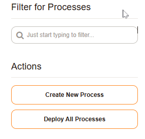

    Process Management Actions Menu

3. Add process name and description

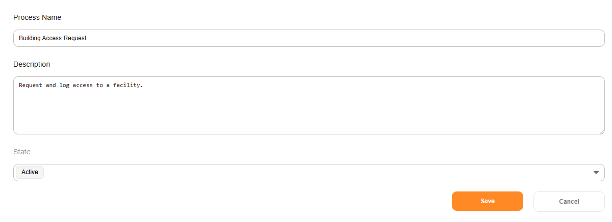

    Name and Description

4. Save

Add Activities
==============

We will identify two activities here. You can create a new activity in the process elements list.

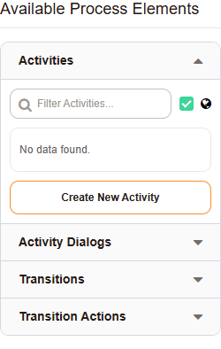

   Add an activity.

1. Register for Visit

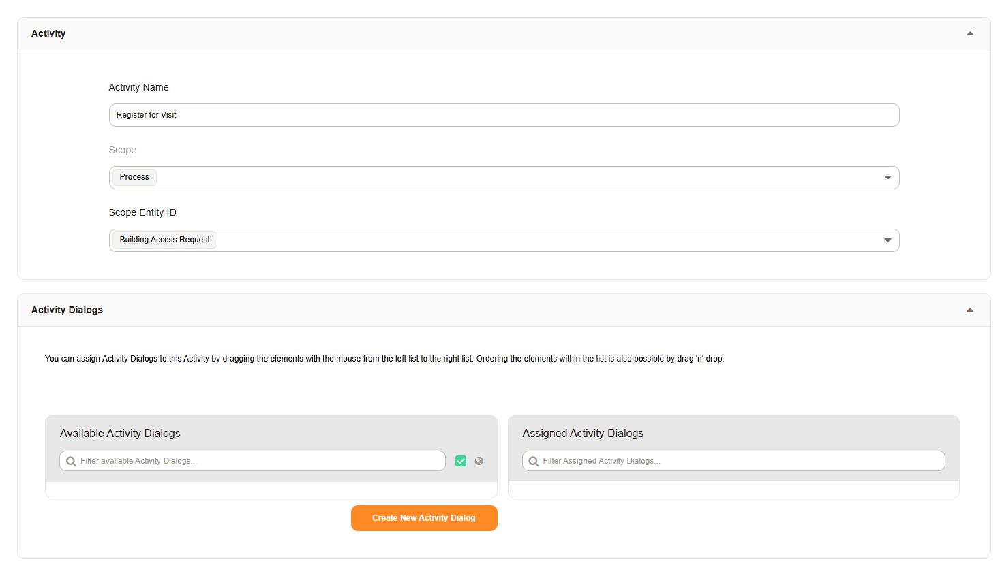
    
   Register for Visitation

2. Record Visit

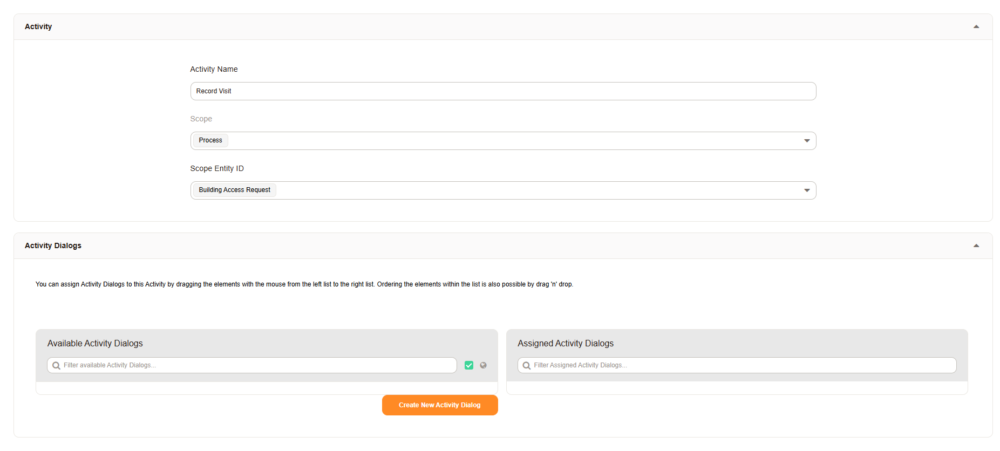
    
   Record Visitation

3. Process End

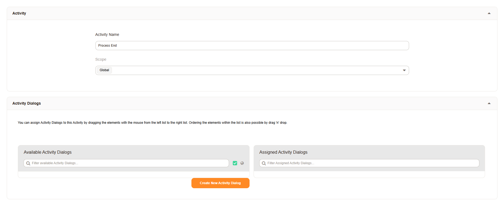
    
   Process Ended

.. note:: Process End

    This is used as a general place holder, to allow us to later apply final ticket data via the :ref:`pagenavigation processmanagement_transitionactions` 

Add Activity Dialogs
====================

We will identify some of the activities in our model, as dialogs of the activity *Record Visit*, where we collect the check-in and checkout time.

You can create a new activity dyalog in the process elements list. Here we will:

- define who can use the dialog
- define the fields and field order

.. seealso:: For more information read the following

    :ref:`pagenavigation processmanagement_activitiydialogs` 

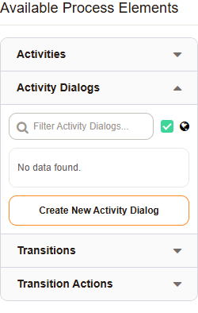

   Add an activity dialog.

1. Visitation Application

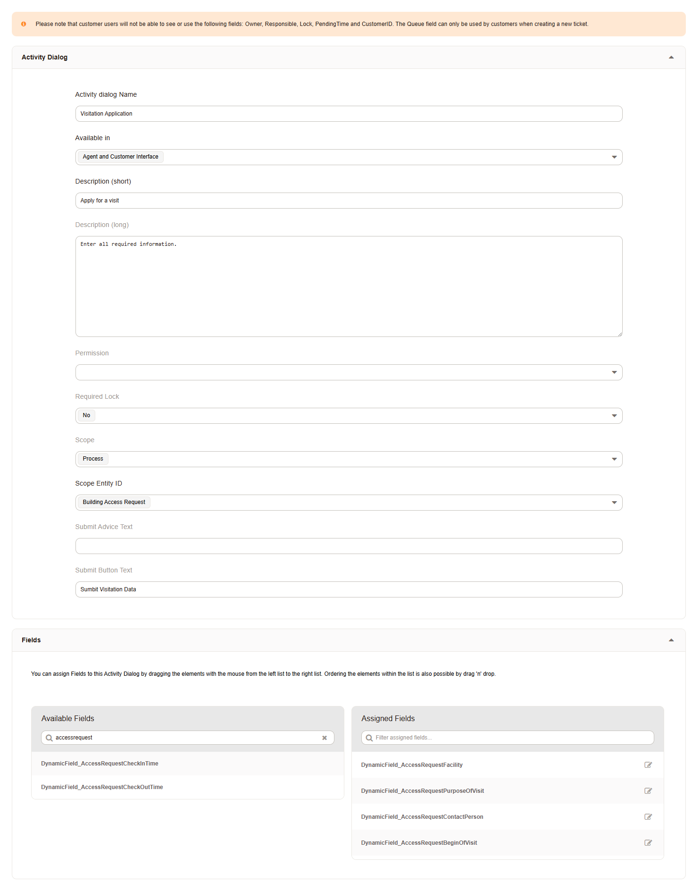
    
   Register for Visitation Dialog

1. Check-in

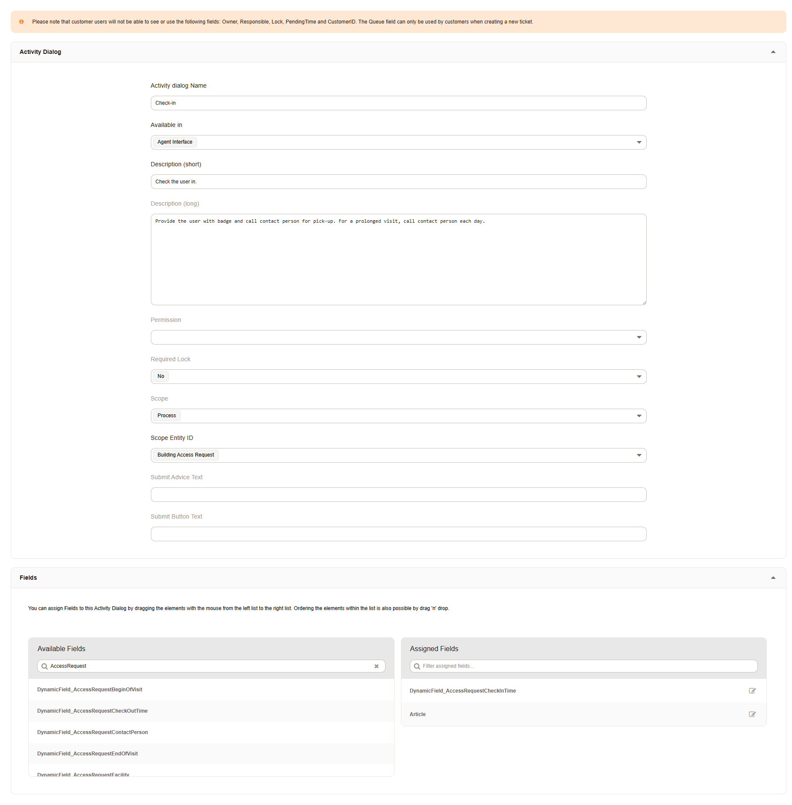
    
   Check-in Dialog

3. Check-out

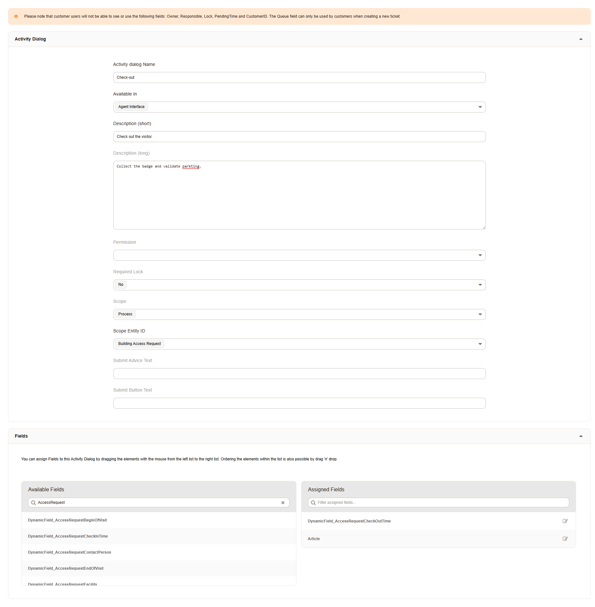
    
   Check-out Dialog

Add Transitions
===============

We will add a transition to evaluate the data entered, and move our process between activities.

You can create a new transition in the process elements list.

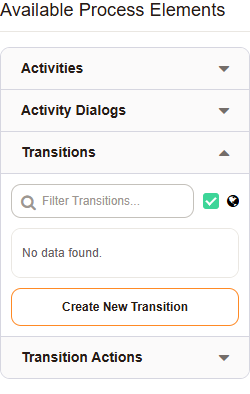

   Add a transition.

1. Application Recorded: Verify the ticket state via a regular expression, because a ticket always has state and we made all fields mandatory.
2. User checked out: Verify the user checked out.

Add Transition Actions
=======================

We will add actions to be applied to the ticket during each step of the process. This automation allows  us to streamline the process for the user. 
This eliminates many confusing aspects, and allows us to modify the process at any time, without it changing for the user. The user just has
to enter data.

You can create a new transition action in the process elements list.

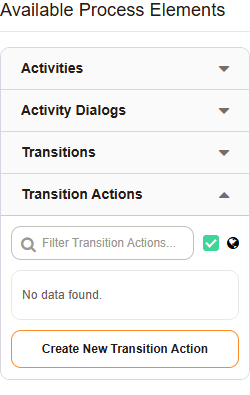

   Add a transition action.

1. Pending 24 Hours

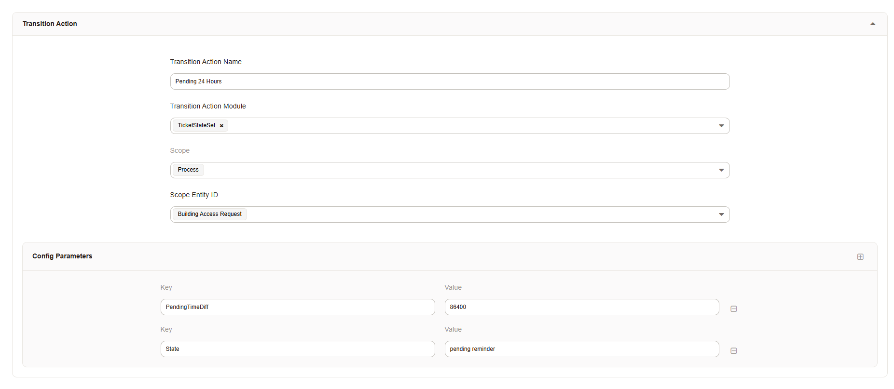

   Set pending state and Time

2. Ticket closed

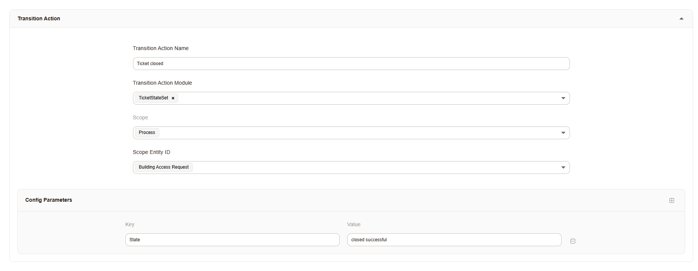

   CLose TIcket
   
3. Ticket unlock

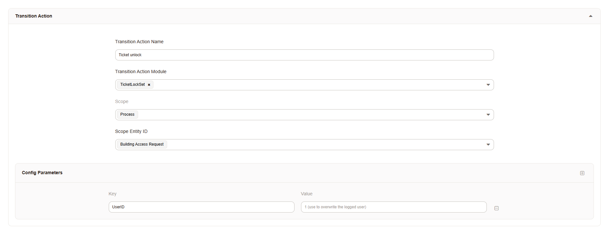

   Unlock Ticket
   

Model the Process
*****************

By dragging the pieces onto the model, we can quickly assemble the process.

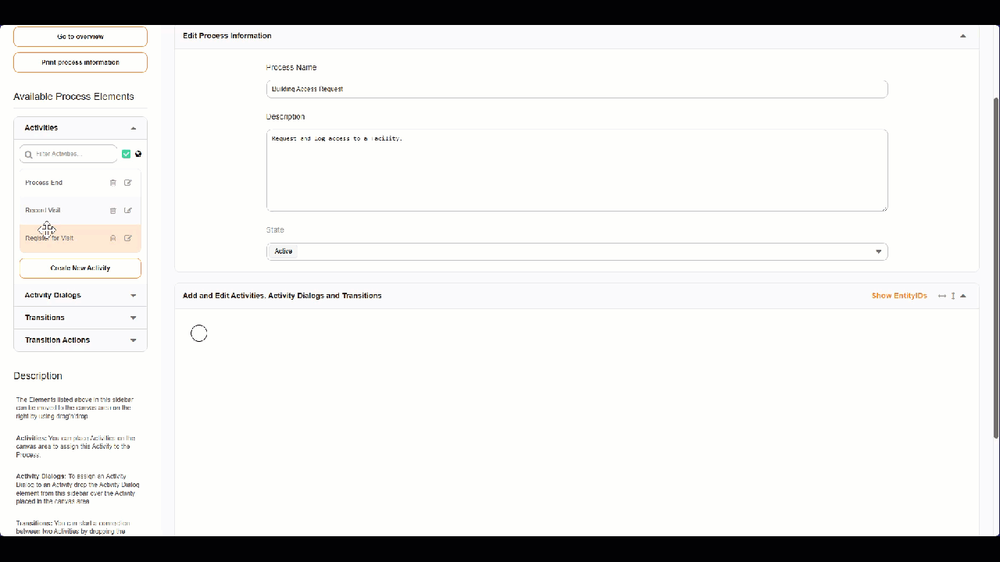

    Modelling the Process   

1. Drag all activities on to the canvas.
2. Drag and drop the dialogs on to the activities.
3. Drag the transition on to an activity, and connect the arrow to the following activity.
4. Drag and drop tho transition actions onto the transition.

Test, Review, Revise, Release
*****************************

Customer Creation
==================
The customer fill and submits the request.

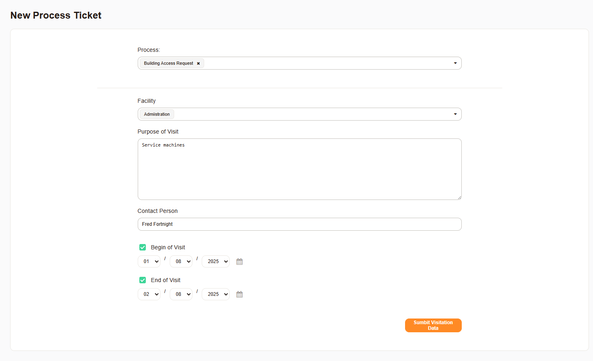

   Customer Form

Agent View
===========
The agent opens the pending ticket, and checks the user in and out.

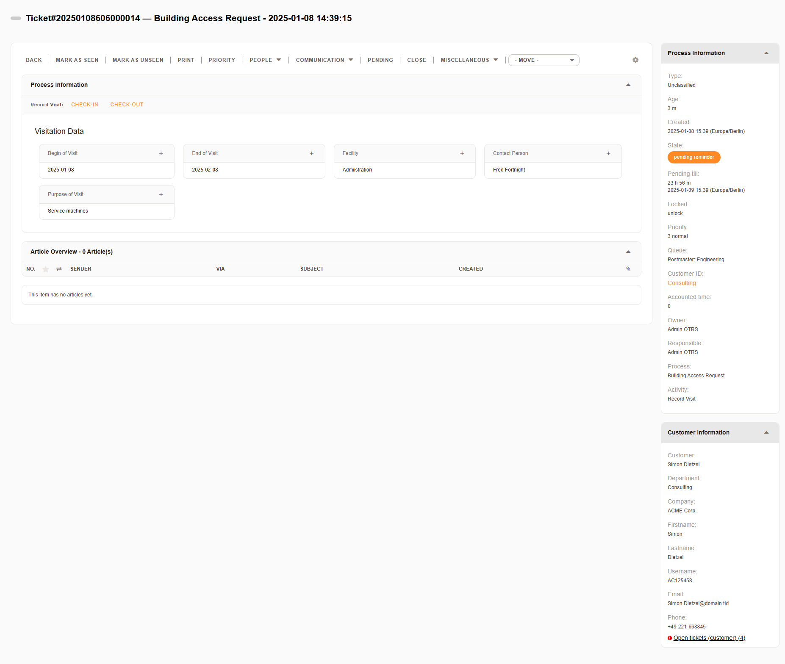

   Agent View

Process End
============
The process ends and the ticket is automatically closed.

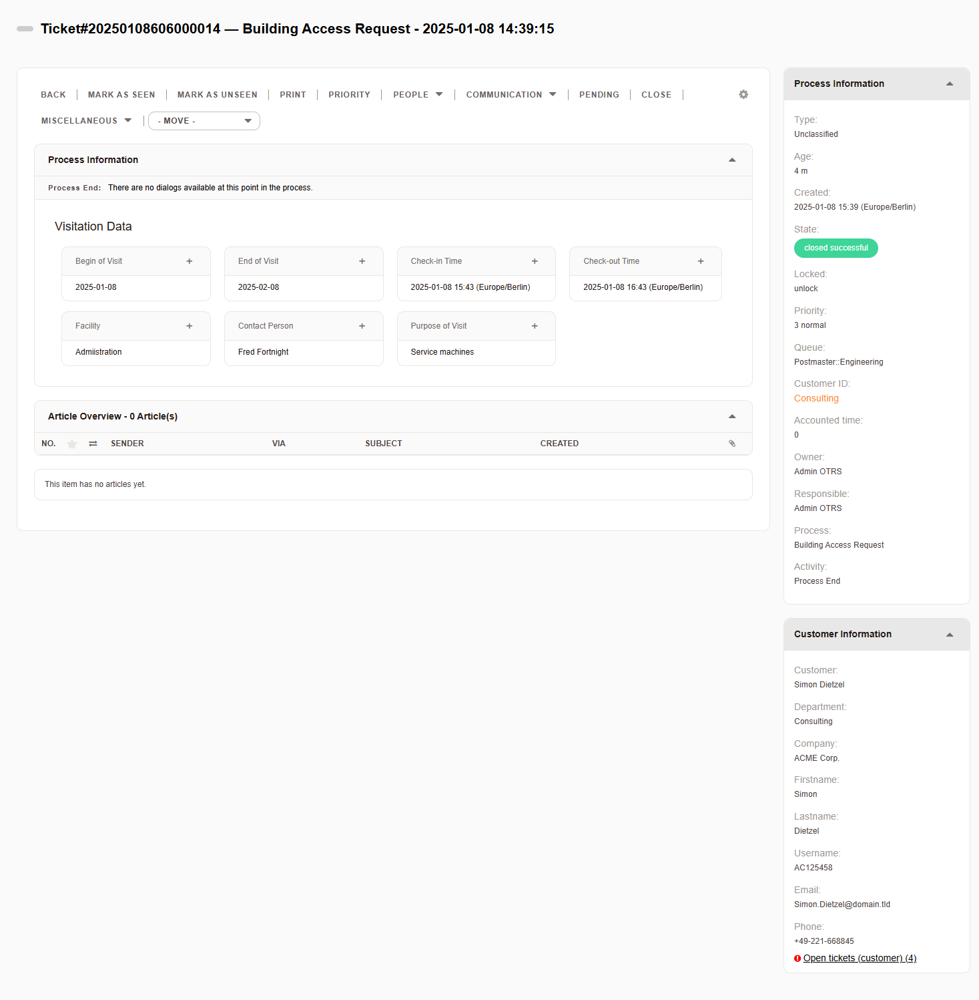

   Process Ended

Touch-ups
=========

To get the full effect as seen above in the screenshots, you must:

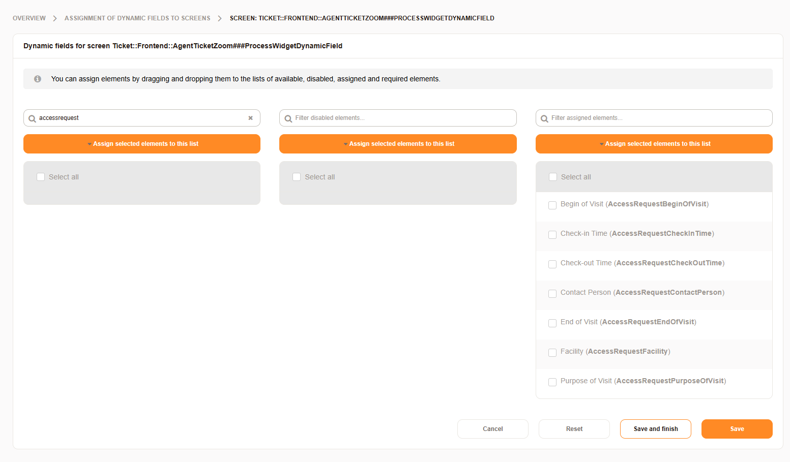

   Add the Dynamic Field for Process Widget Screen

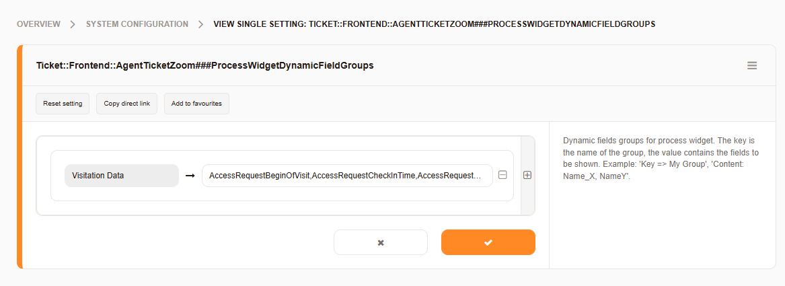

   Grouping the Fields via System Configuration

This process is by no means complete, and should be enhanced with notifications and articles, but this 
cannot be covered by documentation alone.
