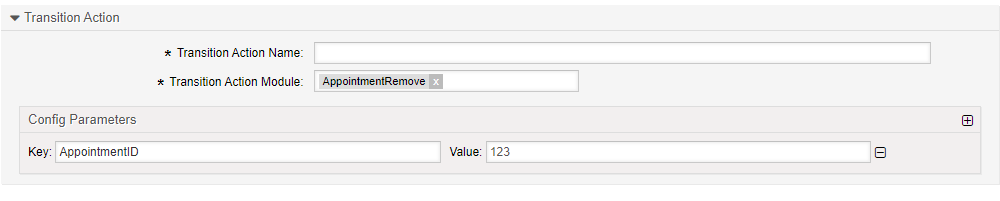

.. _TransitionAction AppointmentRemove:

Remove an Appointment 
#####################

Summary
*******

Use this action to remove (delete) an appointment from within a process.

The name of the transition action is :ref:`AppointmentRemove <TransitionAction AppointmentRemove>`

Transition Action Module Configuration
**************************************

The following list shows the mandatory items.

+---------------+---------------+-------------------------+-----------+
| Key           | Example Value | Description             | Mandatory |
+===============+===============+=========================+===========+
| AppointmentID | 1             | A valid appointment ID. | yes       |
+---------------+---------------+-------------------------+-----------+
