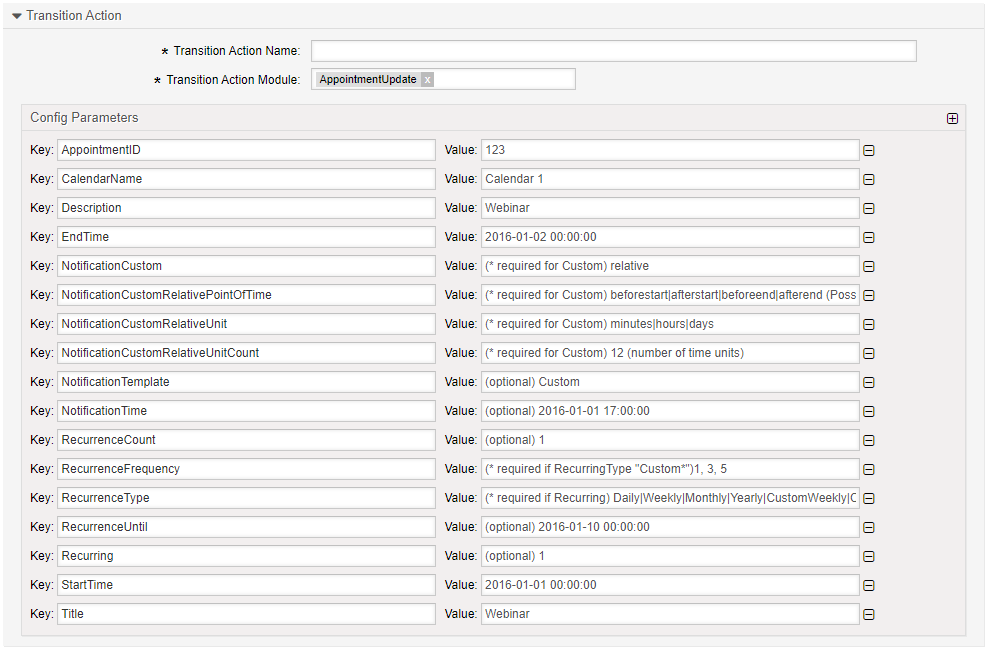

.. _TransitionAction AppointmentUpdate:

Update an Appointment 
#####################

Summary
*******

Use this action to update an appointment from within a process.

The name of the transition action is :ref:`AppointmentUpdate <TransitionAction AppointmentUpdate>`

Transition Action Module Configuration
**************************************

The following list shows the mandatory items.

+----------------------------------------+--------------------------------------------------------------+--------------------------------------------------------------------------------------------------+-------------------------+
| Key                                    | Example Value                                                | Description                                                                                      | Mandatory               |
+========================================+==============================================================+==================================================================================================+=========================+
| AppointmentID                          | 1                                                            | A valid appointment ID.                                                                          | yes, if no CalendarName |
+----------------------------------------+--------------------------------------------------------------+--------------------------------------------------------------------------------------------------+-------------------------+
| CalendarName                           | Calendar 1                                                   | A valid CalendarName                                                                             | yes, if no CalendarID   |
+----------------------------------------+--------------------------------------------------------------+--------------------------------------------------------------------------------------------------+-------------------------+
| Title                                  | Webinar                                                      | Title                                                                                            | yes                     |
+----------------------------------------+--------------------------------------------------------------+--------------------------------------------------------------------------------------------------+-------------------------+
| StartTime                              | 2016-01-01 16:00:00                                          | ISO timestamp                                                                                    | yes                     |
+----------------------------------------+--------------------------------------------------------------+--------------------------------------------------------------------------------------------------+-------------------------+
| EndTime                                | 2016-01-01 17:00:00                                          | ISO timestamp                                                                                    | yes                     |
+----------------------------------------+--------------------------------------------------------------+--------------------------------------------------------------------------------------------------+-------------------------+
| ParentID                               | 1                                                            | A valid ParentID                                                                                 | no                      |
+----------------------------------------+--------------------------------------------------------------+--------------------------------------------------------------------------------------------------+-------------------------+
| UniqueID                               | jwioji-fwjio                                                 | provide desired UniqueID                                                                         | no                      |
+----------------------------------------+--------------------------------------------------------------+--------------------------------------------------------------------------------------------------+-------------------------+
| Description                            | How to use Process tickets                                   | Description                                                                                      | no                      |
+----------------------------------------+--------------------------------------------------------------+--------------------------------------------------------------------------------------------------+-------------------------+
| Location                               | Berlin                                                       | Location                                                                                         | no                      |
+----------------------------------------+--------------------------------------------------------------+--------------------------------------------------------------------------------------------------+-------------------------+
| AllDay                                 | 0                                                            | 0 or 1                                                                                           | no                      |
+----------------------------------------+--------------------------------------------------------------+--------------------------------------------------------------------------------------------------+-------------------------+
| TeamID                                 |                                                              | Not in use                                                                                       | no                      |
+----------------------------------------+--------------------------------------------------------------+--------------------------------------------------------------------------------------------------+-------------------------+
| ResourceID                             |                                                              | Not in use                                                                                       | no                      |
+----------------------------------------+--------------------------------------------------------------+--------------------------------------------------------------------------------------------------+-------------------------+
| Recurring                              | 1                                                            | 0 or 1                                                                                           | no                      |
+----------------------------------------+--------------------------------------------------------------+--------------------------------------------------------------------------------------------------+-------------------------+
| RecurringRaw                           | 1                                                            | 0 or 1                                                                                           | no                      |
+----------------------------------------+--------------------------------------------------------------+--------------------------------------------------------------------------------------------------+-------------------------+
| RecurrenceType                         | Daily                                                        | Possible "Daily", "Weekly", "Monthly", "Yearly", "CustomWeekly", "CustomMonthly", "CustomYearly" | no                      |
+----------------------------------------+--------------------------------------------------------------+--------------------------------------------------------------------------------------------------+-------------------------+
|| RecurrenceFrequency                   || 1, 3, 5                                                     || Patterns                                                                                        ||                        |
||                                       ||                                                             || for CustomWeekly: 1-Mon, 2-Tue,..., 7-Sun                                                       ||                        |
||                                       ||                                                             || for CustomMonthly: 1-1st, 2-2nd,.., 31th                                                        ||                        |
||                                       ||                                                             || for CustomYearly: 1-Jan, 2-Feb,..., 12-Dec                                                      || no                     |
+----------------------------------------+--------------------------------------------------------------+--------------------------------------------------------------------------------------------------+-------------------------+
| RecurrenceCount                        | 1                                                            | How many Appointments to create                                                                  | no                      |
+----------------------------------------+--------------------------------------------------------------+--------------------------------------------------------------------------------------------------+-------------------------+
| RecurrenceInterval                     | 2                                                            | Recurring interval                                                                               | no                      |
+----------------------------------------+--------------------------------------------------------------+--------------------------------------------------------------------------------------------------+-------------------------+
| RecurrenceUntil                        | 2016-01-01 17:00:00                                          | Until Date                                                                                       | no                      |
+----------------------------------------+--------------------------------------------------------------+--------------------------------------------------------------------------------------------------+-------------------------+
| RecurrenceID                           | 2016-01-01 17:00:00                                          | Start time                                                                                       | no                      |
+----------------------------------------+--------------------------------------------------------------+--------------------------------------------------------------------------------------------------+-------------------------+
| RecurrenceExclude                      | 2016-01-01 17:00:00,2016-01-01 17:00:00,2016-01-01 17:00:00' | Recurrences to exclude                                                                           | no                      |
+----------------------------------------+--------------------------------------------------------------+--------------------------------------------------------------------------------------------------+-------------------------+
| NotificationTime                       | 2016-01-01 17:00:00                                          | Notification execution time                                                                      | no                      |
+----------------------------------------+--------------------------------------------------------------+--------------------------------------------------------------------------------------------------+-------------------------+
| NotificationTemplate                   | Custom                                                       | Notification template to be used                                                                 | no                      |
+----------------------------------------+--------------------------------------------------------------+--------------------------------------------------------------------------------------------------+-------------------------+
| NotificationCustom                     | relative                                                     | "relative" uses NotificationCustom\* , "datetime" uses NotificationTIme.                         | no                      |
+----------------------------------------+--------------------------------------------------------------+--------------------------------------------------------------------------------------------------+-------------------------+
| NotificationCustomRelativeUnitCount    | 12                                                           | minutes, hours or days count for custom template                                                 | no                      |
+----------------------------------------+--------------------------------------------------------------+--------------------------------------------------------------------------------------------------+-------------------------+
| NotificationCustomRelativeUnit         | minutes                                                      | minutes, hours or days units for custom template                                                 | no                      |
+----------------------------------------+--------------------------------------------------------------+--------------------------------------------------------------------------------------------------+-------------------------+
|| NotificationCustomRelativePointOfTime || beforestart                                                 || escalation point for custom templates                                                           ||                        |
||                                       ||                                                             || "beforestart", "afterstart", "beforeend", "afterend"                                            || no                     |
+----------------------------------------+--------------------------------------------------------------+--------------------------------------------------------------------------------------------------+-------------------------+
| NotificationCustomDateTime             | 2016-01-01 17:00:00                                          | exact date for custom notification template                                                      | no                      |
+----------------------------------------+--------------------------------------------------------------+--------------------------------------------------------------------------------------------------+-------------------------+
| TicketAppointmentRuleID                | 9bb20ea035e7a9930652a9d82d00c725                             | Ticket appointment rule ID (for ticket appointments only!)                                       | no                      |
+----------------------------------------+--------------------------------------------------------------+--------------------------------------------------------------------------------------------------+-------------------------+
| DynamicField_AppointmentID             | FieldName                                                    | Field to save the appointment ID                                                                 | no                      |
+----------------------------------------+--------------------------------------------------------------+--------------------------------------------------------------------------------------------------+-------------------------+
| UserID                                 | 1                                                            | A valid user id                                                                                  | no                      |
+----------------------------------------+--------------------------------------------------------------+--------------------------------------------------------------------------------------------------+-------------------------+

.. tip:: 
    
    Link the appointment to the ticket using a :ref:`LinkAdd <TransitionAction LinkAdd>` transition action and the value returned by DynamicField_AppointmentID.
