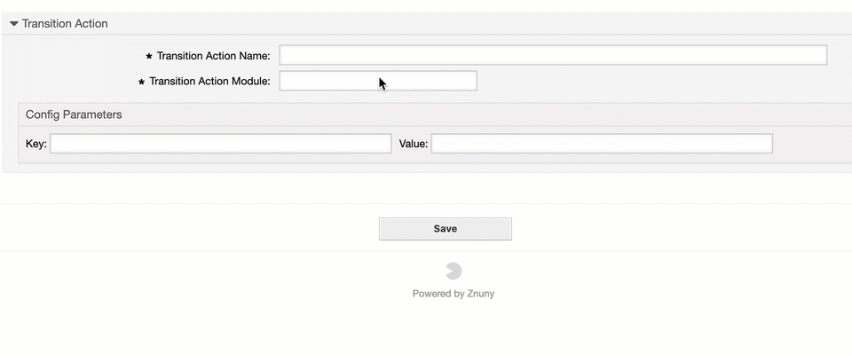
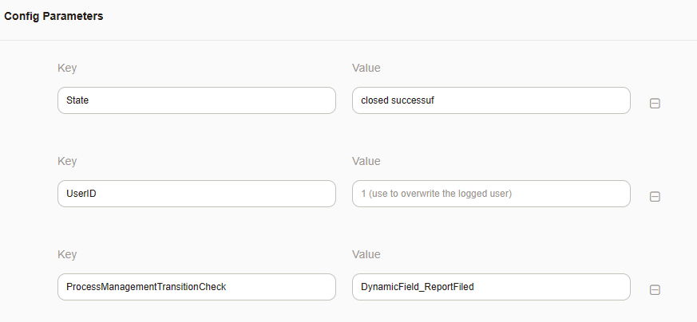
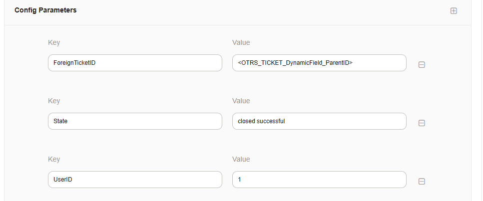

.. _TransitionAction Generic Parameter Helper:

Generic Information
###################

Parameter Helper
*****************

The parameter helper pre-fills transition actions for you, so you don't have to.

This tool shows the required and optional parameters for every transition action right when the module is selected:

Mandatory keys have an *asterisk "\*"* in the example field and require a value. For a detailed description of the modules read the perl API documentation for each transition action.

.. tip:: 

   You can run the command on the command line. All modules are located at Kernel/System/ProcessManagement/TransitionAction

   An example call would be: ``perldoc Kernel/System/ProcessManagement/TransitionAction/TicketTitleSet.pm``

   .. code-block:: shell
   
      NAME
      Kernel::System::ProcessManagement::TransitionAction::TicketTitleSet - A
      Module to set the title of a Ticket
      
      DESCRIPTION
      All TicketTitleSet functions.
      
      PUBLIC INTERFACE
      new()
      Don't use the constructor directly, use the ObjectManager instead:

      my $TicketTitleSetObject = $Kernel::OM->Get('Kernel::System::ProcessManagement::TransitionAction::TicketTitleSet');
      
      Run()
      Runs TransitionAction TicketTitleSet.

        my $Success = $TicketTitleSetActionObject->Run(
            UserID                   => 123,

            # Ticket contains the result of TicketGet including dynamic fields
            Ticket                   => \%Ticket,   # required
            ProcessEntityID          => 'P123',
            ActivityEntityID         => 'A123',
            TransitionEntityID       => 'T123',
            TransitionActionEntityID => 'TA123',

            # Config is the hash stored in a Process::TransitionAction's config key
            Config                   => {
                Title  => 'Some ticket title',
                UserID => 123,                      # optional, to override the UserID from the logged user

            }
        );

    Returns:

        my $Success = 1; # 0

    TERMS AND CONDITIONS
    This software is part of the OTRS project (<https://otrs.org/>).

    This software comes with ABSOLUTELY NO WARRANTY. For details, see the
    enclosed file COPYING for license information (GPL). If you did not
    receive this file, see <https://www.gnu.org/licenses/gpl-3.0.txt>.
   

.. note:: 
    
    For most parameters, the and ID is acceptable. ("Owner" and "OwnerID"). 
    Parameters are single-use. "Owner" and "OwnerID" are redundant and different values might lead to unexpected results.

This feature is customizable:

``ProcessManagement::TransitionAction::DefaultParameters###001-Framework``. 

Modify defaults, remove unused items or add new defaults for transition action modules you've developed.

Tags
****

You can use the following place holder (tags) in the value field of transition actions:

* <OTRS_OWNER_*>
* <OTRS_CURRENT_*>
* <OTRS_RESPONSIBLE_*>
* <OTRS_CUSTOMER_DATA_*>
* <OTRS_AGENT_*>
* <OTRS_CUSTOMER_*>
* <OTRS_TICKET_*>
* <OTRS_FIRST_ARTICLE_*>
* <OTRS_LAST_ARTICLE_*>
* <OTRS_CONFIG_*>

Common Parameters
*****************

Additional check for transition actions
========================================

There is a new parameter available for every transition action. It selectively determines if the transition action applies or not.

``ProcessManagementTransitionCheck``

If this parameter exists (and contains a value), the transition action is performed.

Only if the dynamic field *Example1* contains a value is the ticket state then set.

.. note:: Limitation

   Not all attributes apply as some always exist. This module only checks if a value exists, not which value.
   *Title*, for example, cannot be used as a check as it always exists and has a value.

Some examples fields are:

* CustomerID
* CustomerUserID
* Service
* ServiceID
* SLA
* SLAID
* DynamicField\_<*>

.. _TransitionAction Generic Foreign Ticket:

Executing transition action on other tickets
============================================

With the parameters ``ForeignTicketID`` or ``ForeignTicketNumber``, it is possible to execute a transition action module on behalf of another ticket. 

The example shows how to close a parent ticket.

This functionality is available for almost every ticket-related transition action module.
