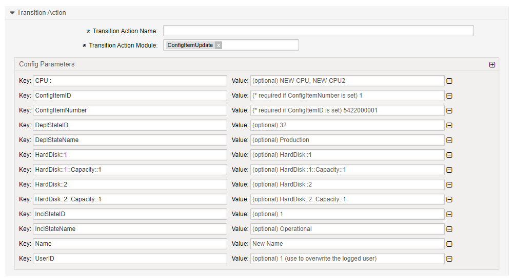

.. _TransitionAction ConfigItemUpdate:

Update a Configuration Item
############################

Pre-Requisites
***************

Some ITSM packages are required to use this transition action:

* GeneralCatalog
* ITSMCore
* ITSMConfigurationManagement

These can be downloaded from the `ITSM Repository for Znuny <https://download.znuny.org/releases/itsm/packages6x/>`_

Summary
*******

Use this action to update configuration item(s).

The name of the transition action is :ref:`ConfigItemUpdate <TransitionAction ConfigItemUpdate>`

Transition Action Module Configuration
**************************************

The following list shows the mandatory items.

+------------------+---------------+----------------------------------------------------+-------------------------------------------------+
| Key              | Example Value | Description                                        | Mandatory                                       |
+==================+===============+====================================================+=================================================+
| ConfigItemID     | 123           | Numerical entity ID of the configuration item.     | yes, or optionally ConfigItemNumber.            |
|                  | or            |                                                    |                                                 |
|                  | 123,456,789   |                                                    | Multiple values are valid when comma separated. |
|                  |               |                                                    |                                                 |
|                  |               |                                                    |                                                 |
+------------------+---------------+----------------------------------------------------+-------------------------------------------------+
| ConfigItemNumber | 123           | Numerical reference of the configuration Item.     | no, if ConfigItemID is used.                    |
|                  | or            |                                                    |                                                 |
|                  | 123,456,789   |                                                    | Multiple values are valid when comma separated. |
+------------------+---------------+----------------------------------------------------+-------------------------------------------------+
| InciStateID      | 1             | Numerical entity ID of the incident state ID found |                                                 |
|                  |               | in the general catalog.                            | no                                              |
+------------------+---------------+----------------------------------------------------+-------------------------------------------------+
| InciStateName    | Operational   | The named incident state as found in the general   |                                                 |
|                  |               | catalog.                                           | no                                              |
+------------------+---------------+----------------------------------------------------+-------------------------------------------------+
| DeplStateID      | 1             | Numerical entity ID of the incident state ID found |                                                 |
|                  |               | in the general catalog.                            | no                                              |
+------------------+---------------+----------------------------------------------------+-------------------------------------------------+
| DeplStateName    | Production    | The named deployment state as found in the         |                                                 |
|                  |               | general catalog.                                   | no                                              |
+------------------+---------------+----------------------------------------------------+-------------------------------------------------+
| XML Keys         |               |                                                    |                                                 |
+------------------+---------------+----------------------------------------------------+-------------------------------------------------+
| CPU              | i7-1165G7     | The value to be saved to the class. The Key is     |                                                 |
|                  |               | the XML key name as seen in the configuration      |                                                 |
|                  |               | items class definition.                            | no                                              |
+------------------+---------------+----------------------------------------------------+-------------------------------------------------+

XML Keys
========

XML keys are named in the configuration item class definition. See the example below.

**Example Class Definition**

.. code-block:: yaml

    ---
    - Key: Vendor
      Name: Vendor
      Searchable: 1
      Input:
        Type: Text
        Size: 50
        MaxLength: 50
        # Example for CI attribute syntax check for text and textarea fields
        #RegEx: ^ABC.*
        #RegExErrorMessage: Value must start with ABC!
    
    - Key: Model
      Name: Model
      Searchable: 1
      Input:
        Type: Text
        Size: 50
        MaxLength: 50
    
    - Key: Description
      Name: Description
      Searchable: 1
      Input:
        Type: TextArea
    
    - Key: Type
      Name: Type
      Searchable: 1
      Input:
        Type: GeneralCatalog
        Class: ITSM::ConfigItem::Computer::Type
        Translation: 1
    
    - Key: CustomerID
      Name: Customer Company
      Searchable: 1
      Input:
        Type: CustomerCompany
    
    - Key: Owner
      Name: Owner
      Searchable: 1
      Input:
        Type: Customer
    
    - Key: SerialNumber
      Name: Serial Number
      Searchable: 1
      Input:
        Type: Text
        Size: 50
        MaxLength: 100
    
    - Key: OperatingSystem
      Name: Operating System
      Input:
        Type: Text
        Size: 50
        MaxLength: 100
    
    - Key: CPU
      Name: CPU
      Input:
        Type: Text
        Size: 50
        MaxLength: 100
      CountMax: 16
    
    - Key: Ram
      Name: Ram
      Input:
        Type: Text
        Size: 50
        MaxLength: 100
      CountMax: 10
    
    - Key: HardDisk
      Name: Hard Disk
      Input:
        Type: Text
        Size: 50
        MaxLength: 100
      CountMax: 10
      Sub:
      - Key: Capacity
        Name: Capacity
        Input:
          Type: Text
          Size: 20
          MaxLength: 10
    
    - Key: FQDN
      Name: FQDN
      Searchable: 1
      Input:
        Type: Text
        Size: 50
        MaxLength: 100
    
    - Key: NIC
      Name: Network Adapter
      Input:
        Type: Text
        Size: 50
        MaxLength: 100
        Required: 1
      CountMin: 0
      CountMax: 10
      CountDefault: 1
      Sub:
      - Key: IPoverDHCP
        Name: IP over DHCP
        Input:
          Type: GeneralCatalog
          Class: ITSM::ConfigItem::YesNo
          Translation: 1
          Required: 1
      - Key: IPAddress
        Name: IP Address
        Searchable: 1
        Input:
          Type: Text
          Size: 40
          MaxLength: 40
          Required: 1
        CountMin: 0
        CountMax: 20
        CountDefault: 0
    
    - Key: GraphicAdapter
      Name: Graphic Adapter
      Input:
        Type: Text
        Size: 50
        MaxLength: 100
    
    - Key: OtherEquipment
      Name: Other Equipment
      Input:
        Type: TextArea
        Required: 1
      CountMin: 0
      CountDefault: 0
    
    - Key: WarrantyExpirationDate
      Name: Warranty Expiration Date
      Searchable: 1
      Input:
        Type: Date
        YearPeriodPast: 20
        YearPeriodFuture: 10
    
    - Key: InstallDate
      Name: Install Date
      Searchable: 1
      Input:
        Type: Date
        Required: 1
        YearPeriodPast: 20
        YearPeriodFuture: 10
      CountMin: 0
      CountDefault: 0
    
    - Key: Note
      Name: Note
      Searchable: 1
      Input:
        Type: TextArea
        Required: 1
      CountMin: 0
      CountDefault: 0

Input Types
~~~~~~~~~~~~

As you can see above there are different input types. In the case of *GeneralCatalog*, you must ensure the value used is registered in the general catalog.

**Example:**

+------------+---------------+
| Key        | Example value |
+============+===============+
| IPoverDHCP | Yes           |
+------------+---------------+
   
Multiple Keys
~~~~~~~~~~~~~

It is possible to have more than one of the same key using:

* CountDefault
* CountMax
* CountMin

They may be modified individually or in one key. In example 2 you would have NIC::1 as Intel and NIC::2 as Wacom.

**Example 1:**

+--------+---------------+
| Key    | Example value |
+========+===============+
| NIC::1 | Intel         |
+--------+---------------+
| NIC::2 | Wacom         |
+--------+---------------+

**Example 2**

+--------+---------------+
| Key    | Example value |
+========+===============+
| NIC\:: | Intel,Wacom   |
+--------+---------------+

Sub-keys
~~~~~~~~

Sub-keys are always separated by "::"

**Example 1:**

+-----------------+---------------+
| Key             | Example value |
+=================+===============+
| NIC::IPoverDHCP | Yes           |
+-----------------+---------------+

**Example 2:**

+--------------------+---------------+
| Key                | Example value |
+====================+===============+
| NIC::1::IPoverDHCP | Yes           |
+--------------------+---------------+

**Example 3:**

+------------+---------------+
| Key        | Example value |
+============+===============+
| NIC::IP::1 | 192.168.2.1   |
+------------+---------------+
| NIC::IP::2 | 57.56.200.128 |
+------------+---------------+
