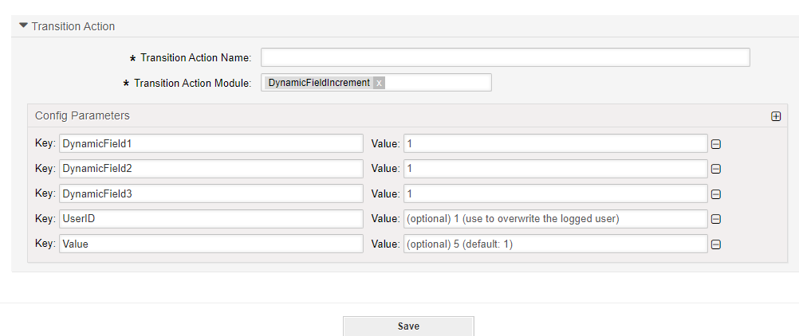

.. _TransitionAction DynamicFieldIncrement:

Incrementing a Dynamic Field Value
############################################################

Summary
********

Use this action to increase or decrease a numerical value saved to a text field. 

The name of the transition action is :ref:`DynamicFieldIncrement <TransitionAction DynamicFieldIncrement>` 

.. note::

   This transition action is designed for fields of the type Text. Don't expect a valid result when using a dropdown, for example.

Transition Action Module Configuration
**************************************

The following list shows the mandatory items.

+-------------------+---------------+-----------------------------------------+-----------+
| Key               | Example value | Description                             | Mandatory |
+===================+===============+=========================================+===========+
| DynamicFieldNameX | 1             | Marks the field for change              | yes       |
+-------------------+---------------+-----------------------------------------+-----------+
| Value             | 5             | Amount to change (can be negative)      | yes       |
+-------------------+---------------+-----------------------------------------+-----------+
| UserID            | 123           | no, will override the logged in user id | no        |
+-------------------+---------------+-----------------------------------------+-----------+
