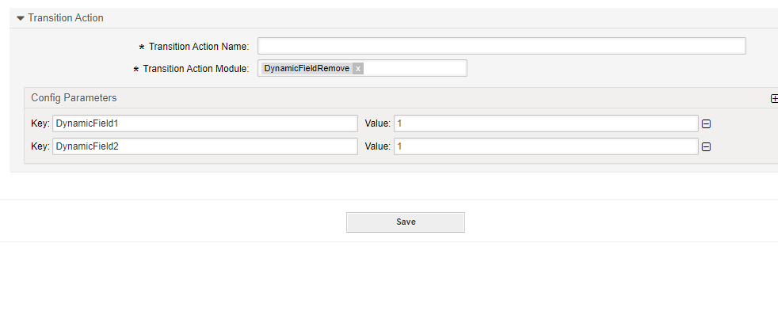

.. _TransitionAction DynamicFieldRemove:

Delete a Dynamic Field
#######################

Summary
********

Use this action to delete a dynamic field.

The name of the transition action is :ref:`DynamicFieldRemove <TransitionAction DynamicFieldRemove>` 

.. note:: 

   This transition action will delete the field from a ticket completly and not clear the value. To clear a value, you can use :ref:`DynamicFieldSet <TransitionAction DynamicFieldSet>` 

Transition Action Module Configuration
**************************************

The following list shows the mandatory items.

+-------------------+---------------+----------------------------+-----------------------------------------+
| Key               | Example value | Description                | Mandatory                               |
+===================+===============+============================+=========================================+
| DynamicFieldNameX | 1             | This will remove the field | yes, at least one field must be removed |
+-------------------+---------------+----------------------------+-----------------------------------------+
| UserID            | 123           | A valid user id            | no, will override the logged in user id |
+-------------------+---------------+----------------------------+-----------------------------------------+
