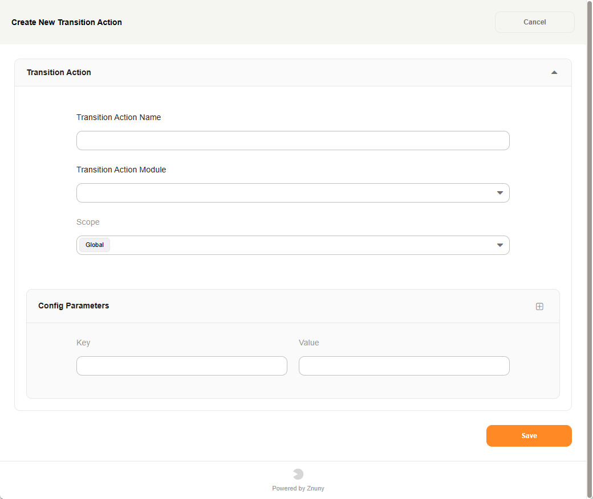

Transition Actions
##################
.. _PageNavigation processmanagement_transitionactions:

Adding a transition action is always similar, only the attributes will change. See the following list for the individual needed attributes.

Overview

.. toctree::
   :maxdepth: 2

   common/index
   appointmentcreate/index
   appointmentremove/index
   appointmentupdate/index
   configitemupdate/index
   dynamicfieldincrement/index
   dynamicfieldpendingtimeset/index
   dynamicfieldremove/index
   executeinvoker/index
   linkadd/index
   ticketarticlecreate/index
   ticketarticlesend/index
   ticketcreate/index
   ticketcustomerset/index
   ticketdynamicfieldset/index
   ticketlockset/index
   ticketpriorityset/index
   ticketqueueset/index
   ticketresponsibleset/index
   ticketserviceset/index
   ticketslaset/index
   ticketstateset/index
   tickettitleset/index
   tickettypeset/index
   ticketwatchset/index

.. add new files to list above to include them in toc
