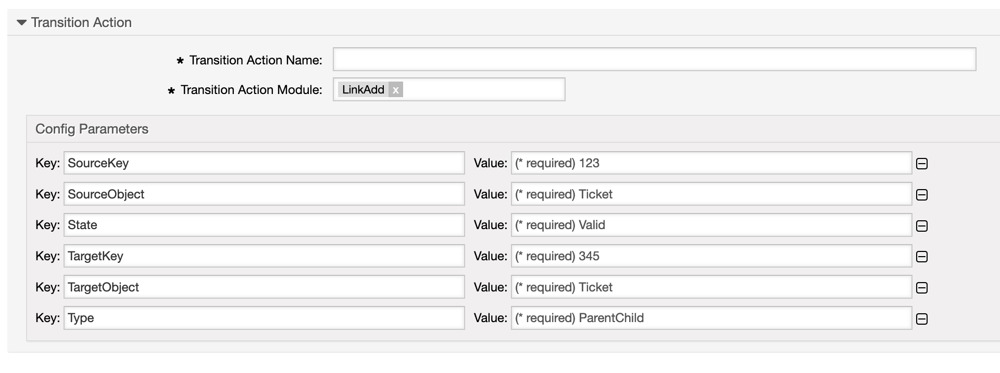

.. _TransitionAction LinkAdd:

Link Objects Together
#####################

Summary
*******

This module allows you to link object together.

The name of the transition action is :ref:`LinkAdd <TransitionAction LinkAdd>` 

.. note:: 

    The objects can be any object and not just tickets. Every available object and link type can be used. 
    

.. warning:: 

    The parameter :ref:`ForeignTicketID/ForeignTicketNumber<TransitionAction Generic Foreign Ticket>` does not work with this transition action.

Transition Action Module Configuration
**************************************

The following list shows the mandatory items.

+--------------+------------------------+------------------------------------------------------------------------------+-----------+
| Key          | Example value          | Description                                                                  | Mandatory |
+==============+========================+==============================================================================+===========+
| SourceObject | Ticket                 | Possible objects could be 'Appointment', 'Service', 'Ticket',                | Yes       |
|              |                        | 'FAQ', 'ITSMConfigItem', 'ITSMChange', 'ITSMWorkOrder'                       |           |
+--------------+------------------------+------------------------------------------------------------------------------+-----------+
| SourceKey    | <OTRS_TICKET_TicketID> | ID of the source object, Smart tags are supported                            | Yes       |
+--------------+------------------------+------------------------------------------------------------------------------+-----------+
| TargetObject | FAQ                    | See SourceObject                                                             | Yes       |
+--------------+------------------------+------------------------------------------------------------------------------+-----------+
| TargetKey    | 45054                  | ID of the source object, Smart tags are supported                            | Yes       |
+--------------+------------------------+------------------------------------------------------------------------------+-----------+
| Type         | Normal                 | Possible values are 'Normal', 'ParentChild', 'AlternativeTo', 'ConnectedTo', | Yes       |
|              |                        | 'DependsOn', 'Includes', 'RelevantTo'                                        |           |
+--------------+------------------------+------------------------------------------------------------------------------+-----------+
| State        | Valid                  | Link state, possible values are 'Valid' and 'Temporary'.                     | Yes       |
|              |                        | Do not use 'Temporary' unless you really know why.                           |           |
+--------------+------------------------+------------------------------------------------------------------------------+-----------+

.. important:: Considerations and Limitations

   The available objects and link types may differ based upon your customizations and installed add-ons.

