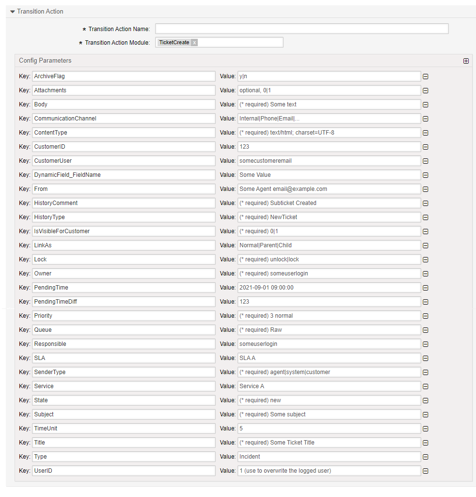
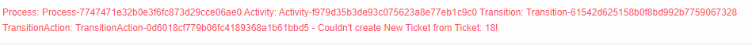

.. _TransitionAction TicketCreate:

Create a Ticket
################

Summary
*******

This action allows you to create a new ticket.

The name of the transition action is :ref:`TicketCreate <TransitionAction TicketCreate>`

Transition Action Module Configuration
**************************************

The following list shows the mandatory items.

+----------------------+-----------------------------------+-----------------------------------------------------------------------------------------------+---------------------------------------------------------------------+
| Key                  | Example value                     | Description                                                                                   | Mandatory                                                           |
+======================+===================================+===============================================================================================+=====================================================================+
| Title                | Some Title                        | text                                                                                          | yes                                                                 |
+----------------------+-----------------------------------+-----------------------------------------------------------------------------------------------+---------------------------------------------------------------------+
| Queue                | Raw                               | Some queue name                                                                               | yes                                                                 |
+----------------------+-----------------------------------+-----------------------------------------------------------------------------------------------+---------------------------------------------------------------------+
| QueueID              | 1                                 | Some queue id                                                                                 | or Queue                                                            |
+----------------------+-----------------------------------+-----------------------------------------------------------------------------------------------+---------------------------------------------------------------------+
| Lock                 | unlock                            | Some valid ticket lock type                                                                   | yes                                                                 |
+----------------------+-----------------------------------+-----------------------------------------------------------------------------------------------+---------------------------------------------------------------------+
| Priority             | 3 normal                          | Some valid ticket priority                                                                    | yes                                                                 |
+----------------------+-----------------------------------+-----------------------------------------------------------------------------------------------+---------------------------------------------------------------------+
| PriorityID           | 3                                 | Some valid priority ID                                                                        | or Priority                                                         |
+----------------------+-----------------------------------+-----------------------------------------------------------------------------------------------+---------------------------------------------------------------------+
| State                | open                              | Some valid State                                                                              | yes                                                                 |
+----------------------+-----------------------------------+-----------------------------------------------------------------------------------------------+---------------------------------------------------------------------+
| StateID              | 3                                 | Some valid State ID                                                                           | or State                                                            |
+----------------------+-----------------------------------+-----------------------------------------------------------------------------------------------+---------------------------------------------------------------------+
| CustomerID           | customer                          | Some customer user value                                                                      | yes, if CustomerUser not a valid customer user                      |
+----------------------+-----------------------------------+-----------------------------------------------------------------------------------------------+---------------------------------------------------------------------+
| CustomerUser         | userlogin                         | Some user email or login                                                                      | yes                                                                 |
+----------------------+-----------------------------------+-----------------------------------------------------------------------------------------------+---------------------------------------------------------------------+
| Owner                | agentlogin                        | A valid agent login                                                                           | no, default to logged in agent                                      |
+----------------------+-----------------------------------+-----------------------------------------------------------------------------------------------+---------------------------------------------------------------------+
| OwnerID              | 1                                 | A valid agent login ID                                                                        | no, only an option instead of logged in agent or Owner              |
+----------------------+-----------------------------------+-----------------------------------------------------------------------------------------------+---------------------------------------------------------------------+
| Type                 | Unclassified                      | A valid type                                                                                  | no                                                                  |
+----------------------+-----------------------------------+-----------------------------------------------------------------------------------------------+---------------------------------------------------------------------+
| TypeID               | 1                                 | A valid type ID                                                                               | no                                                                  |
+----------------------+-----------------------------------+-----------------------------------------------------------------------------------------------+---------------------------------------------------------------------+
| Service              | ServiceA                          | A valid service                                                                               | no                                                                  |
+----------------------+-----------------------------------+-----------------------------------------------------------------------------------------------+---------------------------------------------------------------------+
| ServiceID            | 1                                 | A valid service ID. Must be assignable to the selected CustomerUser                           | no                                                                  |
+----------------------+-----------------------------------+-----------------------------------------------------------------------------------------------+---------------------------------------------------------------------+
| SLA                  | VIP                               | A valid SLA                                                                                   | no                                                                  |
+----------------------+-----------------------------------+-----------------------------------------------------------------------------------------------+---------------------------------------------------------------------+
| SLAID                | 1                                 | A valid SLA ID                                                                                | no                                                                  |
+----------------------+-----------------------------------+-----------------------------------------------------------------------------------------------+---------------------------------------------------------------------+
| Responsible          | supervisor                        | A valid Agent                                                                                 | no                                                                  |
+----------------------+-----------------------------------+-----------------------------------------------------------------------------------------------+---------------------------------------------------------------------+
| ResponsibleID        | 1                                 | A valid agent ID                                                                              | no                                                                  |
+----------------------+-----------------------------------+-----------------------------------------------------------------------------------------------+---------------------------------------------------------------------+
| ArchiveFlag          | n                                 | y or n`                                                                                       | no                                                                  |
+----------------------+-----------------------------------+-----------------------------------------------------------------------------------------------+---------------------------------------------------------------------+
| PendingTime          | 2011-12-23 23:05:00               | On 2011-12-23 at 23:05:00                                                                     | only when choosing a state of type pending auto or pending reminder |
+----------------------+-----------------------------------+-----------------------------------------------------------------------------------------------+---------------------------------------------------------------------+
| PendingTimeDiff      | 1440                              | one day in the future                                                                         | only when choosing a state of type pending auto or pending reminder |
+----------------------+-----------------------------------+-----------------------------------------------------------------------------------------------+---------------------------------------------------------------------+
| TimeUnit             | 5                                 | 5 time units                                                                                  | no                                                                  |
+----------------------+-----------------------------------+-----------------------------------------------------------------------------------------------+---------------------------------------------------------------------+
| DynamicField_NameX   | value                             | A value for field NameX                                                                       | no                                                                  |
+----------------------+-----------------------------------+-----------------------------------------------------------------------------------------------+---------------------------------------------------------------------+
| LinkAs               | Parent                            | Link as parent of current ticket. Parent or Child or Normal                                   | no                                                                  |
+----------------------+-----------------------------------+-----------------------------------------------------------------------------------------------+---------------------------------------------------------------------+
| UserID               | 1                                 | no, will override the logged in user id                                                       | no                                                                  |
+----------------------+-----------------------------------+-----------------------------------------------------------------------------------------------+---------------------------------------------------------------------+
| Attachments          | 1                                 | Use attachments marked for use in the ::ref:`activity dialog <ActivityDialog>` configuration. |                                                                     |
+----------------------+-----------------------------------+-----------------------------------------------------------------------------------------------+---------------------------------------------------------------------+
|                      |                                   |                                                                                               |                                                                     |
+----------------------+-----------------------------------+-----------------------------------------------------------------------------------------------+---------------------------------------------------------------------+
| **Article Data**     |                                   |                                                                                               |                                                                     |
+----------------------+-----------------------------------+-----------------------------------------------------------------------------------------------+---------------------------------------------------------------------+
|                      |                                   |                                                                                               |                                                                     |
+----------------------+-----------------------------------+-----------------------------------------------------------------------------------------------+---------------------------------------------------------------------+
| SenderType           | agent                             | Defines the sender type.                                                                      | yes                                                                 |
+----------------------+-----------------------------------+-----------------------------------------------------------------------------------------------+---------------------------------------------------------------------+
| IsVisibleForCustomer | 1                                 | Defines visibility.                                                                           | yes                                                                 |
+----------------------+-----------------------------------+-----------------------------------------------------------------------------------------------+---------------------------------------------------------------------+
| CommunicationChannel | Internal                          | Defines the channel of communication.                                                         | no                                                                  |
+----------------------+-----------------------------------+-----------------------------------------------------------------------------------------------+---------------------------------------------------------------------+
| ContentType          | text/html; charset=utf-8          | The content Type of the communication.                                                        | yes, if no MimeType and Charset is used                             |
+----------------------+-----------------------------------+-----------------------------------------------------------------------------------------------+---------------------------------------------------------------------+
| MimeType             | text/html                         | The MIME Type of the communication.                                                           | no                                                                  |
+----------------------+-----------------------------------+-----------------------------------------------------------------------------------------------+---------------------------------------------------------------------+
| Charset              | utf-8                             | Only utf=8 should be used.                                                                    | no                                                                  |
+----------------------+-----------------------------------+-----------------------------------------------------------------------------------------------+---------------------------------------------------------------------+
| HistoryType          | AddNote                           | The type of the history entry. Must be a valid type.                                          | yes                                                                 |
+----------------------+-----------------------------------+-----------------------------------------------------------------------------------------------+---------------------------------------------------------------------+
| HistoryComment       | Added Note                        | A free text comment.                                                                          | yes                                                                 |
+----------------------+-----------------------------------+-----------------------------------------------------------------------------------------------+---------------------------------------------------------------------+
| From                 | Some Agent <email@example.com>    | The sender.                                                                                   | yes                                                                 |
+----------------------+-----------------------------------+-----------------------------------------------------------------------------------------------+---------------------------------------------------------------------+
| To                   | Some customer <email@example.com> | The recipient.                                                                                | yes                                                                 |
+----------------------+-----------------------------------+-----------------------------------------------------------------------------------------------+---------------------------------------------------------------------+
| Subject              | Internal                          | Defines the channel of communication.                                                         | yes                                                                 |
+----------------------+-----------------------------------+-----------------------------------------------------------------------------------------------+---------------------------------------------------------------------+
| Body                 | Some text                         | Plain text or HTML text based on content type.                                                | yes                                                                 |
+----------------------+-----------------------------------+-----------------------------------------------------------------------------------------------+---------------------------------------------------------------------+

.. tip:: Start a Process

   By filling ``DynamicField_ProcessManagementProcessID`` and ``DynamicField_ProcessManagementActivityID``, you can start a process at any activity when creating the ticket.

.. tip:: Logging and Errors

   If a ticket is not created, the system log will state why.

**Sample Log:** 

