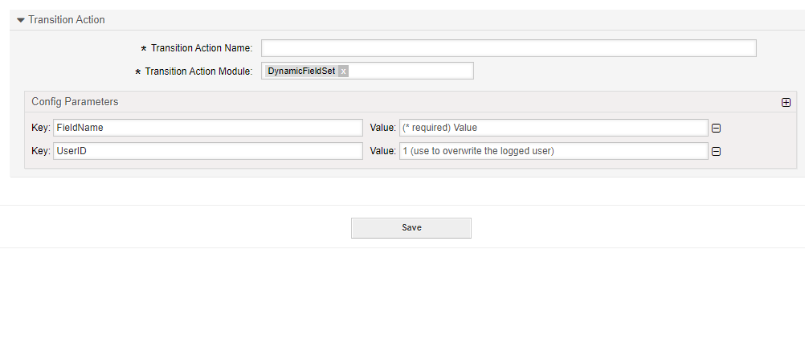

.. _TransitionAction DynamicFieldSet:

Set a Dynamic Field
###################

Summary
********

With this module you can set the customer user of a ticket.

The name of the transition action is :ref:`DynamicFieldSet <TransitionAction DynamicFieldSet>`

Transition Action Module Configuration
**************************************

The following list shows the mandatory items.

+-------------+---------------------+------------------------------+---------------------------------------------------------------+
| Key         | Example Value       | Description                  | Mandatory                                                     |
+=============+=====================+==============================+===============================================================+
| Text        | Value X             | A value to be saved          | yes, at least one dynamic field name and value should be set. |
+-------------+---------------------+------------------------------+---------------------------------------------------------------+
| MultiSelect | value,new,third     | A multi-select value         | no. commas separated values if used                           |
+-------------+---------------------+------------------------------+---------------------------------------------------------------+
| DateTime    | 2022-11-01 00:00:00 | A date time stamp            | no. ISO Format if used                                        |
+-------------+---------------------+------------------------------+---------------------------------------------------------------+
| Date        | 2022-11-01          | A date stamp                 | no. ISO Format if used                                        |
+-------------+---------------------+------------------------------+---------------------------------------------------------------+
| Checkbox    | 1                   | 1 = checked, 0 = not checked | no.                                                           |
+-------------+---------------------+------------------------------+---------------------------------------------------------------+
| UserID      | 123                 | A valid user id              | no, will override the logged in user id                       |
+-------------+---------------------+------------------------------+---------------------------------------------------------------+

.. tip:: Deleting a value

    You may also enter nothing to delete the value of the filed, but not delete the field. To delete the field fully, please use :ref:`DynamicFieldRemove <TransitionAction DynamicFieldRemove>` 

