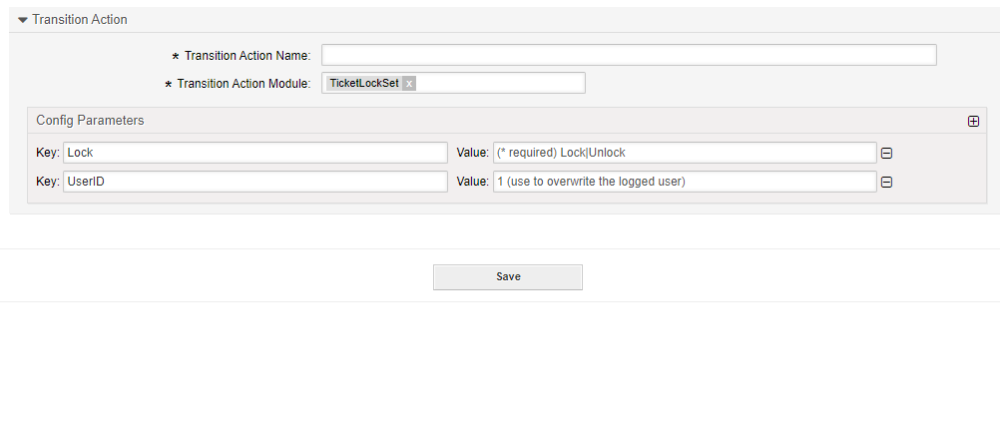

.. _TransitionAction TicketLockSet:

Lock a Ticket
#############

Summary
********

With this module you can set the customer user of a ticket.

The name of the transition action is :ref:`TicketLockSet <TransitionAction TicketLockSet>`

Transition Action Module Configuration
**************************************

The following list shows the mandatory items.

+--------+---------------+---------------------+-----------------------------------------+
| Key    | Example Value | Description         | Mandatory                               |
+========+===============+=====================+=========================================+
| Lock   | lock          | lock or unlock      | yes, or LockID                          |
+--------+---------------+---------------------+-----------------------------------------+
| LockID | 1             | 1 = lock 2 = unlock | no. if Lock is used                     |
+--------+---------------+---------------------+-----------------------------------------+
| UserID | 123           | A valid user id     | no, will override the logged in user id |
+--------+---------------+---------------------+-----------------------------------------+

.. tip:: Owner After Lock

    Using the UserID field will not lock the ticket to the user, but to the owner in the ticket. Generally the field is used to unlock tickets automatically.
