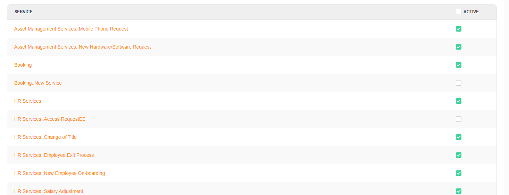

.. _TransitionAction TicketServiceSet:

Set a Ticket Service
#####################

Summary
********

With this module you can set the service of a ticket.

The name of the transition action is :ref:`TicketServiceSet <TransitionAction TicketServiceSet>` and should be used in combination with :ref:`TicketSLASet <TransitionAction TicketSLASet>`.

Transition Action Module Configuration
**************************************

The following list shows the mandatory items.

+-----------+---------------+--------------------+-----------------------------------------+
| Key       | Example Value | Description        | Mandatory                               |
+===========+===============+====================+=========================================+
| Service   | Hardware      | A valid service    | yes, or ServiceID                       |
+-----------+---------------+--------------------+-----------------------------------------+
| ServiceID | 1             | A valid service ID | no. if Service is used                  |
+-----------+---------------+--------------------+-----------------------------------------+
| UserID    | 123           | A valid user ID    | no, will override the logged in user id |
+-----------+---------------+--------------------+-----------------------------------------+

.. important:: Services and Customers

   It's important to know that a service can be set independent of an SLA, the customer has to either 
   be assigned the service or it must be available as a default service.

**Setting an default service:**

**Setting an user specific service:**

.. image:: images/AdminCustomerUserUserServices.png
    :width: 100%
    :alt: Customer Specific Services

.. tip:: System Configuration

   The configuration ``Ticket::Service`` should be enabled.