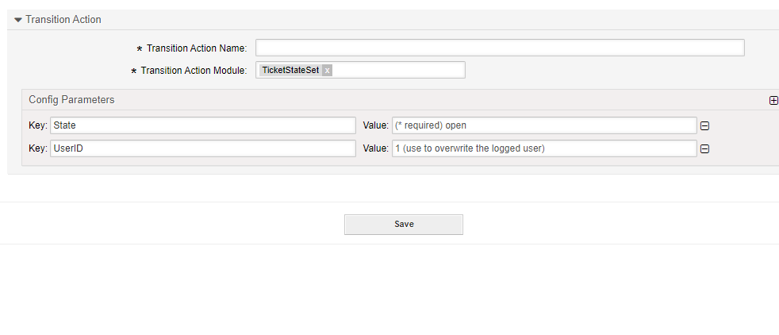

.. _TransitionAction TicketStateSet:

Set a Ticket State
##################

Summary
********

With this module you can set the state of a ticket.

The name of the transition action is :ref:`TicketStateSet <TransitionAction TicketStateSet>`.

Transition Action Module Configuration
**************************************

The following list shows the mandatory items.

.. list-table::
   :widths: 10 20 35 35
   :header-rows: 1

   * - Key
     - Example value
     - Description
     - Mandatory
   * - State
     - open
     - A valid ticket state.
     - Yes, or use StateID.
   * - StateID
     - 2
     - A valid state id.
     - Not if State is used.
   * - PendingTime
     - 2022-11-01 00:00:00
     - A valid ISO date time stamp.
     - Yes, if the state is of the state type pending auto or pending reminder.
   * - PendingTimeDiff
     - 3600
     - Seconds added to the time of the transition action's exectution.
     - No, only if PendingTime is not used.
   * - UserID
     - 123
     - Can be used to override the current user id.
     - Optional
