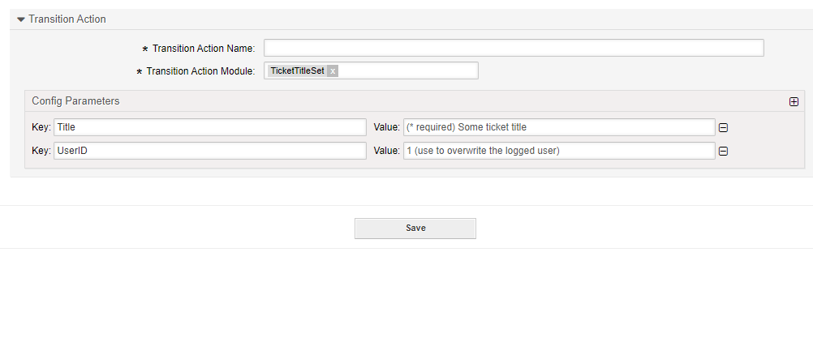

.. _TransitionAction TicketTitleSet:

Set a Ticket Title
##################

Summary
********

With this module you can set the title of a ticket.

The name of the transition action is :ref:`TicketTitleSet <TransitionAction TicketTitleSet>`.

Transition Action Module Configuration
**************************************

The following list shows the mandatory items.

+-----------------+---------------------+-----------------------------+---------------------------------------------------------------+
| Key             | Example Value       | Description                 | Mandatory                                                     |
+=================+=====================+=============================+===============================================================+
| Title           | A title             | A string as ticket title    | yes                                                           |
+-----------------+---------------------+-----------------------------+---------------------------------------------------------------+
| UserID          | 123                 | A valid user ID             | no, will override the logged in user id                       |
+-----------------+---------------------+-----------------------------+---------------------------------------------------------------+
