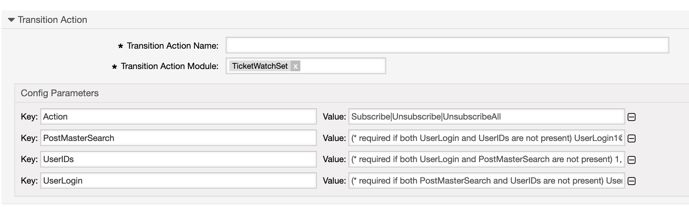
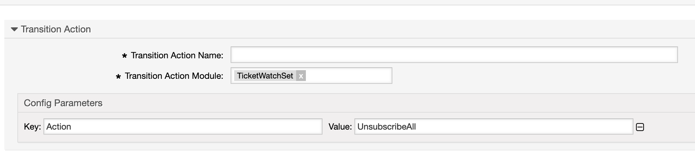

.. _TransitionAction TicketWatchSet:

Manage Ticket Subscriptions
###########################

Summary
*******

A transition action to control a ticket's watching agents. The watcher(s) can be added (Subscribe) and removed (Unsubscribe).

The name of the transition action is :ref:`TicketWatchSet <TransitionAction TicketWatchSet>`.

Transition Action Module Configuration
**************************************

+------------------+----------------+------------------------------------------------+------------------------+
| Key              | Example value  | Description                                    | Mandatory              |
+==================+================+================================================+========================+
| Action           | Subscribe      | 'Subscribe', 'Unsubscribe' and UnsubscribeAll' | yes                    |
+------------------+----------------+------------------------------------------------+------------------------+
| PostMasterSearch | info@znuny.com | One or more valid user                         | yes, for (Un)Subscribe |
+------------------+----------------+------------------------------------------------+------------------------+
| UserIDs          | 1              | One or more valid user ids                     | yes, for (Un)Subscribe |
+------------------+----------------+------------------------------------------------+------------------------+
| UserLogin        | root@localhost | One or more valid user login                   | yes, for (Un)Subscribe |
+------------------+----------------+------------------------------------------------+------------------------+

**Unsubscribe All Example:**

.. note:: Multiple Values

    Multiple values for ``PostMasterSearch``, ``UserIDs`` and ``UserLogin`` are possible. They need to be separated with a ``,``.
    Smart tags like <OTRS_TICKET_OwnerID> for the values are also allowed.
