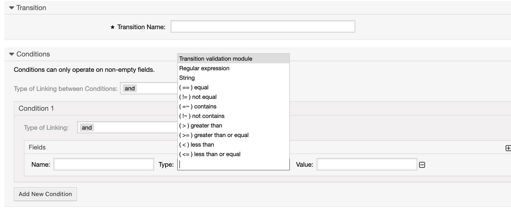

Condition Types in Transitions
~~~~~~~~~~~~~~~~~~~~~~~~~~~~~~

The already know types for conditions `String`, `Regular expression` and `Transition validation module` are extended with these types:

* == equal
* != not equal
* ~= contains
* !~ contains not
* > greater than
* >= greater than or equal
* < less than
* <= less than or equal

The types ``==`` and ``!=`` work for all data types, ``>``, ``>=``, ``<`` and ``<=`` are only usefull with numbers and date / date time values.

The existing smart tags like <OTRS_TICKET_*> can be used for both, the Name and the Value. If you use dynamic fields of the type Dropdown or Multiselect their keys are used in the conditions.
