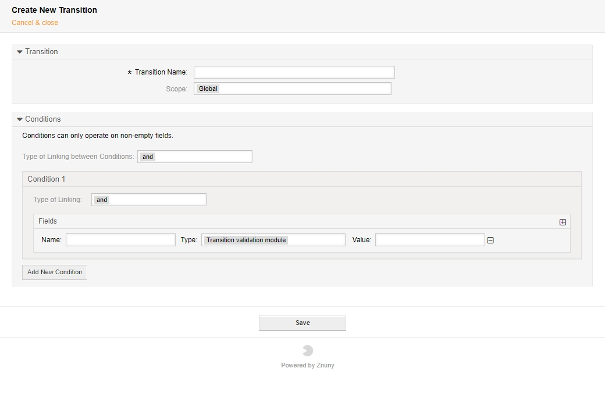

Transitions
###########
.. _PageNavigation processmanagement_transitions:

Transitions are the conditions allowing a process to progress. The conditions match ticket data and use different matching types to compare the ticket data with the expression.

The ticket data (entered in the Name field) is compared to the string in the value field. If the condition evaluates to ``True``, the process transitions and all transition actions are applied.

Common Ticket Data for Comparison:

+----------------+--------------------------+
| Name           | Sample Value             |
+================+==========================+
| TicketNumber   | '20101027000001'         |
+----------------+--------------------------+
| Title          | 'some title'             |
+----------------+--------------------------+
| TicketID       | 123                      |
+----------------+--------------------------+
| State          | 'some state'             |
+----------------+--------------------------+
| StateID        | 123                      |
+----------------+--------------------------+
| StateType      | 'some state type'        |
+----------------+--------------------------+
| Priority       | 'some priority'          |
+----------------+--------------------------+
| PriorityID     | 123                      |
+----------------+--------------------------+
| Lock           | 'lock'                   |
+----------------+--------------------------+
| LockID         | 123                      |
+----------------+--------------------------+
| Queue          | 'some queue'             |
+----------------+--------------------------+
| QueueID        | 123                      |
+----------------+--------------------------+
| CustomerID     | 'customer_id_123'        |
+----------------+--------------------------+
| CustomerUserID | 'customer_user_id_123'   |
+----------------+--------------------------+
| Owner          | 'some_owner_login'       |
+----------------+--------------------------+
| OwnerID        | 123                      |
+----------------+--------------------------+
| Type           | 'some ticket type'       |
+----------------+--------------------------+
| TypeID         | 123                      |
+----------------+--------------------------+
| SLA            | 'some sla'               |
+----------------+--------------------------+
| SLAID          | 123                      |
+----------------+--------------------------+
| Service        | 'some service'           |
+----------------+--------------------------+
| ServiceID      | 123                      |
+----------------+--------------------------+
| Responsible    | 'some_responsible_login' |
+----------------+--------------------------+
| ResponsibleID  | 123                      |
+----------------+--------------------------+
| Age            | 3456                     |
+----------------+--------------------------+
| Created        | '2010-10-27 20:15:00     |
+----------------+--------------------------+
| CreateBy       | 123                      |
+----------------+--------------------------+
| Changed        | '2010-10-27 20:15:15'    |
+----------------+--------------------------+
| ChangeBy       | 123                      |
+----------------+--------------------------+
| ArchiveFlag    | 'y'                      |
+----------------+--------------------------+
| DynamicField_X | 'value_x'                |
+----------------+--------------------------+

Other parameters may and do exist. For more exotic configurations, consult the community or commercial support.

More on conditions:

.. toctree::
   :maxdepth: 2

   conditions/index
