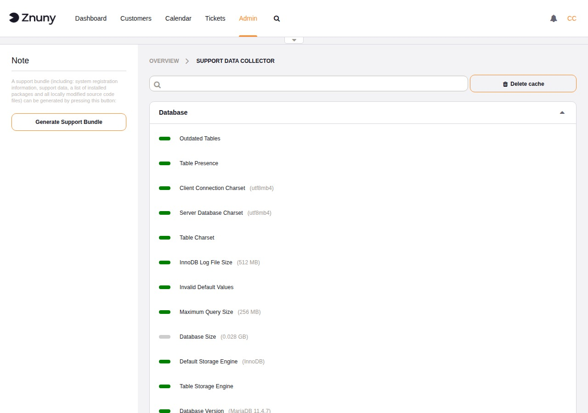
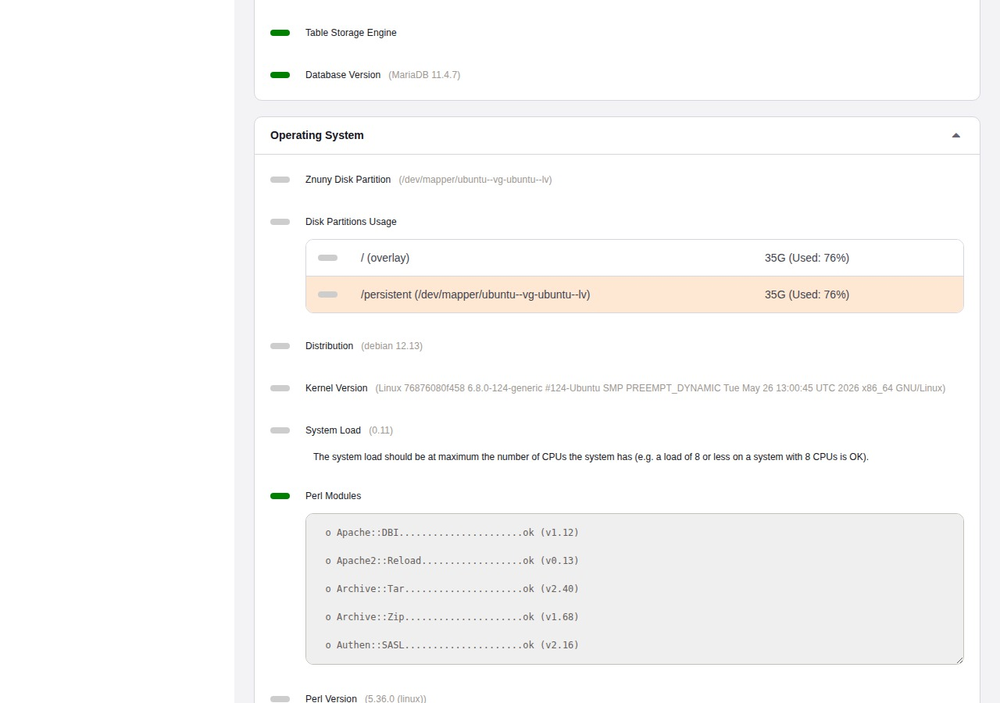

.. meta::
   :description: Use the Znuny Support Data Collector to view a live health check of your installation and generate a support bundle for troubleshooting with the Znuny team.
   :keywords: znuny support data collector, support bundle, system health check, generate support bundle, znuny diagnostics, AdminSupportDataCollector

.. _PageNavigation admin_supportdatacollector_index:

Support Data Collector
######################

The Support Data Collector runs a set of automated checks against your installation and displays the results grouped by subsystem. Use it as a first step when diagnosing a problem or as a regular health check to catch configuration issues before they affect users.

Navigate to **Admin → Support Data Collector** to open the module.

Reading the Results
*******************

Each check is represented by a colored status indicator next to its name:

.. list-table::
   :header-rows: 1
   :widths: 15 85

   * - Indicator
     - Meaning
   * - Green
     - The check passed with no issues.
   * - Orange
     - A warning — the system is functional but the value is outside the recommended range.
   * - Red
     - A problem that should be resolved.
   * - Gray
     - Informational — the value is reported for reference, with no pass/fail judgment.

When a check has a message attached, it appears directly below the indicator. Expanded sub-groups (such as the Perl module list or disk partition table) are shown as inline tables within the group panel.

Check Groups
************

The collector organizes checks into the following groups:

Database
   Schema completeness, table charsets, storage engine, database version, and size. Warnings here typically point to a misconfigured or outdated database server.

Operating System
   Disk space, disk partition assignment, system load, Perl version, and a full Perl module audit listing every required module and its installed version.

Webserver
   Apache modules, MPM model, environment variables, and whether an internal web request to the system succeeds.

Znuny
   Application-level checks including daemon status, FQDN configuration, default user and password status, email queue depth, spool mail count, article search index state, communication log account health, session configuration, package deployment integrity, and a list of installed packages.

Use the **search bar** at the top of the content area to filter by check name across all groups.

Refreshing the Data
*******************

The collector caches its results to avoid running the full check suite on every page load. To force a fresh run, click **Delete cache** in the top-right of the content area. The page reloads and collects new data immediately.

Generating a Support Bundle
***************************

The sidebar **Generate Support Bundle** button creates a compressed archive that captures the full state of your installation for troubleshooting. Generation runs in the background. When it completes, a dialog appears with a **Download** button — save the file locally. The archive is deleted from the server immediately after download.

Send this bundle when opening a support request with the Znuny team. It provides the diagnostic context needed to investigate installation-specific issues without requiring direct server access.

Bundle Contents
===============

The archive (``SupportBundle_YYYY-MM-DD_HH-MM.tar.gz``) contains four files:

``SupportData.json``
   A fresh run of all support data collector checks — the same data shown on screen, serialized to JSON. This run bypasses the cache so the data reflects current system state.

``InstalledPackages.csv``
   A comma-separated list of every installed add-on package with its name, version, MD5 checksum, and vendor.

``ModifiedSettings.yml``
   All SysConfig settings that differ from their shipped defaults. Only settings you have explicitly changed are included — the hundreds of unchanged default values are omitted.

``application.tar.gz``
   A nested archive containing every source code file in the installation directory that has been added or modified compared to the shipped version. Each file is checked against the MD5 checksums in the ``ARCHIVE`` manifest (and installed package manifests). Files whose checksums match the shipped version are excluded — only your local changes travel.

Privacy Protections
===================

Several categories of sensitive data are removed or masked before the bundle is created:

**Passwords in configuration files**

All files matching ``Kernel/Config.pm`` and ``Kernel/Config/Files/`` inside the application archive are processed by the password masker before being written to the bundle. It replaces:

- Simple settings such as ``$Self->{'DatabasePw'} = 'secret'`` → ``$Self->{'DatabasePw'} = 'xxx'``
- Hash-style entries such as ``Password => 'secret'`` → ``Password => 'xxx'``
- Credentials embedded in connection strings such as ``://user:secret@host`` → ``://[user]:[password]@host``

**Passwords in modified SysConfig settings**

The same masking logic is applied to ``ModifiedSettings.yml``. Any setting whose name contains ``Password`` or ``Pwd``, or whose type metadata marks it as a password field, has its effective value replaced with ``xxx`` before the file is written.

**Ticket attachments and article data**

The directory configured as ``Ticket::Article::Backend::MIMEBase::ArticleDataDir`` — which holds email attachments and article bodies stored on disk — is entirely excluded from the application archive.

**Session data**

The ``sessions/`` directory is excluded. No active session tokens or session content are included in the bundle.

**S/MIME keys and certificates**

The directories configured as ``SMIME::PrivatePath`` and ``SMIME::CertPath`` are excluded. Private keys never leave the server.

**Temporary files**

The system's ``TempDir`` is excluded.

**Compiled caches**

The ``js-cache/`` and ``css-cache/`` directories are excluded as they contain no configuration information.

**Unmodified stock files**

Because only files that differ from the shipped checksums are included, the application archive does not contain any unmodified Znuny source code — only the delta introduced by your local customizations.

.. note::

   The bundle contains server paths, installed package names and versions, and system configuration values (with passwords removed). Review it before sharing if your organization has policies about disclosing infrastructure details.
